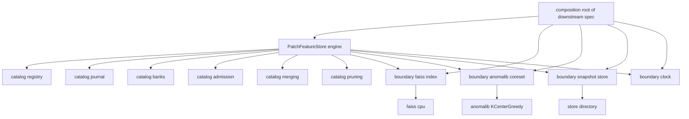
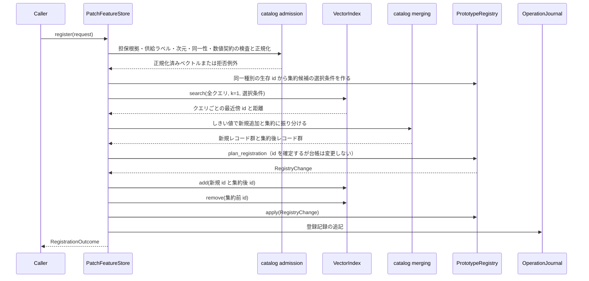
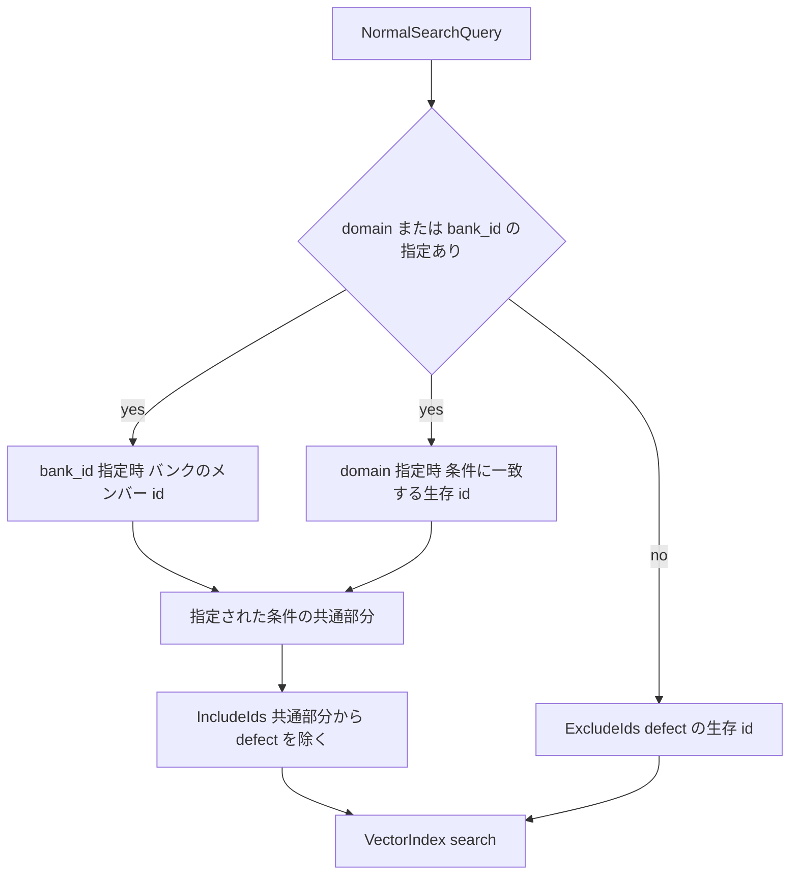
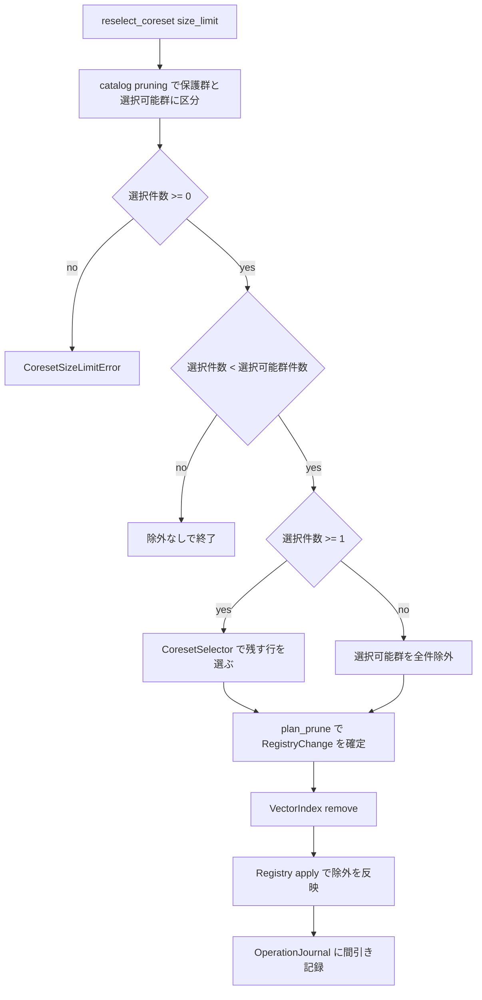
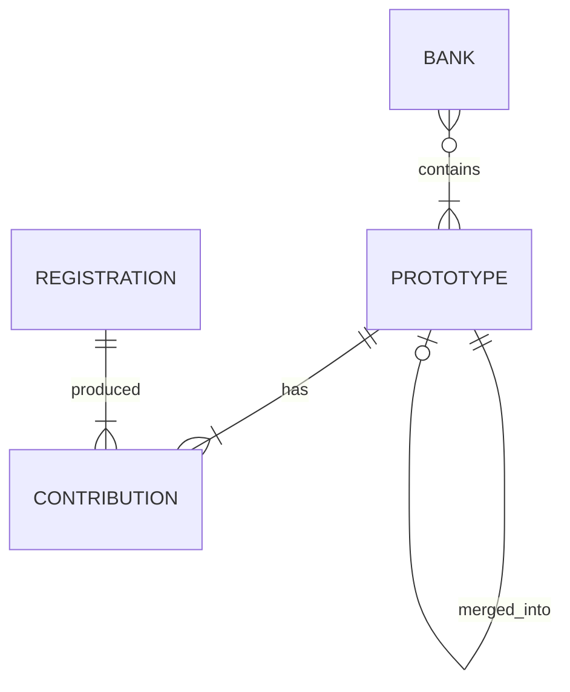

# Design Document

## Overview

本機能（`patch-feature-store`）は、上流 `ssl-vit-feature-extraction` が生成したパッチ特徴を、後から検索できる索引として保持する Python パッケージ `patch_feature_store` を新設する。保持するのは「プロトタイプ」（1 件以上のパッチ特徴を集約した単位）であり、各プロトタイプは安定・不再利用の整数識別子を持ち、正常性の担保根拠・プロトタイプ種別・位置・ドメインタグ・由来キー・annotation メタ・構造化 JSON への参照・適用メタ情報と紐づく。

利用者は下流 spec の合成ルートである。`primary-anomaly-detection` は正常集合に対する近傍検索を、`promptable-correction-layer` は識別子指定の類似度問い合わせを、`evaluation-framework` は由来キー単位の固定サイズバンクを使う。これらはいずれも本パッケージが定義する型と `feature_extraction` の出力型だけを介して対話し、FAISS・anomalib・torch の型に触れない。

現状 `src/` には `correction_layer`（補正レイヤ）と `feature_extraction`（パッチ特徴抽出）の 2 パッケージが存在する。本設計は同じ層パターン（`model` → 中間層 → `engine`）で 3 つ目のパッケージを追加する。中間層は関心事に応じて `catalog`（プロトタイプ台帳と受け入れ・集約・間引き・バンクの純粋ロジック）と `boundary`（FAISS・anomalib・ファイル I/O・システム時刻）に分ける。

### Goals

- 初期構築と定期追加を同一の登録操作で受け付け、最近傍距離による新規追加／集約の判定を登録要求単位のバッチで行う。
- 正常性の担保根拠が示された要求だけを受け入れ、担保根拠と種別を後から辿れる形で記録する。
- 正常集合に対する近傍検索と、識別子指定の類似度問い合わせを、同一の距離尺度（コサイン）で提供する。
- coreset 再選択と expiry 間引きでサイズ上限を維持しつつ、間引き保護と `kind=defect` を除外対象から外す。
- 永続化・再読込で同一クエリに同一結果を返し、抽出器同一性メタの不一致を登録時・検索時の双方で拒否する。
- 由来キー単位の固定サイズバンクを複数構築し、同一指定の再実行で同一集合を再現する。

### Non-Goals

- パッチ特徴の生成、タイル化・パッチ化、バックボーン切替（`ssl-vit-feature-extraction` が所有）。
- 異常スコア算出・ヒートマップ・ROI 候補抽出（`primary-anomaly-detection` が所有）。
- 正常性検証そのもの、ROI 注釈受付、LLM による構造化と監査ログの生成（`llm-feedback-structuring` が所有）。
- 補正レコードの適用条件照合と最終判定、`match.prototype_ids` の集約後識別子への書き換え（`promptable-correction-layer` が所有）。
- 過検出率・安定性・AUROC 等の指標算出と実験プロトコルの実行（`evaluation-framework` が所有）。
- バンクのスナップショット版管理・系譜・マニフェスト（`docs/incremental-development-plan.md` Phase 5）。
- 近似索引（IVF／PQ）の採用と索引方式の設定切替。決定の根拠は「アーキテクチャパターンと境界マップ」に記す。

## 境界コミットメント

### 本 spec が所有するもの

- プロトタイプ識別子の発番と生存状態（生存・集約による retire・間引きによる除外）の権威。集約前識別子から集約後識別子への対応表を含む。
- 登録の受け入れ判定（正常性の担保根拠の有無、担保根拠と申告種別の整合、供給ラベルと申告種別の整合、埋め込み次元、抽出器同一性メタの一致）と、拒否理由の報告契約。
- 集約判定（最近傍コサイン距離としきい値の比較）と集約後プロトタイプの合成規則（重心・寄与の併合・保護属性と失効期限の併合）。
- ベクトルの内部表現。ストアは登録時に L2 正規化した単位ベクトルを保持し、これを永続化の対象とする。
- 近傍検索の対象集合の決定（種別による除外、ドメイン限定、バンク限定）と、距離・類似度の尺度定義。
- プロトタイプ単位のメタデータ（種別・間引き保護・失効期限・寄与パッチの位置）と、登録単位のメタデータ（画像 ID・ドメインタグ・由来キー・担保根拠・annotation メタ・構造化 JSON 参照・適用メタ情報）の保持。
- coreset 再選択と expiry 間引きの対象決定、保護規則、サイズ上限の充足可能性判定。
- 永続化形式（ディレクトリレイアウトとファイル種別）と再読込時の整合検査。
- 評価用バンクの構成（候補抽出・決定的サブサンプル・構成条件の保持）。
- 登録・間引きの操作記録と期間指定の照会。

### 境界外

- 特徴ベクトル・位置・ドメインタグ・由来キー・抽出器同一性メタの生成と正規化。本機能は供給値を保持するだけである。
- 正常性の検証判断そのもの。本機能は担保根拠が示されているか、および供給された種別・ラベルと整合するかだけを判定し、ラベル自体の正しさは判定しない。
- annotation メタ・適用メタ情報の意味解釈とスキーマ検証。値は不透明な文字列マップとして素通しする。
- 異常スコアの算出、しきい値の較正、ヒートマップ生成。
- 補正レコードの読み込み・照合・追従。集約による識別子変更に対する `match.prototype_ids` の追従は補正レイヤ側の責務であり、本機能は対応の保持と提示までを持つ（`docs/structured-json-versioning/correction-layer.md:92-94`）。
- 補正レコードからの参照有無に基づく間引き判断。参照の有無を間引き条件に用いない（`correction-layer.md:88-89` の一方向依存）。
- バンクのスナップショット版管理・系譜・`banks/<snapshot_id>/` 配下の版メタ生成。
- 過検出率・流出率・分布ずれの算出。操作記録の提供までを担う。

### 許可された依存

- 内部: `feature_extraction.model.types`（`DatasetSplit`・`DomainTags`・`ProvenanceKeys`・`ImageLabel`）、`feature_extraction.model.features`（`ExtractorIdentity`・`PatchFeatureSet`）。依存方向は `patch_feature_store` → `feature_extraction` の一方向に限る。逆方向と `correction_layer` との相互依存を作らない。
- 外部: `faiss-cpu>=1.11`、`anomalib>=2.6,<3`（coreset のみ）、`torch>=2.9`（anomalib coreset の入出力）、`numpy>=2.1`、`pydantic>=2.7`（永続形式の検証）。
- `faiss`・`anomalib`・`torch` の import は `patch_feature_store.boundary` の内側だけに置く。`model`・`catalog`・`engine` は `numpy`・`pydantic`・標準ライブラリ・`feature_extraction` の型だけに依存する。
- 依存方向: `engine` → `catalog` / `boundary` → `model`。逆流と `catalog` ⇄ `boundary` の相互 import を禁止する。`catalog` 内のモジュール同士も互いに import しない（配線は `engine`）。
- 上記はいずれも `pyproject.toml` の import-linter 契約で CI 検査する。契約の具体は「変更するファイル」に記す。

### 再検証トリガー

- `PrototypeRecord`・`RegistrationRecord`・`NeighborHit`・`SimilarityLookup`・`BankComposition` のフィールド追加・削除・意味変更。
- 距離尺度の変更（コサイン距離 = 1 − コサイン類似度、内部表現は L2 正規化済みベクトル）。`match.similarity_threshold` の解釈が補正レイヤと食い違うため、`docs/structured-json-versioning/operations.md:48` の未決事項に直結する。
- 集約時に新識別子を発番する方針（既存識別子を継続しない）の変更。補正レイヤの remap 追従の前提が変わる。
- 索引方式を Flat から近似索引（IVF／PQ）へ変更すること。厳密解でなくなり、要件 3.1／6.2 と `match.similarity_threshold` 判定の前提が変わる。
- 永続化ディレクトリのファイル構成・ファイル名・レコード形式の変更。
- 間引き規則（保護対象、上限の充足可能性判定）の変更。
- バンクを永続化対象に含める変更。現設計はバンクをプロセス内の派生物として扱う。
- 上流 `feature_extraction` の `ExtractorIdentity` のフィールド追加。互換判定の比較対象が変わる。

## Architecture

### 既存アーキテクチャの分析

`src/correction_layer` と `src/feature_extraction` は、`model`（型・Protocol）→ 中間層 → `engine`（合成ルート）の一方向構成であり、層契約を import-linter が CI 検査する。重い外部依存は `boundary` に閉じる（`correction_layer/boundary/prototype_store.py` が FAISS を、`feature_extraction/boundary/timm_backbone.py` が torch／timm／anomalib を隠す）。公開面はパッケージルートの `__all__` だけで定義し、サブパッケージの `__init__.py` は空である。本設計はこの構成を踏襲する。

`correction_layer/boundary/prototype_store.py` は本機能と同じ問題（プロトタイプ id と埋め込みの kNN）を扱うが、`PrototypeStore.build` で不変の索引を作る読み取り専用の実装であり、増分追加・間引き・メタデータ層・永続化を持たない。本機能はそれを置き換えるものではなく、補正レイヤが注入する `SimilaritySource` の実装候補を将来増やす関係にある。本 spec では `correction_layer` を変更しない（`SimilaritySource` への適合は補正レイヤ側の合成の問題であり、本機能の `similarities` は同じ意味（コサイン類似度）を返す）。

上流の `feature_extraction` はパッケージルート `__init__.py` で `boundary` を eager import するため、`feature_extraction.model.features` を import すると実行時に torch／anomalib が読み込まれる（計測: 13.3 秒）。静的な import グラフ上は `feature_extraction.model.features` から torch への経路が存在しないことを grimp で確認済みであり、import-linter の禁止契約には影響しない。実行時コストは上流パッケージの公開方式に由来するため、本 spec では受け入れ、`__init__.py` の遅延化は上流 spec の課題として扱う。

### アーキテクチャパターンと境界マップ

選択パターンは既存踏襲のレイヤード + ポート注入である。状態を持つ台帳（`PrototypeRegistry`・`OperationJournal`・`BankRegistry`）は `catalog` に置き、外部ライブラリと I/O は `boundary` のポート実装に閉じる。`engine` の `PatchFeatureStore` が両者を合成し、台帳とベクトル索引の同期を 1 箇所で担う。



主要な決定は 6 点である。

- **索引は FAISS Flat（厳密解）に固定する。** steering `tech.md:37` が Flat（CPU）を宣言しており、要件 3.1 の距離、要件 6.2 の再読込後の同一結果、補正レイヤの `match.similarity_threshold` 判定はいずれも厳密解を前提にする。brief は Flat／IVF／PQ の選択可能性に触れるが、要件は索引方式の切替を求めていない。近似索引の採用は `docs/library-adoption-proposal.md:49-59` が指摘する `similarity_threshold` 判定への影響を含む再検証を要するため、再検証トリガーに置いて本 spec では単一方式とする。
- **距離尺度はコサインに固定する。** 保持するベクトルを L2 正規化し、`IndexFlatIP` の内積をコサイン類似度として扱う。近傍検索はコサイン距離（1 − 類似度）を、識別子指定の問い合わせはコサイン類似度を返す。後者を類似度のまま返すのは、補正レコードの `similarity_threshold` が `[-1, 1]` のコサイン類似度として検証されているためである（`src/correction_layer/model/records.py:82`）。既存 `PrototypeStore` も `IndexFlatIP` + 行 L2 正規化であり、同じ尺度である。
- **集約は新識別子の発番とする。** 集約後のプロトタイプは重心が変わるため、既存識別子を継続すると「同じ id が別のベクトルを指す」状態になり、補正レコードのしきい値判定の意味が黙って変わる。`versioning-model.md:80-81` の「新 `prototype_id` を発番する場合は旧→新の対応表を残す」に沿って、集約のたびに新 id を発番し、集約前 id を retire して対応表に記録する。
- **集約判定は登録要求単位のバッチ最近傍で行う。** 要件 1.4 は「追加対象の特徴と既存プロトタイプとの最近傍距離」と定めており、同一要求内のパッチ同士は既存プロトタイプではない。要求内の全クエリを 1 回のバッチ検索で処理し、要求内の近接パッチ同士は集約しない（次回登録または coreset 再選択で吸収する）。逐次判定にすると 1 要求あたりのクエリ数だけ索引検索が直列化し、実測（後述）で実運用に耐えない。
- **プロトタイプ層と登録層でメタデータを正規化する。** ドメインタグ・由来キー・担保根拠・annotation メタ・構造化 JSON 参照・適用メタ情報は登録要求単位の値であり、パッチ単位で複製するとプロトタイプ 100 万件規模で重複が支配的になる。登録記録を権威とし、プロトタイプは寄与パッチごとに登録 ID と位置だけを持つ。この登録記録は要件 8.1 の操作記録そのものでもあるため、メタデータと操作記録を 1 つの権威に統合する。
- **バンクは主索引上の凍結された id 集合とする。** バンクごとに別の索引を持たず、検索時に ID セレクタで対象を絞る。バンクの構成は仕様（由来キー条件・サイズ・シード）から決定的に再現できるため、永続化の対象にしない。

### 技術スタック

- **近傍探索**: `faiss-cpu` 1.14.3。`IndexIDMap2(IndexFlatIP(dim))` を使い、int64 の `prototype_id` を FAISS の ID として直接持つ（`versioning-model.md:44-48`）。`remove_ids`・`reconstruct`・`SearchParameters.sel` による ID セレクタ検索の 3 つを実測で確認済み。
- **coreset 選択**: `anomalib.models.components.sampling.KCenterGreedy`（k-center greedy）。`docs/library-adoption-proposal.md:71-76` の「自作せず anomalib から呼ぶ」に従う。
- **数値表現**: 公開契約は `numpy`（float32 の C 連続配列、埋め込みは `(N, D)`、位置は `(N, 2)`）。`torch` は coreset アダプタの内部だけで使う。
- **永続形式**: `numpy.save`（ベクトルと生存 id）＋ JSON / JSON Lines（メタデータと操作記録）。pydantic v2（`extra="forbid"`）でディスク上のスキーマを検証する。parquet／Lance は採用しない（`pyarrow` は依存に無く、Lance は `docs/library-adoption-proposal.md:61-62` により Phase 5 前のスパイク対象）。
- **時刻**: `Clock` ポート経由。実装は UTC の `datetime.now(UTC)`。

## ファイル構造計画

### ディレクトリ構造

```text
src/patch_feature_store/
├── __init__.py                  # 公開 API。__all__ でドメイン型・操作・例外・境界の構築口のみを公開
├── engine.py                    # 合成ルート。PatchFeatureStore（台帳と索引の同期、各操作の配線）
├── model/                       # 以下は契約 3 の層順（下位から上位）に並ぶ
│   ├── __init__.py              # 空
│   ├── types.py                 # PrototypeKind, PruneOperation, DatasetEvidence,
│   │                            #   HumanVerificationEvidence, NormalityEvidence
│   ├── criteria.py              # DomainCriteria, ProvenanceCriteria（絞り込み条件と一致判定）
│   ├── config.py                # StoreConfig（集約しきい値）
│   ├── errors.py                # 例外階層（PatchFeatureStoreError とその派生）、IdentityMismatch
│   ├── query.py                 # NeighborHit, IncludeIds, ExcludeIds, IdSelection,
│   │                            #   NormalSearchQuery, SimilarityQuery, SimilarityLookup
│   ├── registration.py          # RegistrationRequest, RegistrationOutcome, PruneOutcome
│   ├── operations.py            # RegistrationRecord, PruneLogEntry, OperationLogEntry
│   ├── bank.py                  # BankSpec, BankComposition
│   ├── prototype.py             # PatchContribution, PrototypeDraft, PrototypeRecord,
│   │                            #   PrototypeResolution 各型, PrototypeView,
│   │                            #   PrototypeContributionView（登録記録を含むため operations の上位）
│   ├── snapshot.py              # StoreSnapshot（永続化の受け渡し単位）
│   └── ports.py                 # Protocol: VectorIndex, CoresetSelector,
│                                #   SnapshotRepository, Clock
├── catalog/
│   ├── __init__.py              # 空
│   ├── registry.py              # PrototypeRegistry, RegistryChange。id 発番・生存状態・
│   │                            #   対応表・解決・寄与の保持（plan と apply を分離）
│   ├── journal.py               # OperationJournal。登録記録と間引き記録の追記・期間照会・
│   │                            #   ドメイン／由来キーによる登録記録の絞り込み
│   ├── admission.py             # 受け入れ検査と正規化（担保根拠・供給ラベル・次元・
│   │                            #   同一性・数値契約）
│   ├── merging.py               # 集約判定と集約後レコードの合成（重心・寄与併合・保護属性）
│   ├── pruning.py               # expiry 判定、保護区分、coreset 上限の充足可能性判定
│   └── banks.py                 # BankRegistry。候補抽出・決定的サブサンプル・構成条件の保持
└── boundary/
    ├── __init__.py              # 空
    ├── faiss_index.py           # FaissFlatIndex, faiss_flat_index（VectorIndex 実装）
    ├── anomalib_coreset.py      # AnomalibCoresetSelector, anomalib_coreset_selector
    ├── snapshot_schema.py       # 永続形式の pydantic モデルとモデル型との相互変換
    ├── snapshot_store.py        # DirectorySnapshotRepository, directory_snapshot_repository
    │                            #   （npy / json / jsonl の I/O と整合検査）
    └── clock.py                 # UtcClock, utc_clock（Clock 実装）

tests/
├── test_store_criteria.py       # DomainCriteria / ProvenanceCriteria の一致規則
├── test_store_query.py          # NormalSearchQuery / SimilarityQuery の不変条件（k >= 1）
├── test_store_public_api.py     # __all__ の網羅性と非公開名の不在、ポートの消費側の存在
├── test_store_admission.py      # 担保根拠・供給ラベル・次元・同一性・数値契約の
│                                #   受け入れと拒否報告
├── test_store_merging.py        # 集約判定としきい値境界、集約後レコードの合成規則
├── test_store_pruning.py        # expiry 判定、保護区分、上限の充足可能性
├── test_store_registry.py       # id 発番・retire・対応表・解決・寄与の併合、plan と apply の分離
├── test_store_journal.py        # 操作記録の追記・期間照会・登録記録の絞り込み
├── test_store_banks.py          # 候補抽出・除外・不足報告・決定性・構成条件
├── test_store_faiss_index.py    # 追加・削除・セレクタ検索・k 超過・再構成
├── test_store_snapshot.py       # 永続化の往復、整合検査の失敗報告、差し替え中断からの復旧
├── test_store_engine.py         # 登録・検索・問い合わせ・間引き・バンクの結合
├── test_store_properties.py     # hypothesis: id 非再利用・対応表の終端性・バンク決定性
└── test_store_e2e.py            # anomalib coreset を含む通し（登録→間引き→永続化→再読込→検索）
```

各モジュールは 300 行未満に収まる想定である。`engine.py` は各操作を `catalog` への委譲で構成し、多段の手順を持つのは `register` と `reselect_coreset` の 2 つだけとする。300 行に達した場合は、スナップショットの組み立てと復元（`snapshot()` / `restore()`）を `engine_snapshot.py` へ切り出し、`engine` 層の layers 契約に第 2 段として加える。

`catalog` の 6 モジュールは互いに import しない。`registry` はプロトタイプ単位、`journal` は登録単位の権威であり、両者の結合（メタデータの合成、条件に一致する id の抽出）は `engine` が行う。

### 公開 API

パッケージルートの `__all__` は次の名前だけを公開する。

- 操作: `PatchFeatureStore`
- 入力型: `RegistrationRequest`、`NormalSearchQuery`、`SimilarityQuery`、`BankSpec`、`StoreConfig`、`DomainCriteria`、`ProvenanceCriteria`、`PrototypeKind`、`DatasetEvidence`、`HumanVerificationEvidence`、`NormalityEvidence`
- 出力型: `RegistrationOutcome`、`NeighborHit`、`SimilarityLookup`、`PrototypeView`、`PrototypeContributionView`、`PruneOutcome`、`BankComposition`、`RegistrationRecord`、`PruneLogEntry`、`PruneOperation`、`LivePrototype`、`MergedPrototype`、`PrunedPrototype`、`UnknownPrototype`、`PrototypeResolution`、`OperationLogEntry`、`IdentityMismatch`
- Protocol: `VectorIndex`、`CoresetSelector`、`SnapshotRepository`、`Clock`
- 境界の構築口: `faiss_flat_index`、`anomalib_coreset_selector`、`directory_snapshot_repository`、`utc_clock`
- 例外: `PatchFeatureStoreError`、`EmbeddingDimensionMismatchError`、`NormalityEvidenceRequiredError`、`ExtractorIdentityMismatchError`、`SnapshotIntegrityError`、`CoresetSizeLimitError`、`BankSizeUnavailableError`、`UnknownBankError`

公開メソッドのシグネチャと公開例外の属性に現れる型は、union alias も含めて公開する。`PrototypeResolution`（と構成要素の `LivePrototype`・`MergedPrototype`・`PrunedPrototype`・`UnknownPrototype`）は `resolve` の戻り値、`PrototypeView` は `describe` の戻り値、`OperationLogEntry` は `operations` の戻り値、`NormalityEvidence` は `RegistrationRequest.evidence` と `RegistrationRecord.evidence`、`IdentityMismatch` は `ExtractorIdentityMismatchError.mismatches` の要素型である（要件 6.4、6.5 の報告要素）。`PrototypeView.resolution` が `PrototypeResolution` を持つため、`describe` の利用者も解決状態の型に触れる。

`PrototypeRegistry`・`OperationJournal`・`BankRegistry`・`FaissFlatIndex` と `catalog` の純関数は公開しない。これらは `PatchFeatureStore` が内部で合成する台帳と手順であり、外部から直接触れると台帳とベクトル索引の同期不変条件を迂回できてしまう。境界の構築口をファクトリ関数で公開する方針は `feature_extraction` に揃える（具象クラス名を公開面の契約にしない。`.kiro/steering/structure.md:46-47`）。

`PrototypeRecord`・`PatchContribution`・`StoreSnapshot`・`IdSelection` も公開しない。前二者は `PrototypeView` として読み取り用に整形して返し、後二者は永続化ポートと索引ポートの内部契約である。

### 変更するファイル

- `pyproject.toml` — `[tool.importlinter]` に `patch_feature_store` を追加する。
  - `root_packages` を `["correction_layer", "feature_extraction", "patch_feature_store"]` にする。
  - 契約 1（layers）: `patch_feature_store.engine` > `patch_feature_store.boundary | patch_feature_store.catalog` > `patch_feature_store.model`。
  - 契約 2（independence）: `catalog.registry`、`catalog.journal`、`catalog.admission`、`catalog.merging`、`catalog.pruning`、`catalog.banks`。
  - 契約 3（layers）: `model.ports` > `model.snapshot` > `model.prototype` > `model.registration | model.operations | model.bank` > `model.query` > `model.errors` > `model.criteria | model.config | model.types`。
    - 同一層を区切る `|` は import-linter の independent 指定であり、同一層のモジュール同士の import も禁止される（`importlinter/contracts/layers.py:20-21,40,56-57`）。依存関係のあるモジュールを同一層に並べると `lint-imports` が落ちるため、依存はすべて層順で解く。
    - `model.prototype` > `model.operations`: `PrototypeContributionView` が寄与ごとの `RegistrationRecord` を持つ（要件 4.3）。`RegistrationRecord` は `prototype_ids: tuple[int, ...]` しか持たず逆向きの依存はない。
    - `model.query` > `model.criteria`: `NormalSearchQuery.domain` が `DomainCriteria` を持つ。
    - `model.errors` > `model.types`: `NormalityEvidenceRequiredError(kind, reason)` が `PrototypeKind` を持つ。
  - 契約 4（forbidden）: source に `patch_feature_store.model`・`patch_feature_store.catalog`・`patch_feature_store.engine`、forbidden に `faiss`・`torch`・`anomalib`。
  - 契約 5（layers）: `boundary.snapshot_store | boundary.faiss_index | boundary.anomalib_coreset | boundary.clock` > `boundary.snapshot_schema`。
    - アダプタ同士は independent 指定で相互 import を禁止する。`snapshot_store` を上位層に置くと `faiss_index` などへの import が契約上通ってしまうため、共通の直列化スキーマだけを下層に置き、アダプタは同一層に並べる。
  - 契約 6（forbidden）: source に `correction_layer`・`feature_extraction`、forbidden に `patch_feature_store`。パッケージ間の依存方向を一方向に固定する。
  - 契約 7（forbidden）: source に `patch_feature_store`、forbidden に `correction_layer`。契約 6 は既存パッケージ → store の向きだけを禁止するため、`correction_layer` との相互依存を作らないという宣言（「許可された依存」）を CI で担保するにはこの向きの契約も要る。`feature_extraction` への依存は許可するため forbidden に含めない。
  - 契約の追加は、列挙するモジュールがすべて存在してから行う。`LayersContract` は非 optional の層モジュールがグラフに無いと `Missing layer` で失敗する（`feature_extraction` 追加時に確認済みの挙動）。
- `src/` 配下の既存パッケージ、`docs/`、`.kiro/steering/` は変更しない。

## System Flows

### 登録（増分追加と集約）



集約は「既存プロトタイプ 1 件 + 同一要求内でそれを最近傍とした全パッチ」を 1 件へまとめる。集約後の重心は寄与パッチ数で重み付けした平均を再正規化した単位ベクトルであり、寄与・担保根拠の参照・ドメイン・由来キーは寄与の併合として和集合になる。間引き保護は論理和、失効期限は「より遅い方」（`None` は無期限として最も遅い）を採る。保護と寿命を集約で弱めないためである。

### 検索対象の決定



限定指定がない既定経路では、登録済み正常集合の全体を単一プールとして扱い、`kind=defect` の生存 id だけを除外するセレクタを渡す。`defect` は件数が少ない前提であり（`versioning-model.md:59`）、包含リストを毎回組むより除外リストの方が小さい。

`domain` と `bank_id` は独立に指定でき、両方が指定された場合は**両条件を満たす交差**を検索対象にする。どちらか一方を優先して他方を無視することはしない。要件 3.6 のドメイン限定にバンクの例外はなく、要件 7.3 のバンク指定にドメインの例外もないため、両立させる解釈は交差だけである。指定された条件ごとに候補 id 集合を作り、その共通部分から `defect` を除いた包含リストを渡す。交差が空集合になる指定は不正ではなく、空の検索結果として返す（`k` 未満の返却は要件 3.2 の経路と同じ）。

### 間引き（coreset 再選択と expiry）



保護群は「間引き保護の指定を持つプロトタイプ」と「`kind=defect` のプロトタイプ」の和である。選択件数は `上限 − 保護群件数` であり、`CoresetSelector.select` の事前条件が `1 <= size <= len(vectors)` であることから、境界の扱いは次の 4 通りに分かれる。

- 選択件数が負（保護群件数 > 上限）: 保護群を除外しないと上限に収まらず、要件 5.1 と 5.3 を同時に満たす結果が存在しないため、何も除外せずに保護群件数と上限を報告して失敗させる。
- 選択件数が選択可能群件数以上: 生存件数が既に上限以内であり除外する対象がない。selector を呼ばず、間引き記録も残さない。
- 選択件数が 0 かつ選択可能群が 1 件以上（保護群件数 = 上限）: 要件 5.1 と 5.3 を同時に満たす結果が「保護群だけを残す」で一意に定まるため成功させる。selector の事前条件 `1 <= size` により 0 件選択は渡せないので、selector を呼ばずに選択可能群を全件除外する。
- それ以外（`1 <= 選択件数 < 選択可能群件数`）: 選択可能群から選択件数を coreset 選択で残し、残らなかったものを検索対象から除外する。

selector を呼ぶのは最後の 1 通りだけであり、事前条件 `1 <= size <= len(vectors)` はこの分岐で常に満たされる。expiry 間引きは失効期限が現在時刻を過ぎた生存プロトタイプのうち間引き保護を持たないものを除外する（`kind=defect` は coreset の対象外だが expiry の対象である）。

## 要件トレーサビリティ

### Requirement 1: パッチ特徴の登録と増分追加

- 1.1 — `PatchFeatureStore.register` が `RegistrationOutcome.prototype_ids`（入力パッチ行と同順）を返す。ベクトルは `VectorIndex.add` で検索対象に入る。
- 1.2 — 登録の入口は `register` の 1 つだけで、初期構築と追加を区別する引数を持たない。担保根拠の種別（`DatasetEvidence` / `HumanVerificationEvidence`）だけが異なる。
- 1.3 — `register` は既存の生存 id に触れず、新規 id の追加と集約対象の差し替えだけを `VectorIndex` に反映する（再登録を要求しない）。
- 1.4 — `catalog/merging.py` がバッチ最近傍距離としきい値を比較し、集約後レコードを合成する。ドメインは寄与の併合により和集合となる。`RegistrationOutcome.prototype_ids` に集約後 id が入る。
- 1.5 — `PrototypeRegistry.plan_registration` が集約前 id → 集約後 id の対応を `RegistryChange` に確定し、`apply` が対応表へ反映する。`resolve` は集約前 id の指定で `MergedPrototype(merged_into=...)` を返す。
- 1.6 — 集約前 id は `VectorIndex.remove` で検索対象から外れ、id 発番は発番済み最大値 + 1 の単調増加であるため再割り当てされない。発番済み id のレコードは削除しない。
- 1.7 — `catalog/admission.py` が登録済み埋め込み次元と要求の次元を比較し、`EmbeddingDimensionMismatchError(expected_dim, actual_dim)` を送出する（索引へは何も追加しない）。
- 1.8 — 本 spec の境界外に特徴生成を置き、`register` の入力は上流が生成した `PatchFeatureSet` に限る。

### Requirement 2: 正常性が担保されたデータだけを登録するガード

- 2.1 — `RegistrationRequest.evidence` は必須フィールドであり、`catalog/admission.py` が種別との整合（`acceptable` / `defect` は人手検証由来のみ）と、`kind=normal` かつ `DatasetEvidence` の場合の `features.image_label == ImageLabel.NORMAL` を検査する。
- 2.2 — 担保根拠が欠けるか、種別と整合しないか、`DatasetEvidence` の担保根拠に対して供給ラベルが `ANOMALOUS` の場合は `NormalityEvidenceRequiredError(kind, reason)` を送出し、索引と台帳を変更しない。
- 2.3 — `DatasetEvidence(dataset_name)` は人手検証の参照を要求しない。要件 2.3 が求める「データセット名と split」は `DatasetEvidence.dataset_name` と `RegistrationRecord.split` の組で記録する。split は `RegistrationRequest.features.split` を唯一の供給元とし、担保根拠側では受け取らない（同じ事実を 2 つの入力から受けて矛盾させないため）。1 回の `register` が 1 画像分の全パッチを一括登録する。
- 2.4 — `HumanVerificationEvidence(verification_ref)` を `RegistrationRecord` に保持し、`describe` と操作記録の双方から辿れる。
- 2.5 — `PrototypeRecord.kind` に `PrototypeKind.NORMAL` / `ACCEPTABLE` / `DEFECT` を保持する。
- 2.6 — `search_normal` は常に `kind=defect` の生存 id を検索対象から外す（除外セレクタまたは包含リストの構成時に除く）。
- 2.7 — 検証そのものは境界外。`admission` は担保根拠の有無と、申告種別・供給ラベルとの整合だけを見る。

### Requirement 3: 近傍検索とドメイン限定

- 3.1 — `search_normal` が `NeighborHit(prototype_id, distance)` を距離の近い順に最大 k 件返す。クエリ特徴と近傍数は `NormalSearchQuery.embedding` / `.k` が保持し、`VectorIndex.search(queries, k, selection)` へ渡す。距離はコサイン距離。
- 3.2 — `FaissFlatIndex.search` は FAISS が返す `-1` パディングを除去するため、対象件数が k 未満なら全件を返す。返却タプルの長さが件数を示す。
- 3.3 — `similarities` は `SimilarityQuery.prototype_ids` を `PrototypeRegistry.resolve` で解決し、生存しているものについて種別を問わずコサイン類似度を返す。
- 3.4 — 解決結果が `MergedPrototype` の id は `SimilarityLookup.merged` に対応先 id とともに載せ、読み替えは行わない。残りの id の結果は返す。
- 3.5 — `UnknownPrototype` と `PrunedPrototype` は `SimilarityLookup.unresolved` に載せる。残りの id の結果は返す。
- 3.6 — `NormalSearchQuery.domain` が指定された場合、`OperationJournal.registration_ids_matching` と `PrototypeRegistry.live_ids_with_registrations` で候補 id を求め、包含セレクタで検索対象を限定する。`bank_id` と同時に指定された場合も両条件の交差に限定し、ドメイン限定を飛ばさない（要件 3.6 にバンクの例外はない）。
- 3.7 — `domain` と `bank_id` がいずれも未指定なら、`defect` を除いた生存集合全体を単一プールとして検索する。
- 3.8 — 追記で集約されなかったプロトタイプは id も索引エントリも変更されないため、追記前と同一 id で返る。

### Requirement 4: メタデータの保持と絞り込み

- 4.1 — `RegistrationRecord.annotation_metadata` / `structured_json_ref` / `applicability_metadata` を登録単位で保持し、`PatchContribution.registration_id` で各プロトタイプに紐づける。
- 4.2 — 位置は `PatchContribution.position`、ドメインタグと由来キーは `RegistrationRecord.domain` / `provenance` に保持する。
- 4.3 — `describe(prototype_ids)` が id ごとに `PrototypeView`（種別・保護・失効期限・解決状態・寄与ごとの `PrototypeContributionView`）を返す。`PrototypeContributionView` は位置と `RegistrationRecord` を持つため、`model.prototype` は `model.operations` の上位層に置く（契約 3）。
- 4.4 — `find_prototypes(domain, provenance)` が条件に一致する登録記録を経由して id 集合を返す。返すのは生存プロトタイプに限る。検索対象の限定（要件 3.6）と同じ候補集合を返す入口に統一し、除外済み・集約済みの識別子は `resolve` から状態付きで引くという役割分担にする。
- 4.5 — 未提供の項目は `None`（`domain` / `provenance` / `structured_json_ref`）または空マップ（annotation・適用メタ）として保持し、補完しない。
- 4.6 — メタデータは検証も正規化もせず、供給値をそのまま保持する。annotation メタと適用メタ情報は不透明な文字列マップとして扱う。

### Requirement 5: coreset 再選択と expiry 間引きによるサイズ上限の維持

- 5.1 — `reselect_coreset(size_limit)` が `CoresetSelector` で残す集合を選び、選ばれなかった id を `VectorIndex.remove` と `PrototypeRegistry.plan_prune` / `apply` で除外する。selector を呼ぶのは `1 <= 選択件数 < 選択可能群件数` のときだけである（「間引き（coreset 再選択と expiry）」の 4 分岐）。
- 5.2 — `prune_expired()` が `Clock.now()` を基準に失効済みの生存プロトタイプを除外する。
- 5.3 — `catalog/pruning.py` が `pinned` を保護群に入れ、coreset・expiry のいずれでも除外対象にしない。
- 5.4 — `kind=defect` は coreset の保護群に含める（expiry の対象からは外さない）。
- 5.5 — 除外された id はレコードを残したまま生存集合から外れ、対応表には載せない。発番は単調増加のため再割り当てされない。
- 5.6 — 除外された id は `resolve` が `PrunedPrototype` を返す。
- 5.7 — 間引きの判定入力は `pinned`・`kind`・`expires_at`・ベクトルだけであり、補正レコードを参照しない（本パッケージは補正レコードを読まない）。

### Requirement 6: 永続化・再読込と抽出器同一性の互換判定

- 6.1 — `save()` が `StoreSnapshot`（ベクトル・生存 id・全プロトタイプレコード・対応表・操作記録・抽出器同一性）を `SnapshotRepository` へ渡す。除外状態は「レコードは存在するが生存 id に無い」ことで表現する。書き込みはステージング後のディレクトリ差し替えで行い、中断時も完全な世代だけが残る（`DirectorySnapshotRepository`）。
- 6.2 — Flat 索引は保存した float32 ベクトルから決定的に再構築されるため、同一クエリに同一結果を返す。
- 6.3 — 初回登録で採用した `ExtractorIdentity`（バックボーン名・重みリビジョン・前処理条件・埋め込み次元・パッチストライドを含む全フィールド）をスナップショットに含める。
- 6.4 — `catalog/admission.py` が登録要求の同一性メタを全フィールド比較し、不一致を `ExtractorIdentityMismatchError(mismatches)` に列挙して送出する。
- 6.5 — `NormalSearchQuery.identity` / `SimilarityQuery.identity` に対しても同じ比較を行い、検索を実行せずに同じ例外を送出する。
- 6.6 — `boundary/snapshot_store.py` が読み取り失敗とスキーマ違反、および相互不整合（件数不一致・次元不一致・生存 id の重複・対応表の参照先欠落・生存 id と対応表の二重登録）を検査し、`SnapshotIntegrityError(target, reason)` を送出して復元を中止する。

### Requirement 7: 評価用の固定サイズバンクの複数構築

- 7.1 — `build_bank(spec)` が `BankSpec.include` に一致する生存プロトタイプから `BankSpec.size` 件を選ぶ。
- 7.2 — `BankSpec.exclude` に一致する由来キーを 1 つでも持つプロトタイプは候補から外す（集約により複数の由来キーを持つ場合も、いずれかが一致すれば除外する）。
- 7.3 — `BankRegistry` が bank_id をキーに複数のバンクを保持し、`NormalSearchQuery.bank_id` で対象を指定できる。`domain` と併用された場合は両条件の交差が対象になる（「検索対象の決定」）。
- 7.4 — 候補 id を昇順に並べ、`numpy.random.default_rng(spec.seed)` で非復元抽出する。同一仕様・同一ストア状態なら同一集合になる。
- 7.5 — 候補が `size` に満たない場合は `BankSizeUnavailableError(bank_id, requested_size, available_count)` を送出し、バンクを作らない。
- 7.6 — `BankComposition(spec, member_ids, patch_count)` を保持し、`bank_composition(bank_id)` で参照できる。`patch_count` は構成プロトタイプの寄与パッチ数の合計。
- 7.7 — 指標算出は境界外。構築と検索の提供までを担う。

### Requirement 8: 登録・間引き操作の記録

- 8.1 — `OperationJournal` が `RegistrationRecord`（実施日時・登録 ID・対象プロトタイプ id・担保根拠を含む）を追記する。
- 8.2 — `PruneLogEntry`（実施日時・除外 id・`PruneOperation.CORESET` / `EXPIRY`）を追記する。
- 8.3 — `operations(since, until)` が期間内の登録記録と間引き記録を実施日時の昇順で返す。
- 8.4 — 率の算出は境界外。記録の提供までを担う。

## Components and Interfaces

| コンポーネント | 層 | 意図 | 要件 | 主な依存 |
| --- | --- | --- | --- | --- |
| PatchFeatureStore | engine | 台帳と索引の同期、各操作の配線 | 1.x〜8.x | 全 catalog / 全 port (P0) |
| PrototypeRegistry | catalog | プロトタイプ単位の権威 | 1.5, 1.6, 3.3, 4.3, 5.5, 5.6 | model (P0) |
| OperationJournal | catalog | 登録単位の権威と操作履歴 | 4.1, 4.2, 4.4, 8.1, 8.2, 8.3 | model (P0) |
| Admission | catalog | 入口の検査と正規化 | 1.7, 2.1, 2.2, 6.4, 6.5 | model (P0) |
| Merging | catalog | 集約判定と合成 | 1.4 | model (P0) |
| Pruning | catalog | 間引き対象の決定 | 5.1〜5.4 | model (P0) |
| BankRegistry | catalog | バンク構築と保持 | 7.1〜7.6 | model (P0) |
| FaissFlatIndex | boundary | ベクトル索引 | 3.1, 3.2, 6.2 | faiss (P0) |
| AnomalibCoresetSelector | boundary | coreset 選択 | 5.1 | anomalib, torch (P0) |
| DirectorySnapshotRepository | boundary | 永続化と整合検査 | 6.1, 6.6 | pydantic, numpy (P0) |
| UtcClock | boundary | 現在時刻 | 5.2, 8.1, 8.2 | 標準ライブラリ (P2) |

### Model（ポートと契約）

#### ports

```python
class VectorIndex(Protocol):
    def add(self, prototype_ids: Sequence[int], vectors: np.ndarray) -> None: ...
    def remove(self, prototype_ids: Sequence[int]) -> None: ...
    def search(
        self, queries: np.ndarray, k: int, selection: IdSelection | None
    ) -> tuple[tuple[NeighborHit, ...], ...]: ...
    def reconstruct(self, prototype_ids: Sequence[int]) -> np.ndarray: ...


class CoresetSelector(Protocol):
    def select(self, vectors: np.ndarray, size: int) -> tuple[int, ...]: ...


class SnapshotRepository(Protocol):
    def save(self, snapshot: StoreSnapshot) -> None: ...
    def load(self) -> StoreSnapshot: ...


class Clock(Protocol):
    def now(self) -> datetime: ...
```

- 事前条件: `add` の `vectors` は `(len(prototype_ids), 埋め込み次元)` の float32・単位ベクトル。`search` の `queries` は `(Q, 埋め込み次元)` の float32・単位ベクトル、`k >= 1`。`select` の `size` は `1 <= size <= len(vectors)`。
- 埋め込み次元と件数を読み出す口はポートに置かない。次元の権威は採用済み `ExtractorIdentity.embedding_dim`（照合は `admission`）、件数の権威は `PrototypeRegistry` の生存 id 集合であり、ポートに重複した読み出し口を持たせない。
- 事後条件: `search` は入力クエリと同順・同数のタプルを返し、各要素は距離昇順で最大 k 件（対象件数が k 未満なら全件）。`select` は入力行インデックスの重複なし集合を `size` 件返す。`reconstruct` は要求順に単位ベクトルを返す。
- 不変条件: `VectorIndex` が保持する id 集合は `PrototypeRegistry` の生存 id 集合と一致する。この同期は `PatchFeatureStore` だけが行う。

`CoresetSelector.select` が行インデックスを返す（id ではない）のは、実装が id 体系を知らずに済むようにするためである。`PatchFeatureStore` が候補 id とベクトル行の対応を持つ。

### Catalog

#### PrototypeRegistry

| 項目 | 内容 |
| --- | --- |
| Intent | プロトタイプ単位の状態（発番・生存・集約・除外・寄与）の権威 |
| Requirements | 1.5, 1.6, 3.3, 4.3, 5.5, 5.6 |

##### 責務と制約 (PrototypeRegistry)

- 発番済み id を減らさない。id は発番済み最大値 + 1 の単調増加で払い出す。
- 生存集合・対応表・除外の 3 状態を相互排他に保つ。生存 id は対応表に現れず、対応表の鍵は生存集合に現れない。
- レコードは発番済みの全 id について保持し続ける（除外・集約後も削除しない）。
- 状態変更は `apply` だけが行う。`plan_registration` と `plan_prune` は識別子を確定した `RegistryChange` を返すだけで、台帳を変更しない（`PatchFeatureStore` の「準備 → コミット」を成立させるため）。`apply` は辞書更新だけで例外を送出しない。

##### 主なインターフェース (PrototypeRegistry)

```python
class PrototypeRegistry:
    def plan_registration(
        self,
        new_drafts: Sequence[PrototypeDraft],
        merges: Sequence[tuple[Sequence[int], PrototypeDraft]],
    ) -> RegistryChange: ...
    def plan_prune(self, prototype_ids: Sequence[int]) -> RegistryChange: ...
    def apply(self, change: RegistryChange) -> None: ...
    def resolve(self, prototype_ids: Sequence[int]) -> dict[int, PrototypeResolution]: ...
    def record(self, prototype_id: int) -> PrototypeRecord | None: ...
    def live_ids(self) -> tuple[int, ...]: ...
    def live_ids_of_kind(self, kind: PrototypeKind) -> tuple[int, ...]: ...
    def live_ids_with_registrations(self, registration_ids: Set[int]) -> tuple[int, ...]: ...
    def selection_for(self, included_ids: Sequence[int]) -> IdSelection: ...
    def snapshot_records(self) -> tuple[PrototypeRecord, ...]: ...
    def merged_into(self) -> dict[int, int]: ...
```

`RegistryChange` は発番済みレコード群・retire する id と対応先・除外する id を持つ確定済みの差分である。`PatchFeatureStore` は `plan_*` の戻り値から `RegistrationOutcome.prototype_ids` と `retired_prototype_ids`、索引へ渡す id とベクトルを組み立てる。

`selection_for` は、包含 id 数が生存件数の半分を超える場合に `ExcludeIds`（補集合）へ切り替える。ID セレクタの構築費用が対象件数に比例するためで、既定の正常集合検索（`defect` だけを除く）を小さなセレクタで処理する経路がこれに当たる。

`resolve` は対応表を終端まで辿る。id は単調増加で、対応先は常に自身より大きい id であるため、連鎖は有限で循環しない。

#### OperationJournal

| 項目 | 内容 |
| --- | --- |
| Intent | 登録単位のメタデータと、登録・間引きの操作履歴の権威 |
| Requirements | 4.1, 4.2, 4.4, 8.1, 8.2, 8.3 |

##### 責務と制約 (OperationJournal)

- 追記のみ。既存エントリを書き換えない。
- 登録記録は「登録時点の事実」であり、その後の集約・間引きで内容を更新しない。`RegistrationRecord.prototype_ids` は登録時に生成された id であって、現在の構成ではない。
- 実施日時は `Clock` から `PatchFeatureStore` が取得して渡す。ジャーナルは時刻源を持たない。

```python
class OperationJournal:
    def append_registration(self, record: RegistrationRecord) -> None: ...
    def append_prune(self, entry: PruneLogEntry) -> None: ...
    def registration(self, registration_id: int) -> RegistrationRecord: ...
    def registration_ids_matching(
        self, domain: DomainCriteria | None, provenance: ProvenanceCriteria | None
    ) -> frozenset[int]: ...
    def entries_between(
        self, since: datetime, until: datetime
    ) -> tuple[OperationLogEntry, ...]: ...
    def next_registration_id(self) -> int: ...
    def entries(self) -> tuple[OperationLogEntry, ...]: ...
```

#### Admission

| 項目 | 内容 |
| --- | --- |
| Intent | 入口での受け入れ検査と数値の正規化 |
| Requirements | 1.7, 2.1, 2.2, 6.4, 6.5 |

```python
def accept_registration(
    request: RegistrationRequest, store_identity: ExtractorIdentity | None
) -> AcceptedRegistration: ...

def accept_query(
    embedding: np.ndarray, identity: ExtractorIdentity, store_identity: ExtractorIdentity | None
) -> np.ndarray: ...
```

- 検査順序: 担保根拠と種別の整合 → 供給ラベルと申告種別の整合 → 抽出器同一性メタの全フィールド一致 → 埋め込み次元 → 数値契約（float32 化・有限値・非ゼロノルム）→ L2 正規化。
- 空のストア（同一性メタ未採用）への最初の登録では、要求の同一性メタを採用する。以後の不一致は全項目を列挙して報告する。
- 検索時にストアが空の場合は同一性比較を行わず、検索対象が無いことによる空結果を返す。
- `kind=acceptable` と `kind=defect` は `HumanVerificationEvidence` のみを受け入れる。`kind=normal` は両方を受け入れる（データセット由来の初期構築経路）。
- 供給ラベルと申告種別の整合: `kind=normal` かつ `DatasetEvidence` の場合は `request.features.image_label == ImageLabel.NORMAL` を要求し、不一致は `NormalityEvidenceRequiredError(kind, reason)` で拒否する。`DatasetEvidence` の担保根拠はデータセットのラベルに由来する（requirements.md:29）ため、そのラベルが `ANOMALOUS` の場合、示された根拠は正常性を担保していない。この検査がないと、欠陥パッチを `kind=normal` として登録でき要件 2 の目的（欠陥を正常として登録する汚染の防止）を満たせない。判定は上流が供給した 2 つの値（`image_label` と `kind`）の突合であり、正常性の検証判断そのもの（「境界外」）には踏み込まない。
- `HumanVerificationEvidence` の場合は `image_label` を検査しない。`kind=acceptable` / `defect` は `image_label=ANOMALOUS` のパッチを対象とする経路であり、`kind=normal` でも人手検証がラベルより後の権威になりうる（要件 2.4 の検証結果参照が担保根拠）。
- `AcceptedRegistration` には `request.features.split` を採用値として載せ、`PatchFeatureStore` が `RegistrationRecord.split` に書く。担保根拠側は split を持たないため、突合すべき二重入力は存在しない。

#### Merging

| 項目 | 内容 |
| --- | --- |
| Intent | 集約の判定と集約後レコードの合成 |
| Requirements | 1.4 |

```python
def plan_merges(
    nearest: Sequence[tuple[NeighborHit, ...]], merge_distance_threshold: float
) -> MergePlan: ...

def merged_vector(
    base_vector: np.ndarray, base_weight: int, incoming: np.ndarray
) -> np.ndarray: ...

def merged_draft(
    base: PrototypeRecord,
    incoming: Sequence[PatchContribution],
    incoming_pinned: bool,
    incoming_expires_at: datetime | None,
) -> PrototypeDraft: ...
```

- 判定は「最近傍距離 <= しきい値」。等号を含めるのは要件 1.4 の「しきい値以内」に対応する。
- 重心は寄与パッチ数で重み付けした平均の再正規化。`base_weight` は既存プロトタイプの寄与パッチ数。
- 保護属性は論理和、失効期限はより遅い方（`None` を最も遅いものとして扱う）、寄与は連結。
- `incoming_pinned` / `incoming_expires_at` は `RegistrationRequest.pinned` / `.expires_at` の値を `PatchFeatureStore` が渡す。`PatchContribution` は登録 ID と位置しか持たず、登録要求側の保護属性・失効期限はここからしか届かないためである。種別は同一種別内でのみ集約候補を選ぶため `base.kind` を継ぐ。
- 同一の既存プロトタイプを最近傍とする複数のクエリは 1 件へまとめる（1 回の登録で同一 id が二重に retire されない）。

#### Pruning

| 項目 | 内容 |
| --- | --- |
| Intent | 間引き対象の決定と上限の充足可能性判定 |
| Requirements | 5.1, 5.2, 5.3, 5.4 |

```python
def partition_for_coreset(
    records: Sequence[PrototypeRecord], size_limit: int
) -> CoresetPartition: ...
def expired_ids(records: Sequence[PrototypeRecord], now: datetime) -> tuple[int, ...]: ...
```

- `CoresetPartition` は保護群（`pinned` または `kind=defect`）と選択可能群に分け、選択件数 `size_limit - len(protected)` を持つ。
- 選択件数が負になる場合だけ充足不能として呼び出し側に判定を返し、`PatchFeatureStore` が `CoresetSizeLimitError` を送出する。選択件数 0 は充足可能である（保護群だけを残せば上限を満たす）。
- `PatchFeatureStore` は `CoresetSelector.select` の事前条件 `1 <= size <= len(vectors)` を満たす場合だけ selector を呼ぶ。選択件数が選択可能群件数以上なら除外なしで終了し、選択件数が 0 なら選択可能群を全件除外する（「間引き（coreset 再選択と expiry）」の 4 分岐）。
- `expired_ids` は `expires_at is not None and expires_at <= now` かつ `pinned` でない生存プロトタイプを返す。

#### BankRegistry

| 項目 | 内容 |
| --- | --- |
| Intent | 評価用バンクの構築・保持・構成条件の提示 |
| Requirements | 7.1, 7.2, 7.3, 7.4, 7.5, 7.6 |

```python
class BankRegistry:
    def build(
        self,
        spec: BankSpec,
        candidates: Sequence[tuple[PrototypeRecord, frozenset[ProvenanceKeys | None]]],
    ) -> BankComposition: ...
    def composition(self, bank_id: str) -> BankComposition: ...
    def member_ids(self, bank_id: str) -> tuple[int, ...]: ...
```

- `candidates` には `PatchFeatureStore` が「生存 かつ `kind != defect`」のレコードだけを渡す。`defect` は正常集合検索から構造的に除外されるため（要件 2.6）、固定サイズのバンクに含めると実効サイズが黙って縮む。
- 各候補の由来キー集合は `PatchFeatureStore` が `OperationJournal.registration(...)` で寄与ごとに解決して渡す。由来キーの権威は `RegistrationRecord.provenance` にあり、`PrototypeRecord` は登録 ID しか持たないためである。`provenance is None` の登録は `None` を要素として含め、全軸が無指定の由来キーとして一致判定する。
- 包含・除外の判定は寄与元の登録記録が持つ由来キーに対して行う。集約で複数の由来キーを持つプロトタイプは、除外条件にいずれかが一致した時点で候補から外す。
- `exclude is None` は「除外指定なし」であり、除外判定そのものを行わない。要件 7.2 は除外指定を含む要求の条件付き要件であり、`include` とサイズだけを指定する要件 7.1 の構築がこの経路で成立する。全軸が空集合の `ProvenanceCriteria` は無指定（何にでも一致）を意味するため（「論理データモデル」の絞り込み条件の一致規則）、それを除外条件に使うと全候補が外れてしまい「除外なし」を表現できない。
- 同一 bank_id での再構築は置き換えとする。要件 7.4 により同一仕様の再実行は同一集合になるため、再構築は冪等である。

### Boundary

#### FaissFlatIndex

| 項目 | 内容 |
| --- | --- |
| Intent | FAISS Flat 索引による厳密近傍探索と id 管理 |
| Requirements | 3.1, 3.2, 6.2 |

##### 責務と制約 (FaissFlatIndex)

- `IndexIDMap2(IndexFlatIP(dim))` を保持し、`prototype_id` を FAISS の int64 ID として直接使う。
- `search` は `SearchParameters.sel` に `IDSelectorBatch`（包含）または `IDSelectorNot(IDSelectorBatch(...))`（除外）を渡す。
- FAISS が返す `-1` の id とパディングスコアを除去してから `NeighborHit` に変換する。距離は `1.0 - inner_product`。
- 次元は最初の `add` で確定する。以後の次元不一致は `ValueError`。

実測（faiss-cpu 1.14.3、WSL2 CPU、D=384、単一試行）: 50 万件への `add` が 0.38 秒、1024 クエリ・k=1 のバッチ検索が 8.27 秒（1 クエリあたり約 8 ミリ秒）、除外セレクタ付きが 7.87 秒、生存の半数を包含するセレクタ付きが 5.97 秒。`remove_ids` 後も残存 id の `reconstruct` と検索が正しく動くこと、削除済み id の `reconstruct` が `RuntimeError` になること、`k` が件数を超えると `-1` が返ることを確認済み。

#### AnomalibCoresetSelector

| 項目 | 内容 |
| --- | --- |
| Intent | k-center greedy による coreset 選択 |
| Requirements | 5.1 |

```python
def anomalib_coreset_selector() -> CoresetSelector: ...
```

- `KCenterGreedy(embedding=torch.from_numpy(vectors), sampling_ratio=(size + 0.5) / n)` を構築し、`select_coreset_idxs()` の返す行インデックスを使う。`KCenterGreedy` は絶対件数ではなく比率を受け取り `int(n * ratio)` で件数を決めるため、`+0.5` で目的件数へ丸める。`(M, N)` が `(3,10) (7,10) (19,50) (1,3) (33,100) (2,3)` のいずれでも `M` 件になることを実測で確認済み。
- `KCenterGreedy` は開始点を `torch.randint` で選び、`SparseRandomProjection` を `random_state` 未指定で使うため、選択結果は実行ごとに変わる。要件 5 は coreset の決定性を求めていない（決定性を要求する要件 7.4 はバンク構築が担い、`BankSpec.seed` で満たす）。決定性を要する検証は決定的な代替 `CoresetSelector` を注入して行い（Integration Tests）、この境界アダプタは `torch` / `numpy` / `random` のグローバル RNG を操作しない（seed の設定も状態の退避・復元も行わない）。`KCenterGreedy` と `SparseRandomProjection` は既定ジェネレータから乱数を消費するため、呼び出しの前後で RNG 状態そのものは進む。
- 入力は `PatchFeatureStore` が `VectorIndex.reconstruct` で取り出した候補ベクトル。単位ベクトル上では L2 距離とコサイン距離が単調に対応するため、索引の尺度と整合する。

#### DirectorySnapshotRepository

| 項目 | 内容 |
| --- | --- |
| Intent | ストア状態のディレクトリ永続化と再読込時の整合検査 |
| Requirements | 6.1, 6.6 |

```python
def directory_snapshot_repository(store_dir: Path) -> SnapshotRepository: ...
```

- 書き込みはステージングディレクトリ `<store_dir>.staging/` に 6 ファイルすべてを出力してから、ディレクトリ単位で差し替える。ファイルごとの `os.replace` は使わない（6 ファイルの一部だけが新しい状態になりうるため）。
- 差し替えの順序は「既存 `store_dir` を `<store_dir>.previous/` へ改名 → `staging` を `store_dir` へ改名 → `previous` を削除」である。どの時点で中断しても、完全な世代が `store_dir` か `previous` のいずれかに残る。
- 読み込み時に `store_dir` が存在せず `previous` が残っている場合は、直前の差し替えが中断したものとして `previous` を `store_dir` へ戻してから読み込む。`staging` が残っている場合は不完全な書き込みとして削除する。
- 読み込みは pydantic（`extra="forbid"`）で各ファイルを検証したうえで、相互整合を検査する。失敗は `SnapshotIntegrityError(target, reason)`。
- 検査項目: JSON / JSONL のパース、ベクトルの dtype（float32）・次元・有限性、`live_ids` と行数の一致、`live_ids` の重複、生存 id のレコード存在、対応表の鍵と値のレコード存在、生存集合と対応表の重複、`prototypes.jsonl` の id 重複、抽出器同一性メタと埋め込み次元の一致。

#### UtcClock

```python
def utc_clock() -> Clock: ...
```

`datetime.now(UTC)` を返すだけの実装。テストは固定時刻の代替実装を注入する。

### Engine

#### PatchFeatureStore

| 項目 | 内容 |
| --- | --- |
| Intent | 台帳・索引・ポートの合成と、操作ごとの配線 |
| Requirements | 1.1〜8.4 |

```python
class PatchFeatureStore:
    def __init__(
        self,
        config: StoreConfig,
        index: VectorIndex,
        coreset_selector: CoresetSelector,
        repository: SnapshotRepository,
        clock: Clock,
    ) -> None: ...

    @classmethod
    def restore(
        cls,
        config: StoreConfig,
        index: VectorIndex,
        coreset_selector: CoresetSelector,
        repository: SnapshotRepository,
        clock: Clock,
    ) -> "PatchFeatureStore": ...

    def register(self, request: RegistrationRequest) -> RegistrationOutcome: ...
    def search_normal(self, query: NormalSearchQuery) -> tuple[NeighborHit, ...]: ...
    def similarities(self, query: SimilarityQuery) -> SimilarityLookup: ...
    def describe(self, prototype_ids: Sequence[int]) -> dict[int, PrototypeView]: ...
    def find_prototypes(
        self,
        domain: DomainCriteria | None = None,
        provenance: ProvenanceCriteria | None = None,
    ) -> tuple[int, ...]: ...
    def resolve(self, prototype_ids: Sequence[int]) -> dict[int, PrototypeResolution]: ...
    def reselect_coreset(self, size_limit: int) -> PruneOutcome: ...
    def prune_expired(self) -> PruneOutcome: ...
    def build_bank(self, spec: BankSpec) -> BankComposition: ...
    def bank_composition(self, bank_id: str) -> BankComposition: ...
    def operations(self, since: datetime, until: datetime) -> tuple[OperationLogEntry, ...]: ...
    def save(self) -> None: ...
```

##### 責務と制約 (PatchFeatureStore)

- 台帳（`PrototypeRegistry`）とベクトル索引（`VectorIndex`）の同期を担う唯一の場所。`register`・`reselect_coreset`・`prune_expired`・`restore` の 4 経路でのみ両者を更新する。
- `__init__` と `restore` に渡す `VectorIndex` は空であることを前提とする。`restore` は台帳の再構成後に生存 id を `add` するだけで既存の内容を消さないため、空でない索引を渡すと「生存 id の集合 = 索引の id 集合」という不変条件が構築時点で崩れる。`faiss_flat_index` は常に空の索引を返す。
- 現在時刻の取得は `Clock` に一本化し、`catalog` へは解決済みの `datetime` を渡す。
- 状態を変える 3 経路（`register`・`reselect_coreset`・`prune_expired`）は「準備 → コミット」の 2 段で実行する。準備段は検査・最近傍検索・集約計画・間引き対象の決定・識別子の確定までを行い、台帳とジャーナルを変更しない。確定結果は `RegistryChange` として保持する。
- コミット段の順序は索引 → 台帳 → ジャーナルである。台帳の反映（`apply`）とジャーナル追記は辞書とリストの更新だけで、例外を送出しない。したがって索引更新が失敗した時点で処理を止めれば、台帳とジャーナルは要求前の状態のままになる。
- 例外が送出される場合、索引と台帳のいずれも要求前の状態で一致する。`register` は `add`（新規 id と集約後 id）→ `remove`（集約前 id）の順に索引を更新し、`add` が失敗したときは何も反映せずに送出し、`remove` が失敗したときは直前に `add` した id を取り消してから送出する。間引きは `remove` だけなので取り消しを要しない。
- 準備段で確定した識別子は `apply` までの間に他の操作へ払い出されない。本パッケージは単一スレッドでの逐次利用を前提とし、並行呼び出しの排他は持たない。
- `describe`・`find_prototypes`・`resolve`・`operations`・`bank_composition` は台帳への委譲と合成だけで、追加の判断を持たない。

##### 実装メモ (PatchFeatureStore)

- `restore` は `repository.load()` の結果で台帳を再構成し、`index.add(live_ids, vectors)` を 1 回だけ呼ぶ。
- `search_normal` は指定された限定条件ごとに候補 id 集合を作る（`bank_id` は `BankRegistry.member_ids` と生存集合の共通部分、`domain` は `OperationJournal.registration_ids_matching` と `PrototypeRegistry.live_ids_with_registrations`）。両方が指定された場合はその交差を取り、`kind=defect` を除いてから包含セレクタを作る。
- `similarities` は解決済みの生存 id についてのみ `VectorIndex.reconstruct` を呼び、正規化済みクエリとの内積を取る。
- `PruneOutcome(operation, pruned_prototype_ids)` を返し、同じ内容を `OperationJournal` へ追記する。

## Data Models

### ドメインモデル

- **プロトタイプ（集約ルート）**: 識別子・種別・間引き保護・失効期限・寄与パッチ列。ベクトルは索引側が保持し、識別子で結ばれる。
- **寄与パッチ**: 登録 ID と元画像内の位置。プロトタイプに 1 件以上含まれる。集約でのみ増える。
- **登録記録**: 1 回の `register` に対応する不変の事実。画像 ID・split・ドメインタグ・由来キー・担保根拠・annotation メタ・構造化 JSON 参照・適用メタ情報・実施日時・生成された識別子。画像 ID と split は `PatchFeatureSet` の供給値の写しであり、`PatchFeatureSet` 自体は永続化しないため登録記録が保持する。
- **間引き記録**: 1 回の間引き操作に対応する不変の事実。
- **バンク**: 仕様（由来キー条件・サイズ・シード）と構成（メンバー識別子・パッチ数）。

不変条件は次の 4 つである。

1. 識別子は単調増加で払い出され、再利用されない。
2. 1 つの識別子は「生存」「集約により retire（対応先あり）」「間引きにより除外（対応先なし）」のいずれか 1 つの状態を持つ。
3. 生存識別子の集合はベクトル索引の識別子集合と一致する。
4. プロトタイプの寄与パッチは 1 件以上であり、寄与パッチ数が集約時の重みとバンクのパッチ数になる。



### 論理データモデル

```python
class PrototypeKind(StrEnum):
    NORMAL = "normal"
    ACCEPTABLE = "acceptable"
    DEFECT = "defect"


class PruneOperation(StrEnum):
    CORESET = "coreset"
    EXPIRY = "expiry"


@dataclass(frozen=True)
class StoreConfig:
    merge_distance_threshold: float  # コサイン距離。この値以内で集約する（要件 1.4）


@dataclass(frozen=True)
class DatasetEvidence:
    dataset_name: str


@dataclass(frozen=True)
class HumanVerificationEvidence:
    verification_ref: str


NormalityEvidence = DatasetEvidence | HumanVerificationEvidence


@dataclass(frozen=True)
class DomainCriteria:  # 軸ごとの値集合。空集合は無指定（何にでも一致）
    process: frozenset[str] = frozenset()
    material: frozenset[str] = frozenset()
    equipment: frozenset[str] = frozenset()


@dataclass(frozen=True)
class ProvenanceCriteria:  # 軸は ProvenanceKeys に対応
    wafer_id: frozenset[str] = frozenset()
    lot_id: frozenset[str] = frozenset()
    captured_on: frozenset[date] = frozenset()


@dataclass(frozen=True)
class PatchContribution:
    registration_id: int
    position: tuple[int, int]  # 元画像座標 (top, left)


@dataclass(frozen=True)
class PrototypeRecord:
    prototype_id: int
    kind: PrototypeKind
    pinned: bool
    expires_at: datetime | None
    contributions: tuple[PatchContribution, ...]


@dataclass(frozen=True)
class RegistrationRecord:
    registration_id: int
    occurred_at: datetime
    image_id: str
    split: DatasetSplit  # features.split の写し。担保根拠の split はここだけが権威（要件 2.3）
    domain: DomainTags | None
    provenance: ProvenanceKeys | None
    evidence: NormalityEvidence
    annotation_metadata: Mapping[str, str]
    structured_json_ref: str | None
    applicability_metadata: Mapping[str, str]
    prototype_ids: tuple[int, ...]


@dataclass(frozen=True)
class PruneLogEntry:
    occurred_at: datetime
    operation: PruneOperation
    prototype_ids: tuple[int, ...]


OperationLogEntry = RegistrationRecord | PruneLogEntry


@dataclass(frozen=True)
class RegistrationRequest:
    features: PatchFeatureSet
    kind: PrototypeKind
    evidence: NormalityEvidence
    pinned: bool = False
    expires_at: datetime | None = None
    annotation_metadata: Mapping[str, str] = MappingProxyType({})
    structured_json_ref: str | None = None
    applicability_metadata: Mapping[str, str] = MappingProxyType({})


@dataclass(frozen=True)
class RegistrationOutcome:
    registration_id: int
    prototype_ids: tuple[int, ...]          # 入力パッチ行と同順の登録先識別子
    retired_prototype_ids: tuple[int, ...]  # 集約で retire した既存識別子


@dataclass(frozen=True)
class NeighborHit:
    prototype_id: int
    distance: float  # コサイン距離 = 1 - コサイン類似度


@dataclass(frozen=True)
class NormalSearchQuery:
    embedding: np.ndarray            # (D,) float32。L2 正規化は accept_query が行う
    k: int                           # 要件 3.1 の近傍数
    identity: ExtractorIdentity
    domain: DomainCriteria | None    # None はドメイン限定なし（要件 3.7）
    bank_id: str | None              # None はバンク限定なし。domain との併用は交差

    def __post_init__(self) -> None:
        # k >= 1 はこの型の不変条件。逸脱は ValueError
        ...


@dataclass(frozen=True)
class SimilarityQuery:
    embedding: np.ndarray            # (D,) float32。L2 正規化は accept_query が行う
    prototype_ids: tuple[int, ...]   # 類似度を問い合わせる識別子（要件 3.3）
    identity: ExtractorIdentity


@dataclass(frozen=True)
class SimilarityLookup:
    similarities: Mapping[int, float]  # 生存識別子 → コサイン類似度
    merged: Mapping[int, int]          # 集約された識別子 → 対応先識別子
    unresolved: tuple[int, ...]        # 未知、または対応先を持たず除外済み


@dataclass(frozen=True)
class BankSpec:
    bank_id: str
    include: ProvenanceCriteria
    exclude: ProvenanceCriteria | None
    size: int
    seed: int


@dataclass(frozen=True)
class BankComposition:
    spec: BankSpec
    member_ids: tuple[int, ...]
    patch_count: int


@dataclass(frozen=True)
class PrototypeDraft:  # 識別子未発番のプロトタイプ。ベクトルは持たない
    kind: PrototypeKind
    pinned: bool
    expires_at: datetime | None
    contributions: tuple[PatchContribution, ...]


@dataclass(frozen=True)
class LivePrototype:  # 生存。索引の検索対象に含まれる
    pass


@dataclass(frozen=True)
class MergedPrototype:  # 集約により retire
    merged_into: int  # 対応表を終端まで辿った生存識別子


@dataclass(frozen=True)
class PrunedPrototype:  # 間引きで除外。対応先を持たない
    pass


@dataclass(frozen=True)
class UnknownPrototype:  # 未発番
    pass


PrototypeResolution = LivePrototype | MergedPrototype | PrunedPrototype | UnknownPrototype


@dataclass(frozen=True)
class PrototypeContributionView:
    position: tuple[int, int]         # 元画像座標 (top, left)
    registration: RegistrationRecord  # 寄与元の登録記録（要件 4.1、4.2 のメタデータ）


@dataclass(frozen=True)
class PrototypeView:
    kind: PrototypeKind
    pinned: bool
    expires_at: datetime | None
    resolution: PrototypeResolution
    contributions: tuple[PrototypeContributionView, ...]


@dataclass(frozen=True)
class PruneOutcome:
    operation: PruneOperation
    pruned_prototype_ids: tuple[int, ...]


@dataclass(frozen=True)
class IdentityMismatch:
    field: str
    expected: object
    actual: object
```

補助型のうち、`catalog` が返す結果型は各モジュールに置く。`admission.AcceptedRegistration`（正規化済みベクトル・採用する同一性メタ・採用する split・寄与の素材）、`merging.MergePlan`（新規追加するクエリ行と、集約先ごとにまとめたクエリ行）、`pruning.CoresetPartition`（保護群・選択可能群・選択件数）、`registry.RegistryChange`（発番済みレコード・retire の対応・除外 id）である。いずれも生成元のモジュールと 1 対 1 で、他の `catalog` モジュールからは参照しない。

`DomainCriteria` と `ProvenanceCriteria` の軸は上流の `DomainTags`（工程・材料・装置）と `ProvenanceKeys`（ウェハ ID・ロット ID・撮像日）に 1 対 1 で対応する。空集合の軸は「無指定（何にでも一致）」であり、値が `None` のタグはその軸が無指定のときだけ一致する。両者は検索時のドメイン限定（要件 3.6）、メタデータ絞り込み（要件 4.4）、バンクの包含・除外（要件 7.1、7.2）で共通に使う。

`describe` と `resolve` の戻り値は識別子を鍵とする辞書であり、識別子自体は値の側に持たない。`describe` は発番済み識別子だけを鍵に持ち（集約・間引き済みも含む。状態は `PrototypeView.resolution` が示す）、未発番の識別子は鍵に現れない。未発番かどうかの判定は `resolve` の `UnknownPrototype` で行う。

クエリ型から索引への経路は次のとおりである。`search_normal` は `NormalSearchQuery.embedding` と `identity` を `accept_query` に渡して正規化済みベクトルを得たうえで、`domain` / `bank_id` から `IdSelection` を組み、`VectorIndex.search(queries=正規化済みベクトルを (1, D) に整形, k=query.k, selection=...)` を呼び、返るタプルの先頭を戻り値とする。`similarities` は `prototype_ids` の解決結果と `reconstruct` の結果に対して正規化済みベクトルの内積を取る。

`k >= 1` の検証責務は `NormalSearchQuery.__post_init__` に置き、`accept_query` では検証しない。`accept_query` は `search_normal` と `similarities` の双方が使うが `SimilarityQuery` に `k` はなく、`accept_query` へ任意引数の `k` を追加すると片方の呼び出し元で意味を持たない引数になるためである。これによりポートの事前条件（`k >= 1`）は型の構築時点で満たされる。

### 物理データモデル（永続化レイアウト）

```text
<store_dir>/
├── extractor_identity.json   # 抽出器同一性メタ。空ストアでは null
├── prototypes.jsonl          # 1 行 1 プロトタイプ。発番済み全識別子のレコード
├── live_ids.npy              # int64 (M,)。vectors.npy の行と対応する生存識別子
├── vectors.npy               # float32 (M, D)。L2 正規化済み
├── merged_into.json          # 集約前識別子 → 集約後識別子の対応表
└── journal.jsonl             # 1 行 1 操作記録（登録記録と間引き記録）
```

- `<store_dir>.staging/` と `<store_dir>.previous/` は差し替えの途中だけ存在する作業ディレクトリであり、正常終了後は残らない。

- 除外状態は独立したフィールドを持たない。`prototypes.jsonl` に存在し `live_ids.npy` にも `merged_into.json` にも現れない識別子が「間引きで除外済み」である。
- 次の識別子は保存しない。発番済み識別子は削除されないため、`prototypes.jsonl` と `journal.jsonl` の最大値 + 1 で復元できる。
- バンクは保存しない。仕様とストア状態から決定的に再構築できるため（要件 7.4）、権威を二重に持たない。
- スキーマ版フィールドは持たない。版管理は Phase 5 の対象であり、本 spec のレイアウト変更は再検証トリガーとして扱う。

## Error Handling

### エラー戦略

要件が「登録せず報告する」「検索を実行せず報告する」と定める経路は、いずれも型付き例外で報告する。既存パッケージ（`DatasetInputError`、`BackboneUnavailableError`）と同じく、失敗は戻り値ではなく送出で表す。検査は状態変更の前に完了させ、例外送出時に台帳と索引が変わらないことを保証する。

### エラー分類と応答

- `EmbeddingDimensionMismatchError(expected_dim, actual_dim)` — 要件 1.7。期待次元と受領次元を保持する。
- `NormalityEvidenceRequiredError(kind, reason)` — 要件 2.2。種別と拒否理由を保持する。
- `ExtractorIdentityMismatchError(mismatches)` — 要件 6.4、6.5。`IdentityMismatch(field, expected, actual)` の列を保持し、不一致項目をすべて含める。
- `SnapshotIntegrityError(target, reason)` — 要件 6.6。失敗した対象ファイルまたは検査項目と理由を保持する。
- `CoresetSizeLimitError(protected_count, size_limit)` — 保護群件数が上限を超え、要件 5.1 と 5.3 を同時に満たせない場合。保護件数と上限を保持する。件数が等しい場合は成功経路であり送出しない。
- `BankSizeUnavailableError(bank_id, requested_size, available_count)` — 要件 7.5。失敗した `BankSpec.bank_id` と、不足を判定できる要求件数・利用可能件数を保持する。複数バンクを順に構築するとき、どの仕様が失敗したかを識別できる必要があるため `bank_id` を含める。
- `UnknownBankError(bank_id)` — 未構築のバンクを検索・照会で指定した場合。
- `ValueError` — 数値契約違反（非有限値・ゼロノルム・形状不一致）は `admission`、`k < 1` は `NormalSearchQuery` の構築時に送出する。いずれも上流契約で保証されるべき入力の逸脱であり、既存 `PrototypeStore` の扱いに揃える。

すべての型付き例外は `PatchFeatureStoreError` を継承し、呼び出し側がパッケージ単位で捕捉できるようにする。

### 監視

操作記録（要件 8）が観測の一次手段である。登録・間引きの実施日時と対象識別子が残るため、下流の `evaluation-framework` が追加前後の流出率・過検出率の変化を突き合わせられる。本パッケージはログ出力を持たず、記録の提供に閉じる。

## Testing Strategy

### Unit Tests

- `admission`: 担保根拠と種別の整合（`acceptable` にデータセット由来を渡すと拒否）、`kind=normal` かつ `DatasetEvidence` で `features.image_label=ANOMALOUS` の要求が `NormalityEvidenceRequiredError` で拒否され索引と台帳が変わらないこと、同条件で `image_label=NORMAL` なら受理されること、`HumanVerificationEvidence` では `image_label=ANOMALOUS` でも `image_label` を理由に拒否しないこと、次元不一致の報告内容、同一性メタの複数項目不一致がすべて列挙されること、ゼロノルム・非有限値の拒否、正規化後のノルムが 1 であること、`AcceptedRegistration.split` が `features.split` と一致すること。
- `merging`: しきい値の等号境界で集約になること、同一の既存プロトタイプを最近傍とする複数クエリが 1 件へまとまること、重心が寄与数で重み付けされること、保護属性の論理和と、失効期限がより遅い方（`None` を最も遅いものとして扱う）になること。
- `pruning`: `pinned` と `kind=defect` が coreset の保護群に入ること、`kind=defect` が expiry では除外されること、`partition_for_coreset` が受け取った `size_limit` と保護群件数から選択件数を算出すること、保護群件数が上限を超える場合に充足不能と判定されること、保護群件数が上限と等しい場合は充足可能と判定され選択件数が 0 になること、選択件数が選択可能群件数以上になる区分を判別できること。
- `registry`: 集約・間引き後に識別子が再利用されないこと、対応表の連鎖が終端まで解決されること、3 状態が相互排他であること、`selection_for` が包含・除外を切り替えること、`plan_registration` / `plan_prune` の呼び出しだけでは生存集合・対応表が変わらず `apply` で初めて反映されること。
- `journal`: 期間照会が昇順で登録記録と間引き記録の双方を返すこと、ドメイン・由来キーの絞り込みが軸ごとの無指定を正しく扱うこと。
- `banks`: 除外由来キーを 1 つでも持つプロトタイプが候補から外れること、不足時に `BankSizeUnavailableError` が `bank_id`・`requested_size`・`available_count` の 3 属性を保持して失敗すること、同一シードで同一集合になること、`patch_count` が寄与数の合計になること。
- `criteria`: 値が `None` のタグが、無指定軸にだけ一致すること。
- `query`: `NormalSearchQuery` の構築が `k <= 0` で `ValueError` になり `k = 1` で成功すること。`accept_query` は `k` を受け取らないこと（責務の一元化）。
- 公開契約: `patch_feature_store.__all__` の全名が import でき、`PatchFeatureStore` の公開メソッドの引数・戻り値・公開例外の属性に現れるパッケージ内の型（alias を含む）がすべて `__all__` に含まれること。`PrototypeRegistry`・`OperationJournal`・`BankRegistry`・`FaissFlatIndex`・`PrototypeRecord`・`PatchContribution`・`StoreSnapshot`・`IdSelection` が `__all__` に無いこと。
- ポート契約: `model/ports.py` の各 Protocol が宣言するメンバーが `catalog` / `engine` のいずれかから呼ばれること（消費側のない拡張点を残さない）。

### 依存契約（CI）

- `lint-imports` が契約 1〜7 を検査する。契約 6 と 7 の対で `correction_layer` との相互依存が双方向とも検出される。契約 3 は同一層の `|` が independent 指定である（同一層同士の import も禁止）ため、`model.prototype` → `model.operations`、`model.errors` → `model.types`、`model.query` → `model.criteria` の各依存が層順で解けていることをこの検査で担保する。

### Property Tests（hypothesis）

- 任意の登録・集約・間引きの操作列に対して、発番済み識別子が再利用されないこと。
- 任意の対応表に対して `resolve` が有限回で終端に達すること（循環しないこと）。
- 同一仕様・同一ストア状態でのバンク構築が集合として等価であること。

### Integration Tests

- `FaissFlatIndex` 実物を使った `PatchFeatureStore` の登録→検索: 追記前に登録したプロトタイプが追記後も同一識別子で返ること（要件 3.8）。
- 集約が起きた登録の後、集約前識別子を指定した `similarities` が対応先を提示し、他の識別子の類似度は返ること（要件 3.4、3.5）。
- 保護なし・失効期限 `T1` の既存プロトタイプへ `pinned=True` と `expires_at=T2`（`T2 > T1`）を指定した登録要求が集約されたとき、集約後プロトタイプが `pinned=True` と `expires_at=T2` を持つこと（要件 1.4）。`RegistrationRequest` の保護属性・失効期限が `merged_draft` へ届く配線を、併合規則（保護属性は論理和、失効期限はより遅い方）に沿って検証する。
- `kind=defect` が `search_normal` に現れず、`similarities` では返ること（要件 2.6、3.3）。
- ドメイン限定あり・なしで検索対象が変わること（要件 3.6、3.7）と、`k` が件数を超えた場合に全件が返ること（要件 3.2）。
- `domain` と `bank_id` を同時に指定した検索が両条件の交差だけを返すこと（要件 3.6、7.3）。バンクのメンバーでもドメイン条件に一致しないプロトタイプが結果に現れず、交差が空なら空結果になる。
- `add` で失敗する代替 `VectorIndex` を注入した `register` が例外を送出したとき、生存 id 集合・対応表・操作記録が要求前と一致すること。`remove` で失敗する場合は追加済み id が索引から取り消され、生存 id 集合と索引の id 集合が一致したままであること（「責務と制約 (PatchFeatureStore)」の準備 → コミット）。
- 永続化→再読込後に、保存前と同一クエリで同一の識別子列と距離が返ること（要件 6.2）。壊した保存内容（行数不一致・次元不一致・対応表の参照先欠落）で `SnapshotIntegrityError` になること（要件 6.6）。`store_dir` が無く `<store_dir>.previous/` だけが残る状態から、差し替え中断として復旧して読み込めること（要件 6.1、6.2）。
- 決定的な代替 `CoresetSelector` を注入した `reselect_coreset` で、保護対象が残り、上限が守られ、除外識別子が操作記録に載ること（要件 5.1〜5.6、8.2）。
- 代替 `CoresetSelector` の呼び出し回数を数えたうえで、`reselect_coreset` の 4 分岐が境界どおりに動くこと（要件 5.1、5.3）。保護群件数 = 上限 + 1 では `CoresetSizeLimitError(protected_count, size_limit)` になり索引と台帳が変わらない。保護群件数 = 上限では例外にならず、selector を呼ばずに選択可能群が全件除外される。生存件数が上限以内では selector を呼ばず何も除外しない。`1 <= 選択件数 < 選択可能群件数` でだけ selector が `1 <= size <= len(vectors)` を満たす引数で 1 回呼ばれる。
- データセット由来で登録した後の `RegistrationRecord` が `DatasetEvidence.dataset_name` と `features.split` と一致する `split` を保持すること（要件 2.3）。
- 由来キーの異なる複数の登録を行った状態で `build_bank` を呼び、`BankSpec.exclude` に一致する由来キーを寄与に持つプロトタイプがメンバーから外れ、`include` に一致するものだけが残ること（要件 7.1、7.2）。同じ状態に対し `exclude=None` の仕様で構築すると除外が起きず、`include` に一致する候補が全件残ること（要件 7.1）も検証する。`PatchFeatureStore` が寄与元の登録記録から由来キー集合を解決して `BankRegistry.build` へ渡す配線を検証する。

### End-to-End Tests

- 合成した `PatchFeatureSet` を用いた通し: データセット由来の初期一括登録 → 人手検証由来の追加登録（集約発生）→ expiry 間引き → `anomalib_coreset_selector` による coreset 再選択 → 永続化 → 再読込 → バンク構築 → バンク指定検索 → 操作記録の期間照会。実行時に torch と anomalib を読み込むため、他のテストから分離する。

## Performance & Scalability

- 登録費用は `O(登録パッチ数 × 生存件数 × 次元)` であり、実測では 50 万件・384 次元に対して 1 クエリあたり約 8 ミリ秒である。8000 × 8000 画像 1 枚のパッチ数（タイル 512・ストライド 16 で約 26 万パッチ、`.kiro/specs/ssl-vit-feature-extraction/design.md:942`）をそのまま登録すると約 35 分かかる。したがって、1 画像の全パッチを登録する運用は成立せず、呼び出し側が登録対象を絞るか、coreset 再選択でストアの上限を保つ必要がある。この制約は設計上の前提として明示し、上限値そのものは運用（`evaluation-framework` のストア規模スイープ）で決める。
- メモリは生存件数 × 次元 × 4 バイト（50 万件・384 次元で 0.77 GB）に、寄与とレコードの Python オブジェクトが加わる。DGX Spark の 128 GB 統一メモリを前提とする。
- coreset 選択は候補ベクトル全体を `VectorIndex.reconstruct` で取り出し torch テンソルへ移すため、選択時に索引と同規模の一時メモリを要する。
- ID セレクタの構築費用は対象件数に比例する。既定の正常集合検索を小さな除外セレクタで処理する `selection_for` の切り替えは、この費用を抑えるためである。
- `find_prototypes` とドメイン限定検索は、登録記録の絞り込み（登録件数に比例）とプロトタイプ走査（生存件数に比例）を伴う。1 クエリごとの近傍探索より重くなる場合があるため、ドメイン限定は任意指定に留める（要件 3.7 の既定は単一プール）。
