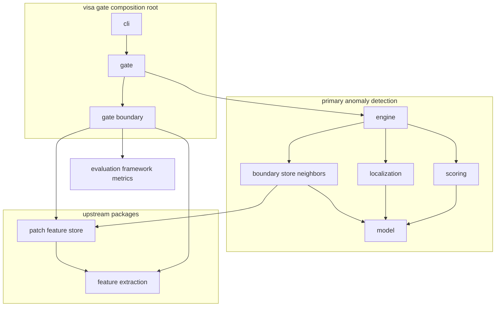
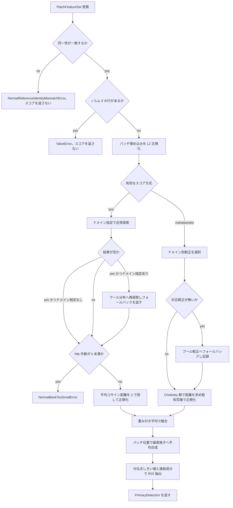
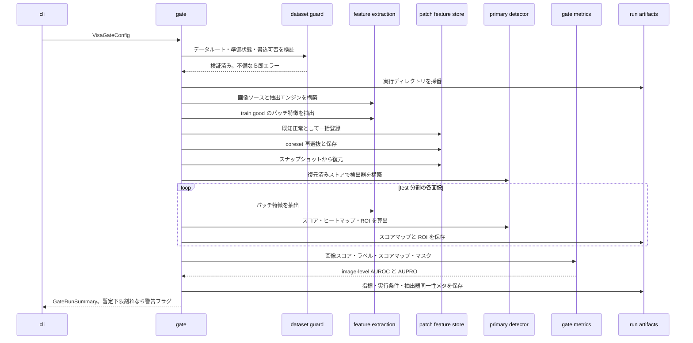

# 技術設計書

## Overview

**Purpose**: 本機能は、固定 SSL ViT が出力したパッチ特徴を正常分布と突き合わせ、
教師なしで欠陥候補ヒートマップと ROI 候補を得る一次検出を提供する。

**Users**: 検査エンジニアはスコア方式と重みを切り替えて検出の効き方を調整し、検査オペレータは
ヒートマップと ROI 候補で確認対象を絞り込む。開発者は VisA 検証ゲート CLI で
特徴テンソル → ストアレコード → スコア／ROI のデータ契約が成立することを確認する。

**Impact**: `feature_extraction`（パッチ特徴抽出）と `patch_feature_store`（正常メモリバンク）
の 2 パッケージは実装済みだが、両者を通す合成ルートが存在しない。本機能は
スコア化パッケージ `primary_anomaly_detection` と、検証ゲートの合成ルートパッケージ
`visa_gate` を追加し、初めてパイプラインを端から端まで接続する。

### Goals

- パッチ単位の異常スコアを Mahalanobis 距離と k 近傍距離で算出し、埋め込み次元に依存しない
  共通尺度へ揃えて重み付き融合する。
- パッチスコアから元画像と同じ画素格子のヒートマップを生成し、分位点基準で ROI 候補を切り出す。
- ドメイン別正常分布との突き合わせを任意経路として提供し、対応分布が無い場合は
  ドメイン非依存へフォールバックする。
- VisA でメモリバンク構築 → スコア化 → 最小指標を通しで実行する CLI を提供し、
  実行条件と結果を出力先に残す。

### Non-Goals

- HITL フィードバックによるスコア補正と最終判定（`promptable-correction-layer` が所有）。
- image-level AUROC / AUPRO の算出処理そのもの、閾値の運用点確定、コスト感度分析
  （`evaluation-framework` が所有）。
- データセットの読み込み・train/test 分割・GT マスク取得（`feature_extraction` の
  入力アダプタが所有）。
- 正常メモリバンクの構築ロジック・永続化・近傍索引の管理（`patch_feature_store` が所有）。
- MAE ピクセル再構成誤差（将来検討）。

## 境界コミットメント

### This Spec Owns

- パッチ単位異常スコアの算出規則（k 近傍距離、Mahalanobis 距離）と、その正規化規則。
- 複数スコア方式の融合規則と、融合に用いた条件の記録。
- パッチスコアから画素格子ヒートマップへの合成規則（重なり領域の合成を含む）。
- 分位点による ROI 候補の切り出し規則と、ROI 候補の識別子・位置範囲・代表スコア。
- ドメイン別正常分布との突き合わせ経路と、対応分布が無い場合のフォールバック判定。
- VisA 検証ゲートの合成ルート（引数解釈、実行前の安全検証、実行順序、成果物の出力レイアウト、
  実行条件の記録）。
- 上記を実現する 2 パッケージ `src/primary_anomaly_detection/`（Req 1–6）と
  `src/visa_gate/`（Req 7–10）の公開契約。

### Out of Boundary

- 正常メモリバンクの登録・集約・coreset 再選抜・剪定・永続化の実装
  （`patch_feature_store` が所有。本機能は公開 API を呼ぶだけ）。
- パッチ特徴・パッチ位置・抽出器同一性メタの生成、データセット読み込み
  （`feature_extraction` が所有）。
- image-level AUROC / AUPRO の計算実装（`evaluation-framework` が所有。本機能は port を
  定義して合成ルートから呼ぶだけ）。
- 補正レイヤによるスコア再構成・最終判定。
- 正常メモリバンクから正常特徴ベクトルを読み出す新 API の追加
  （`patch_feature_store` の公開契約変更にあたるため本 spec では行わない）。

### Allowed Dependencies

- `primary_anomaly_detection` → `patch_feature_store` → `feature_extraction`（一方向）。
  `patch_feature_store` の import は `primary_anomaly_detection.boundary` に閉じる。
- `visa_gate` → `primary_anomaly_detection` / `patch_feature_store` / `feature_extraction` /
  `evaluation_framework`（合成ルートなので全方向へ出せる。逆向きは禁止）。
- `primary_anomaly_detection` は `visa_gate`・`evaluation_framework`・`correction_layer` を
  import しない。
- `torch` / `timm` / `anomalib` / `faiss` は `primary_anomaly_detection` では
  `boundary` の内側でも直接 import しない（本パッケージは numpy / scipy のみで書く）。
  `boundary` が `patch_feature_store` 経由で faiss を推移的に引くことは許す
  （ストアの公開 API を呼ぶ以上避けられない）。
- 上記はすべて `pyproject.toml` の import-linter contract に追加して CI で検査する
  （contract 一覧と検査粒度は「ファイル構造計画 > Modified Files」に記載）。ただし
  `evaluation_framework → visa_gate` の逆向き禁止だけは、同パッケージが未実装で
  `root_packages` に加えられないため、`evaluation-framework` 実装時に追加する。

### Revalidation Triggers

- `PatchFeatureSet.positions` の意味（元画像座標系の `(top, left)`、タイル全面被覆）が変わる
  → ヒートマップの画素格子復元が壊れる。
- `NeighborHit.distance` の尺度（コサイン距離 `1 - 類似度`、範囲 `[0, 2]`）が変わる
  → k 近傍スコアの正規化規則が壊れる。
- `patch_feature_store` が登録・問い合わせ時の内部 L2 正規化をやめる、または
  `feature_extraction` が埋め込みを L2 正規化して返すようになる
  → 較正空間・スコア空間・近傍探索空間を揃える前提（正規化を行うのはストアの `admission` と、
  本パッケージでは `scoring/mahalanobis.py` の `l2_normalize_rows()` を呼ぶ
  `MahalanobisCalibration.fit`/`extend` と `detect()` だけ）が変わる。
- `PatchFeatureStore.search_normal` のシグネチャ、または対象ドメイン不在時に空タプルを返す
  挙動が変わる → ドメインフォールバック判定が壊れる。
- `ExtractorIdentity` のフィールド構成が変わる → 同一性照合と実行条件記録が壊れる。
- `GateMetrics` port のシグネチャが変わる → `evaluation-framework` 側の前倒し実装と不整合になる。
- `primary_anomaly_detection` の公開結果型（`PrimaryDetection` / `RoiCandidate`）が変わる
  → `llm-feedback-structuring` / `promptable-correction-layer` / `evaluation-framework` に波及。

## Architecture

### Existing Architecture Analysis

既存 3 パッケージは同一の層パターン（`model` → 関心事別の中間層 → `engine`）で構成され、
外部 ML ライブラリの import は `boundary` に閉じ、依存方向は import-linter で強制されている。
本機能もこのパターンを踏襲する。

尊重すべき既存境界と統合点は次の 4 点。

- **正常近傍探索**: `PatchFeatureStore.search_normal(NormalSearchQuery) -> tuple[NeighborHit, ...]`。
  距離はコサイン距離で `[0, 2]`。1 クエリ 1 呼び出し。バッチ経路は公開されていない。
- **正常特徴の読み出し経路は非公開**: ストアはベクトル復元を公開していない。したがって
  Mahalanobis の入力となる正常特徴はストアからは取れない。
- **初期構築経路**: `RegistrationRequest(kind=NORMAL, evidence=DatasetEvidence(...))` が
  データセット由来既知正常の一括登録経路。`admission` が `ImageLabel.NORMAL` を要求する。
- **抽出器同一性照合**: 登録・問い合わせの両方で `accept_*` が
  `ExtractorIdentityMismatchError` を送出する。ただし判定対象は「問い合わせに渡された同一性メタ」
  であり、ストアは自身が保持する同一性メタを公開しない。したがって入力特徴の同一性メタを
  問い合わせにそのまま載せない限り、この照合は成立しない。また近傍探索を呼ばない構成
  （Mahalanobis 単独）では照合経路が無いため、検出器側にも照合点が必要になる。

技術的負債の回避方針として、`patch_feature_store` に読み出し API を足す変更は行わない。
Requirement 2 の入力は**合成ルートが供給する**（後述の設計判断を参照）。

### Architecture Pattern & Boundary Map



**Architecture Integration**:

- **Selected pattern**: 既存踏襲のレイヤード（`model` → 中間層 → `engine`）＋
  合成ルートのパッケージ分離。スコア化ロジックと外部配線を別パッケージにすることで、
  `evaluation-framework → primary-anomaly-detection` の依存と逆行させずに指標を呼べる。
- **Domain/feature boundaries**: `primary_anomaly_detection` は「特徴 → スコア → ヒートマップ →
  ROI」だけを持ち、データセット・永続化・指標を一切知らない。`visa_gate` は逆にロジックを持たず、
  順序と配線と入出力だけを持つ。
- **Existing patterns preserved**: port は Protocol、port 実装の入口は `boundary` の
  snake_case ファクトリ関数、設定は pydantic `extra="forbid"`、パッケージ間を渡る数値は
  `np.float32` の C 連続配列。
- **New components rationale**: 合成ルートを別パッケージ `visa_gate` にする理由は
  循環依存の回避（下記 Key Decision 1）。
- **Steering compliance**: `tech.md` の「パッケージ間の依存も一方向」「外部 ML ライブラリは
  boundary 限定」「距離尺度はコサイン固定」「重み固定・推論時適応」に整合。

**Key Decisions**（詳細な代替案比較は `research.md`）:

1. **合成ルートを別パッケージ `visa_gate` にする**。CLI を `primary_anomaly_detection` 内に置くと
   パッケージ単位で `primary_anomaly_detection → evaluation_framework` の import が生まれ、
   将来の `evaluation_framework → primary_anomaly_detection` と相互依存になる。
   steering はパッケージ間相互依存を両向きの forbidden contract で禁止している。
2. **Mahalanobis の正常特徴は呼び出し側が供給する**。ストアは正常ベクトルの読み出しを公開して
   いない。VisA ゲートは登録前の正常パッチ特徴を手元に持つため、同じ配列を較正へ渡せる。
   ストアへの API 追加は境界外。
3. **スコアの共通尺度は「次元非依存かつテスト入力非依存」の固定写像**。
   k 近傍は `mean(コサイン距離) / 2`、Mahalanobis は `d / (d + sqrt(D))`。いずれも
   `[0, 1)` に収まり、埋め込み次元 `D` が変わっても同じ規則で算出できる（Req 3.4）。
   画像内分布に依存する正規化（z-score・順位化）は採らない。画像ごとに尺度が変わると
   image-level 比較が壊れるため。
4. **ヒートマップの画素格子は `positions` から復元する**。`PatchFeatureSet` は画像 H/W を
   持たないが、`max(top) + patch_stride` / `max(left) + patch_stride` が厳密に H/W と一致する。
   呼び出し側から H/W を別経路で受け取ると、特徴と食い違ったときに誤りが検出できない。

### Technology Stack

| Layer | Choice / Version | Role in Feature | Notes |
| --- | --- | --- | --- |
| CLI | Python 標準 `argparse` | ゲート引数の解釈 | `package = false` のため `scripts/` から起動 |
| 数値計算 | numpy `>=2.1,<3` | スコア・共分散・合成 | 既存依存 |
| 線形代数 | numpy `linalg.cholesky` / `solve` | Mahalanobis 距離 | 追加依存なし |
| 連結成分 | scipy `>=1.13` `ndimage.label` | ROI 切り出し | 既存依存。本 spec が初使用 |
| 近傍探索 | `patch_feature_store`（FAISS Flat） | k 近傍距離 | 本 spec は API を呼ぶだけ |
| 特徴抽出 | `feature_extraction`（timm / anomalib） | パッチ特徴とデータ入力 | 本 spec は API を呼ぶだけ |
| 指標 | `evaluation_framework`（前倒し実装） | AUROC / AUPRO | port 経由。未実装（下記リスク） |
| 永続化 | `numpy.save` ＋ JSON | 成果物出力 | 既存ストアと同じ方式 |

## ファイル構造計画

### Directory Structure

```text
src/
├── primary_anomaly_detection/         # Req 1-6: スコア化・ヒートマップ・ROI
│   ├── __init__.py                    # 公開 API（結果型・設定型・エラー・port 実装入口）
│   ├── model/
│   │   ├── types.py                   # ScoreMethod StrEnum
│   │   ├── config.py                  # DetectionConfig（pydantic, extra=forbid）
│   │   ├── results.py                 # PrimaryDetection / RoiCandidate / ScoringProvenance
│   │   ├── errors.py                  # 一次検出のエラー型
│   │   └── ports.py                   # NormalNeighborSearch Protocol
│   ├── scoring/
│   │   ├── knn.py                     # k 近傍距離スコアと正規化
│   │   ├── mahalanobis.py             # 行単位 L2 正規化・正常分布の較正・再較正と距離スコア
│   │   └── fusion.py                  # 重み付き融合
│   ├── localization/
│   │   ├── heatmap.py                 # パッチスコア→画素格子ヒートマップ合成
│   │   └── roi.py                     # 分位点しきい値と連結成分から ROI 候補生成
│   ├── boundary/
│   │   └── store_neighbors.py         # PatchFeatureStore を NormalNeighborSearch へ適合
│   └── engine.py                      # composition root（PrimaryAnomalyDetector）
└── visa_gate/                         # Req 7-10: VisA 検証ゲート合成ルート
    ├── __init__.py                    # 公開 API（run_visa_gate / VisaGateConfig / エラー）
    ├── model/
    │   ├── config.py                  # VisaGateConfig とバックボーンプリセット
    │   ├── results.py                 # GateRunConditions / GateMetricValues / GateRunSummary
    │   ├── errors.py                  # データセット準備・書き込みのエラー型
    │   └── ports.py                   # GateMetrics Protocol
    ├── boundary/
    │   ├── dataset_guard.py           # 実行前検証（存在・準備済み・ダウンロード許可・書込可否）
    │   ├── extraction_assembly.py     # 画像ソースと FeatureExtractionEngine の組み立て
    │   ├── store_assembly.py          # PatchFeatureStore の構築・保存・復元
    │   ├── run_artifacts.py           # 実行ディレクトリ採番と成果物書き出し
    │   └── metrics_adapter.py         # evaluation_framework を GateMetrics へ適合
    ├── gate.py                        # ゲート通し実行（run_visa_gate）
    └── cli.py                         # argparse による引数解釈と終了コード
scripts/
└── visa_gate.py                       # `mise run visa-gate` から呼ぶ薄いエントリ
tests/
├── test_primary_scoring_knn.py
├── test_primary_scoring_mahalanobis.py
├── test_primary_scoring_fusion.py
├── test_primary_heatmap.py
├── test_primary_roi.py
├── test_primary_engine.py
├── test_primary_store_neighbors.py
├── test_primary_public_api.py
├── test_visa_gate_config.py
├── test_visa_gate_dataset_guard.py
├── test_visa_gate_run_artifacts.py
├── test_visa_gate_gate.py
├── test_visa_gate_cli.py
└── test_visa_gate_e2e.py              # 実データ・実重み・指標実装が揃うときだけ実行
```

同一中間層のモジュール同士は import しない（`scoring/*` 相互、`localization/*` 相互、
`visa_gate/boundary/*` 相互）。配線は `engine.py` / `gate.py` が行う。

### Modified Files

- `pyproject.toml` — import-linter の `root_packages` に `primary_anomaly_detection` と
  `visa_gate` を追加し、下記 contract を追記する。
  - `primary_anomaly_detection` 層順: `engine` →
    `boundary | scoring | localization` → `model`
  - `primary_anomaly_detection.model` 内層順: `ports | results` → `config` → `errors | types`
  - `scoring.knn` / `scoring.mahalanobis` / `scoring.fusion` の independence
  - `localization.heatmap` / `localization.roi` の independence
  - `torch` / `timm` / `anomalib` / `faiss` を `primary_anomaly_detection` 全体で forbidden。
    `allow_indirect_imports = true` を付ける（理由は下記）
  - `patch_feature_store` を `primary_anomaly_detection.model` / `.scoring` / `.localization` /
    `.engine` から forbidden。ストア型に触れられるのは `boundary` だけであることを CI で強制する
    （既存の「`correction_layer` / `feature_extraction` は `patch_feature_store` を import しない」
    `pyproject.toml:225-232` と同じ形）
  - `primary_anomaly_detection` から `visa_gate` / `evaluation_framework` /
    `correction_layer` を forbidden
  - `correction_layer` / `feature_extraction` / `patch_feature_store` から
    `primary_anomaly_detection` / `visa_gate` を forbidden
  - `visa_gate` 層順: `cli` → `gate` → `boundary` → `model`
  - `visa_gate.boundary` 内モジュールの independence
- `mise.toml` — `[tasks.visa-gate]` を追加（`PYTHONPATH=src uv run python scripts/visa_gate.py`）。
- `README.md` — 実装済みパッケージ一覧に 2 パッケージとゲート起動コマンドを追記。

ML ライブラリ contract に `allow_indirect_imports = true` を付ける理由: 既定は `false` で
間接チェーンも違反になる（`importlinter/contracts/forbidden.py:72` の default False、
同 131 行で直接チェーンのみに切り替わることを確認）。`boundary/store_neighbors.py` は
`patch_feature_store` を使い、その公開 root `patch_feature_store/__init__.py:3` は
`boundary/faiss_index.py` を import するため、既定のままでは「ストアの公開 API を呼ぶだけ」の
実装が faiss 違反として落ちる。`true` にすると直接 import だけが違反になり、
「本パッケージのどの層も ML ライブラリを直接 import しない」という宣言を `boundary` まで含めて
検査できる。既存 2 パッケージのように `source_modules` から `boundary` を除く形は採らない。
本パッケージの `boundary` は ML ライブラリを必要とせず、検査対象から外す理由がないため。

`visa_gate` には ML ライブラリの forbidden contract を置かない。合成ルートとして
`patch_feature_store` / `feature_extraction` の公開ファクトリ（`faiss_flat_index` /
`anomalib_coreset_selector` / `visa_image_source` など boundary 由来の関数）を直接呼ぶ必要が
あるため。ML ライブラリ隔離は各ドメインパッケージ側で担保する。

## System Flows

### 一次検出のスコア算出フロー



フォールバックは k 近傍と Mahalanobis で独立に判定し、それぞれが判定結果を戻り値で返す。
k 近傍は `neighbor_distances()` の 2 要素目、Mahalanobis は `select()` の 2 要素目が伝達口で、
`detect()` が有効な方式の分だけ論理和を取り、結果に 1 つの `domain_fallback_applied` として
集約する（いずれかで発生したら true）。

### VisA 検証ゲートの実行フロー



## 要件トレーサビリティ

| ID | 実現コンポーネント | 主要契約・判定点 |
| --- | --- | --- |
| 1.1 | `scoring/knn.py`, `boundary/store_neighbors.py` | `knn_scores()` が k 近傍距離からスコアを算出 |
| 1.2 | `model/config.py`, `model/results.py` | `neighbor_count` を設定受領・結果記録 |
| 1.3 | `scoring/knn.py`, `model/errors.py` | フォールバック後の件数 `< k` で `NormalBankTooSmallError` |
| 1.4 | `engine.py`, `scoring/*` | 決定的演算のみ。乱数・並び依存を持たない |
| 2.1 | `scoring/mahalanobis.py` | `MahalanobisCalibration.scores()` |
| 2.2 | `scoring/mahalanobis.py`, `model/results.py` | `normal_feature_count` を結果へ記録 |
| 2.3 | `scoring/mahalanobis.py`, `model/errors.py` | `N < D+1` / Cholesky 失敗でエラー |
| 2.4 | `scoring/mahalanobis.py` | `extend()` が十分統計量を足して再較正 |
| 3.1 | `model/config.py` | `method_weights` を設定受領 |
| 3.2 | `scoring/fusion.py` | 正規化済みスコアの重み付き平均 |
| 3.3 | `scoring/fusion.py` | 単一方式時は当該方式の正規化スコアをそのまま返す |
| 3.4 | `scoring/knn.py`, `scoring/mahalanobis.py` | 次元非依存の固定正規化写像 |
| 3.5 | `model/config.py`, `localization/roi.py` | `roi_quantile` を受領。絶対値しきい値を持たない |
| 3.6 | `model/results.py` | `method_weights` を結果記録 |
| 3.7 | `model/config.py` | pydantic validator が空の重み集合を構築時に拒否 |
| 4.1 | `localization/heatmap.py` | `compose_heatmap(scores, positions, patch_stride)` |
| 4.2 | `localization/heatmap.py` | `positions` から H/W を復元し `(H, W)` を返す |
| 4.3 | `localization/heatmap.py` | 重なり画素は算術平均。順序非依存で決定的 |
| 4.4 | `model/results.py`, `engine.py` | `PrimaryDetection.provenance` に方式・重み・k・同一性 |
| 5.1 | `localization/roi.py` | 分位点しきい値超え画素の連結成分 |
| 5.2 | `model/results.py` | `RoiCandidate` に外接矩形と代表スコア |
| 5.3 | `localization/roi.py` | 画像内で 1 から連番の `roi_id` |
| 5.4 | `localization/roi.py`, `model/config.py` | 代表スコア降順・`roi_max_count` で打ち切り |
| 5.5 | `localization/roi.py` | 該当領域なしは空タプル（エラーにしない） |
| 6.1 | `engine.py`, `model/config.py` | `domain_scoped` 既定 false でプール分布 |
| 6.2 | `boundary/store_neighbors.py`, `scoring/mahalanobis.py` | ドメインタグで分布を選択 |
| 6.3 | `engine.py` | ドメイン不一致を候補除外の理由にしない |
| 6.4 | `boundary/store_neighbors.py`, `scoring/*`, `engine.py` | 空結果／較正欠如でプール再探索し戻り値で伝達 |
| 6.5 | `model/results.py` | `domain_scope` に使用したドメイン範囲を記録 |
| 7.1 | `visa_gate/gate.py`, `boundary/store_assembly.py` | 既知正常一括登録 → 保存 → 復元 |
| 7.2 | `visa_gate/gate.py` | test 分割の各画像でスコア・ヒートマップ・ROI |
| 7.3 | `visa_gate/model/ports.py`, `boundary/metrics_adapter.py` | `GateMetrics.evaluate()` |
| 7.4 | `boundary/run_artifacts.py` | スコアマップ・ROI・指標・同一性メタを出力先へ保存 |
| 7.5 | `visa_gate/gate.py`, `cli.py` | AUROC < 0.9 で配線確認を促す警告 |
| 8.1 | `visa_gate/cli.py` | data-root / category / backbone / output-dir 引数 |
| 8.2 | `visa_gate/cli.py` | `--data-root` は `required=True`、既定値なし |
| 8.3 | `visa_gate/cli.py`, `model/config.py` | 既定 `pcb1`、`CATEGORIES` を `choices` |
| 8.4 | `boundary/run_artifacts.py` | 条件別ディレクトリ採番。既存を上書きしない |
| 8.5 | `model/config.py`, `model/results.py`, `boundary/run_artifacts.py` | 条件値の発生源と保存 |
| 9.1 | `boundary/dataset_guard.py`, `model/errors.py` | ルート不在で `DatasetRootMissingError` |
| 9.2 | `visa_gate/cli.py`, `model/config.py` | `--download` 既定 false |
| 9.3 | `boundary/dataset_guard.py` | 未取得かつ未許可で `DatasetNotPreparedError` |
| 9.4 | `boundary/dataset_guard.py` | 書込不可で `DatasetLocationNotWritableError` |
| 9.5 | `primary_anomaly_detection/engine.py`, `visa_gate/gate.py` | `detect()` 冒頭で同一性照合し送出 |
| 10.1 | `visa_gate/gate.py`, `visa_gate/__init__.py` | `run_visa_gate()` を公開し import 可能 |
| 10.2 | `tests/test_visa_gate_e2e.py` | データ未取得時は `pytest.skip` |

## Components and Interfaces

| Component | Layer | Intent | Req | Key Dependencies | Contracts |
| --- | --- | --- | --- | --- | --- |
| DetectionConfig | model | 検出設定の検証 | 3.1, 3.5, 3.7 | pydantic (P0) | State |
| NormalNeighborSearch | model | 近傍探索の差し替え seam | 1.1, 1.3, 6.2, 6.4, 9.5 | numpy (P0) | Service |
| KnnScorer | scoring | k 近傍スコア | 1.1-1.4, 3.4, 6.4, 9.5 | port (P0) | Service |
| MahalanobisCalibration | scoring | 正常分布の較正と距離 | 2.1-2.4, 3.4 | numpy (P0) | Service, State |
| ScoreFusion | scoring | 重み付き融合 | 3.2, 3.3 | model (P0) | Service |
| HeatmapComposer | localization | 画素格子への合成 | 4.1-4.3 | numpy (P0) | Service |
| RoiExtractor | localization | ROI 候補抽出 | 5.1-5.5 | scipy ndimage (P0) | Service |
| StoreNeighborSearch | boundary | ストア適合 | 1.1, 6.2, 6.4, 9.5 | patch_feature_store (P0) | Service |
| PrimaryAnomalyDetector | engine | 検出の合成 | 1-6, 9.5 | 上記全部 (P0) | Service |
| DatasetGuard | gate boundary | 実行前検証 | 9.1-9.4 | pathlib (P0) | Service |
| RunArtifacts | gate boundary | 成果物出力 | 7.4, 8.4, 8.5 | numpy, json (P0) | Batch |
| GateMetrics | gate model | 指標取得 seam | 7.3 | evaluation_framework (P0) | Service |
| VisaGate | gate | 通し実行 | 7.1-7.5, 10.1 | 上記全部 (P0) | Batch |
| VisaGateCli | cli | 引数解釈 | 8.1-8.3, 9.2 | argparse, anomalib (P0) | Service |

### 一次異常検出

#### DetectionConfig

| Field | Detail |
| --- | --- |
| Intent | 検出の設定値を構築時に検証して保持する |
| Requirements | 3.1, 3.5, 3.7, 1.2, 5.4, 6.1 |

##### Responsibilities & Constraints (DetectionConfig)

- pydantic `BaseModel` + `model_config = ConfigDict(extra="forbid")`。不正値は構築時に拒否する。
- `method_weights` が空、または 0 以下の重みを含む場合は `ValueError` を送出する（Req 3.7）。
- ROI の運用点は分位点のみ。異常スコアの絶対値しきい値フィールドを持たない（Req 3.5）。

##### Service Interface (DetectionConfig)

```python
class ScoreMethod(StrEnum):
    KNN = "knn"
    MAHALANOBIS = "mahalanobis"


class DetectionConfig(BaseModel):
    model_config = ConfigDict(extra="forbid")

    method_weights: Mapping[ScoreMethod, float]
    neighbor_count: int = 5
    roi_quantile: float = 0.99
    roi_max_count: int = 16
    domain_scoped: bool = False
```

- Preconditions: `method_weights` は 1 件以上、各値 > 0。`neighbor_count >= 1`。
  `0 < roi_quantile < 1`。`roi_max_count >= 1`。
- Postconditions: 構築に成功した設定は以後不変。
- Invariants: 有効なスコア方式の集合は `method_weights` のキー集合と一致する。

#### NormalNeighborSearch（port）

| Field | Detail |
| --- | --- |
| Intent | 正常メモリバンクへの近傍距離取得を差し替え可能にする |
| Requirements | 1.1, 1.3, 6.2, 6.4, 9.5 |

##### Responsibilities & Constraints (NormalNeighborSearch)

- `patch_feature_store` の型（`NeighborHit`・`DomainCriteria`・`NormalSearchQuery`）を本パッケージへ
  持ち込まない。受け渡すのは numpy 配列・`DomainTags`・`ExtractorIdentity`・距離のタプルと
  フォールバック有無の bool だけ。
  `ExtractorIdentity` は `feature_extraction` の型で、本パッケージも結果記録に使う。
- 返す距離は昇順、長さは `k` 以下。長さが `k` 未満なら参照可能な正常件数がその値である。
- ドメインを指定した探索が 0 件だった場合、プール（`domain=None`）へ切り替えて探索し直すのは
  実装側の責務。切り替えたかどうかを戻り値の 2 要素目で返す（Req 6.4）。呼び出し側が
  空の距離列からフォールバックの要否を判断する経路は持たせない。
- `identity` は呼び出しごとに受け取る。入力特徴の同一性メタを正常メモリバンク側の値と照合するのは
  実装側（ストア）の責務であり、port は値を素通しするだけ（Req 9.5）。

##### Service Interface (NormalNeighborSearch)

```python
class NormalNeighborSearch(Protocol):
    def neighbor_distances(
        self,
        embedding: np.ndarray,          # shape (D,), float32, L2 正規化済み
        k: int,
        domain: DomainTags | None,      # None はプール（ドメイン非依存）
        identity: ExtractorIdentity,    # 入力特徴の抽出器同一性メタ
    ) -> tuple[tuple[float, ...], bool]: ...
```

- Preconditions: `embedding` は有限値で L2 ノルム > 0。`k >= 1`。
- Postconditions: 戻り値は「昇順のコサイン距離（範囲 `[0, 2]`）」と「プールへフォールバック
  したか」の組。距離列はフォールバック後の探索結果であり、`domain=None` の呼び出しでは
  2 要素目が常に false。
- Invariants: 同一入力に対して同一出力（Req 1.4）。

#### StoreNeighborSearch（boundary 実装）

| Field | Detail |
| --- | --- |
| Intent | `PatchFeatureStore` を `NormalNeighborSearch` へ適合させる |
| Requirements | 1.1, 6.2, 6.4, 9.5 |

##### Dependencies (StoreNeighborSearch)

- Outbound: `PatchFeatureStore.search_normal` — 近傍探索 (P0)
- External: なし（`patch_feature_store` 経由でのみ FAISS に触れる）

##### Responsibilities & Constraints (StoreNeighborSearch)

- `DomainTags` を `DomainCriteria` へ変換する。`None` でない軸だけを 1 要素の
  `frozenset` として渡す。全軸 `None` の `DomainTags` はプール扱い（`domain=None`）にする。
- `NormalSearchQuery(embedding, k, identity, domain, bank_id)` を組み立てて呼ぶ。`identity` は
  `neighbor_distances()` の引数をそのまま渡す。ファクトリで固定すると入力特徴の同一性メタが
  ストアへ届かず、`accept_query` の照合が常に成立してしまうため（Req 9.5）。
- `bank_id` には常に `None` を渡す。`NormalSearchQuery` の必須フィールドなので省略できないが、
  バンク単位に絞った突き合わせは Requirement 1–10 にも呼び出し元にも存在しない。必要になった
  時点で `NormalNeighborSearch` port の契約追加として、渡す呼び出し元と一緒に入れる。
- ドメインを指定した探索が空タプルを返したら、同じクエリを `domain=None` で組み直して
  再探索し、その距離列と `True` の組を返す（Req 6.4）。`search_normal` は対象ドメインの
  正常分布が無いとき例外ではなく空タプルを返す（`engine.py` の `_normal_search_selection` が
  `None` を返す経路）ため、この空判定がフォールバックの唯一の検知点である。ドメイン未指定の
  呼び出しと、再探索を要さなかった呼び出しは `False` を返す。
- `ExtractorIdentityMismatchError` は握り潰さず素通しする。
  「ストアが保持する同一性メタと入力の同一性メタが一致するか」の判定はストアが所有する。
- ストアからの import はサブモジュール粒度で書く（`from patch_feature_store.engine import
  PatchFeatureStore`、`from patch_feature_store.model.query import NormalSearchQuery` など）。
  既存の跨ぎ方（`patch_feature_store` から `from feature_extraction.model.features import ...`）と
  同じ流儀に揃えるため。`patch_feature_store` を import できる唯一のモジュールがこのファイルで
  あることは Modified Files の forbidden contract が保証する。

##### Service Interface (StoreNeighborSearch)

```python
def store_normal_neighbor_search(store: PatchFeatureStore) -> NormalNeighborSearch: ...
```

#### KnnScorer

| Field | Detail |
| --- | --- |
| Intent | k 近傍距離から次元非依存の正規化スコアを算出する |
| Requirements | 1.1, 1.2, 1.3, 1.4, 3.4, 6.4, 9.5 |

##### Responsibilities & Constraints (KnnScorer)

- パッチごとに `neighbor_distances()` を 1 回呼ぶ。取得距離の平均を `2.0` で除して `[0, 1]` へ
  写す。除数 `2.0` はコサイン距離の理論上限であり、埋め込み次元に依存しない（Req 3.4）。
- 件数不足の判定は port が返した距離列、すなわちフォールバック後の結果に対して行う。
  取得件数が `k` 未満のパッチが 1 つでもあれば、以降のスコアを返さずに
  `NormalBankTooSmallError(requested_k, available_count)` を送出する（Req 1.3）。
  ドメイン指定で 0 件だった場合はプール再探索の結果で判定されるため、フォールバックすべき
  状況が件数不足として誤検知されることはない。
- 各パッチのフォールバック有無の論理和を、スコア配列と組にして返す（Req 6.4）。
- `identity` は引数で受け取り、そのまま `neighbor_distances()` へ渡す。自前で保持しない。

##### Service Interface (KnnScorer)

```python
def knn_scores(
    embeddings: np.ndarray,             # (P, D) float32, L2 正規化済み
    search: NormalNeighborSearch,
    k: int,
    domain: DomainTags | None,
    identity: ExtractorIdentity,
) -> tuple[np.ndarray, bool]:           # ((P,) float32 範囲 [0, 1], フォールバックしたか)
    ...
```

- Preconditions: `embeddings` は 2 次元・有限値で、各行の L2 ノルム > 0
  （`neighbor_distances()` の port 契約と同じ前提。`detect()` が正規化済みで渡す）。`k >= 1`。
- Postconditions: スコアは入力行と同じ順序・同じ件数。2 要素目はいずれかのパッチで
  プールへのフォールバックが起きたとき true。
- Invariants: 同一入力・同一バンクに対して同一出力（Req 1.4）。

#### MahalanobisCalibration

| Field | Detail |
| --- | --- |
| Intent | 正常特徴から分布を推定し、次元非依存の正規化スコアを算出する |
| Requirements | 2.1, 2.2, 2.3, 2.4, 3.4, 6.2 |

##### Responsibilities & Constraints (MahalanobisCalibration)

- 較正は**十分統計量**（件数 `sample_count`、和ベクトル `sum_vector` `(D,)`、スキャッタ行列
  `scatter` `(D, D)`。配列はいずれも float64）で保持する。元の特徴配列は保持しない。
  再較正はこの統計量に追加分を足して行うため、「全件をまとめて較正した結果」と一致する（Req 2.4）。
- 平均は `sum_vector / sample_count`、共分散は
  `(scatter - sample_count * mu muT) / (sample_count - 1)` として統計量から導く。
- 共分散の Cholesky 因子 `cholesky_factor` もフィールドとして持つ。分解の成否が Req 2.3 の
  判定そのものであり、`fit` / `extend` の時点で確定させる必要があるため。これにより
  `scores()` は分解済みの因子を使うだけになり、較正 1 回につき分解 1 回で済む。
- `embedding_dim` は `sum_vector` の長さ、`normal_feature_count` は `sample_count` から導出する
  プロパティ。同じ事実を別フィールドとして二重に持たない。
- `sample_count < D + 1` の場合、または共分散の Cholesky 分解が失敗した場合は
  `NormalFeatureCountInsufficientError(feature_count, embedding_dim)` を送出する（Req 2.3）。
  数値安定化のためのリッジ項は加えない。加えると Req 2.3 の不足検知が働かなくなるため。
- 距離は `L z = (x - mu)` を三角行列で解いて `d = ||z||` として求める。逆行列は作らない。
- 正規化は `d / (d + sqrt(D))`。`D` で割ることで次元差を吸収し、`[0, 1)` に収める（Req 3.4）。
- **較正空間の L2 正規化は本コンポーネントの責務**。`fit()` / `extend()` は受け取った特徴を
  行ごとに L2 正規化してから十分統計量へ積む。抽出器は埋め込みを L2 正規化しない
  （`feature_extraction/boundary/timm_backbone.py` の正規化は入力画素の平均・分散正規化と
  backbone final norm だけ）ため、合成ルートから渡る `train/good` の特徴は未正規化である。
  一方ストアは登録・問い合わせの内部でベクトルを L2 正規化する
  （`patch_feature_store/catalog/admission.py`）。較正だけを未正規化空間に残すと、
  `detect()` がスコア化する空間（L2 正規化後）と平均・共分散の空間が食い違い、
  エラーにならずに距離だけが無意味になる。正規化を較正側に置くことでこの食い違いを構造的に断つ。
- 行単位 L2 正規化の定義は本モジュールの `l2_normalize_rows()` 1 箇所に置く。`fit()` /
  `extend()` も `engine.py` の `detect()` もこの関数を呼ぶだけにする。同じ正規化を 2 箇所に
  書くと、片方だけが退化入力の扱いを変えたときに空間の食い違いが再発するため。
- ノルム 0 の行は正規化できないため `l2_normalize_rows()` が `ValueError` を送出する
  （ストアの `admission.py:132-134` / `147-149` と同じ型・同じ判定）。`fit()` / `extend()` /
  `detect()` の 3 経路ともこの送出を継承し、十分統計量にもスコアにも到達させない。
- `scores()` は入力を再正規化しない。呼び出し元は `PrimaryAnomalyDetector.detect()` だけで、
  そこで L2 正規化済みの埋め込みが渡る。較正入力（外部由来・未正規化）とスコア入力
  （`detect()` 由来・正規化済み）で扱いが違うため、両者を Preconditions に明記する。

##### Service Interface (MahalanobisCalibration)

```python
def l2_normalize_rows(
    features: np.ndarray,               # (N, D) float32
) -> np.ndarray:                        # (N, D) float32, 各行の L2 ノルムは 1
    ...


@dataclass(frozen=True)
class MahalanobisCalibration:
    sample_count: int
    sum_vector: np.ndarray              # (D,) float64
    scatter: np.ndarray                 # (D, D) float64, sum(x xT)
    cholesky_factor: np.ndarray         # (D, D) float64, 共分散の下三角分解

    @property
    def embedding_dim(self) -> int: ...          # sum_vector の長さ

    @property
    def normal_feature_count(self) -> int: ...   # sample_count

    @classmethod
    def fit(
        cls,
        normal_features: np.ndarray,    # (N, D) float32。内部で L2 正規化する
    ) -> "MahalanobisCalibration": ...

    def extend(
        self,
        additional_features: np.ndarray,  # (M, D) float32。内部で L2 正規化する
    ) -> "MahalanobisCalibration": ...

    def scores(
        self,
        embeddings: np.ndarray,         # (P, D) float32, L2 正規化済み（detect() が保証）
    ) -> np.ndarray: ...


@dataclass(frozen=True)
class MahalanobisCalibrationSet:
    pooled: MahalanobisCalibration
    by_domain: Mapping[DomainTags, MahalanobisCalibration]

    def select(self, domain: DomainTags | None) -> tuple[MahalanobisCalibration, bool]: ...
```

- Preconditions: `normal_features` / `additional_features` は `(N, D)` float32 の有限値で、
  各行の L2 ノルム > 0（違反した行があれば `l2_normalize_rows()` が `ValueError`）。
  L2 正規化は `fit` / `extend` が内部で行うため、呼び出し側は
  正規化済みでも未正規化でも渡せる（正規化は冪等）。`extend` は同じ `D`。
  `scores()` の `embeddings` は `(P, D)` float32 で**L2 正規化済み**（`detect()` が保証する）。
- Postconditions: `scores()` は `(P,)` float32、範囲 `[0, 1)`。
  `select()` は「選ばれた較正」と「プールへフォールバックしたか」を返す（Req 6.4）。
- Invariants: `fit(A).extend(B)` と `fit(concat(A, B))` は同じ平均・共分散を与える。

#### ScoreFusion

| Field | Detail |
| --- | --- |
| Intent | 正規化済みスコアを重みで融合して単一のパッチスコアにする |
| Requirements | 3.2, 3.3, 3.6 |

##### Responsibilities & Constraints (ScoreFusion)

- 融合は重み付き平均 `sum(w_i * s_i) / sum(w_i)`。各 `s_i` が `[0, 1]` なので結果も `[0, 1]`。
- 有効方式が 1 つのときは重みで割った結果が当該方式の正規化スコアそのものになる（Req 3.3）。
- 方式の走査順は `ScoreMethod` の宣言順に固定し、浮動小数の加算順を決定的にする（Req 1.4）。

##### Service Interface (ScoreFusion)

```python
def fuse_scores(
    method_scores: Mapping[ScoreMethod, np.ndarray],
    method_weights: Mapping[ScoreMethod, float],
) -> np.ndarray: ...
```

#### HeatmapComposer

| Field | Detail |
| --- | --- |
| Intent | パッチスコアを元画像と同じ画素格子へ合成する |
| Requirements | 4.1, 4.2, 4.3 |

##### Responsibilities & Constraints (HeatmapComposer)

- 画素格子は `positions` から復元する。`H = max(top) + patch_stride`、
  `W = max(left) + patch_stride`。タイル配置が画像全面を被覆し、タイル辺長が
  `patch_stride` で割り切れることが上流で保証されているため厳密に一致する。
- `patch_stride` は引数で受け取る。供給元は `PatchFeatureSet.identity.patch_stride`
  （`ExtractorIdentity` のフィールド）で、`engine.py` が `detect()` の入力から取り出して渡す。
  同じ特徴集合から H/W と刻み幅の両方を導くため、別経路の値と食い違うことがない。
- 各パッチは `[top, top + patch_stride) x [left, left + patch_stride)` の矩形へスコアを寄与する。
- 重なり画素は寄与スコアの**算術平均**とする。加算値の総和と寄与回数を別配列に積み、
  最後に除算するため、パッチの走査順に依存しない（Req 4.3）。

##### Service Interface (HeatmapComposer)

```python
def compose_heatmap(
    patch_scores: np.ndarray,     # (P,) float32
    positions: np.ndarray,        # (P, 2) int32, (top, left)
    patch_stride: int,
) -> np.ndarray:                  # (H, W) float32
    ...
```

- Preconditions: `patch_scores` と `positions` の行数が一致。`patch_stride >= 1`。
- Postconditions: 全画素が 1 回以上寄与を受ける（被覆保証）。
- Invariants: 同一入力に対して同一出力。

#### RoiExtractor

| Field | Detail |
| --- | --- |
| Intent | ヒートマップから分位点基準で ROI 候補を切り出す |
| Requirements | 5.1, 5.2, 5.3, 5.4, 5.5, 3.5 |

##### Responsibilities & Constraints (RoiExtractor)

- しきい値は `numpy.quantile(heatmap, roi_quantile)`。判定は**しきい値超過**（`>`）。
  ヒートマップが定数のときは超過画素が無く、空タプルを返す（Req 5.5）。
- 連結成分は `scipy.ndimage.label` を 8 近傍構造（`np.ones((3, 3))`）で適用する。
- 各成分の外接矩形を `top` / `left` / `height` / `width`、成分内最大スコアを
  `representative_score` とする（Req 5.2）。
- 代表スコア降順、同点は `(top, left)` 昇順で整列してから `roi_max_count` 件で打ち切り、
  先頭から `roi_id = 1, 2, ...` を振る（Req 5.3, 5.4）。整列後に採番するため、
  同一入力に対して同一の識別子になる。

##### Service Interface (RoiExtractor)

```python
def extract_roi_candidates(
    heatmap: np.ndarray,
    roi_quantile: float,
    roi_max_count: int,
) -> tuple[RoiCandidate, ...]: ...
```

#### PrimaryAnomalyDetector（engine）

| Field | Detail |
| --- | --- |
| Intent | スコア方式の選択・融合・局在化を合成して検出結果を返す |
| Requirements | 1-6, 9.5 |

##### Dependencies (PrimaryAnomalyDetector)

- Inbound: `visa_gate.gate` — ゲート実行 (P0)
- Outbound: `scoring/*`, `localization/*` — 算出 (P0)
- Outbound: `NormalNeighborSearch` port — 近傍探索 (P0)

##### Responsibilities & Constraints (PrimaryAnomalyDetector)

- 構築時に「有効な方式」と「その方式が必要とする依存」の整合を検査する。
  `KNN` が有効なのに `search` が `None`、または `MAHALANOBIS` が有効なのに
  `calibrations` が `None` の場合は構築を失敗させる。
- 構築時に `normal_identity` を受け取る。これは突き合わせ先の正常分布（メモリバンクと
  Mahalanobis 較正）を生成した `PatchFeatureSet.identity` であり、呼び出し側が渡す。
- `detect()` は最初に `features.identity` を `normal_identity` と照合し、不一致なら
  `NormalReferenceIdentityMismatchError(expected, actual)` を送出してスコアを 1 件も返さない
  （Req 9.5）。スコア方式の構成に依らず必ず通る位置に置く。`MAHALANOBIS` 単独構成では
  近傍探索を呼ばないため、ストア側の照合だけでは同一性不一致が検出されない。
- 近傍探索へは `features.identity` をそのまま渡す。同一性メタを本パッケージの複数箇所で
  保持しないため、port 実装側では固定しない。ストアは自身が保持する同一性メタと照合して
  `ExtractorIdentityMismatchError` を送出する。これは `normal_identity` の申告自体が
  ストアの実体とずれている場合を捕まえる、別の事実に対する検査である。
- `detect()` は入力 `PatchFeatureSet` の埋め込みを `scoring/mahalanobis.py` の
  `l2_normalize_rows()` で正規化してから各スコアラーへ渡す。正規化を engine 側に再実装せず
  呼ぶだけにするのは、較正空間とスコア空間で退化入力の扱いを 1 つに保つためである
  （層順は `engine` → `scoring` なので依存方向にも反しない）。突き合わせ先も同じ正規化を
  経ている（ストアは `admission`、Mahalanobis 較正は `fit()` / `extend()`）ため、
  3 経路の尺度が一致する。抽出器は L2 正規化を行わないので、この 3 箇所が正規化の全てである。
- ノルム 0 の行が 1 つでもあれば、この正規化が `fit()` / `extend()` と同型の `ValueError` を
  送出し、スコアを 1 件も返さない。正規化は同一性照合の後・スコア方式の分岐より前に置くため、
  どの構成でも必ず通る。同一性不一致とノルム 0 の行が同時に成り立つ入力では、先に通る
  同一性照合の `NormalReferenceIdentityMismatchError` が出る（Req 9.5）。
  `KNN` 有効時はストアの `accept_query` も同じ入力を弾くが、
  `MAHALANOBIS` 単独構成ではストアを呼ばないため、ここで送出しないとゼロ除算由来の nan が
  `scores()` から `fuse_scores()` / `compose_heatmap()` へ流れる。`numpy.quantile` が nan を
  返してしきい値比較が全画素 false になり、ROI 空・エラー無しという
  「距離だけが無意味になる」失敗が表に出ない。
- `compose_heatmap()` へ渡す `patch_stride` は `features.identity.patch_stride` から取る。
  H/W は同じ特徴集合の `positions` から復元されるため、格子と刻み幅の出所が 1 つに揃う。
- `domain_scoped` が false のときはドメインタグを一切参照しない（Req 6.1）。
  true のときも、ドメイン不一致を候補除外の理由には使わない（Req 6.3）。
  行うのは「突き合わせ先の分布の選択」だけで、フィルタではない。
- フォールバック発生は自分で判定せず、各スコアラーの戻り値から受け取る。`knn_scores()` の
  2 要素目と `MahalanobisCalibrationSet.select()` の 2 要素目について、有効な方式の分だけ
  論理和を取り `ScoringProvenance.domain_fallback_applied` に載せる（Req 6.4）。

##### Service Interface (PrimaryAnomalyDetector)

```python
@dataclass(frozen=True)
class RoiCandidate:
    roi_id: int
    top: int
    left: int
    height: int
    width: int
    representative_score: float


@dataclass(frozen=True)
class ScoringProvenance:
    method_weights: tuple[tuple[ScoreMethod, float], ...]
    neighbor_count: int | None
    normal_feature_count: int | None
    domain_scope: DomainTags | None
    domain_fallback_applied: bool
    identity: ExtractorIdentity


@dataclass(frozen=True)
class PrimaryDetection:
    patch_scores: np.ndarray            # (P,) float32
    heatmap: np.ndarray                 # (H, W) float32
    roi_candidates: tuple[RoiCandidate, ...]
    provenance: ScoringProvenance


class PrimaryAnomalyDetector:
    def __init__(
        self,
        config: DetectionConfig,
        normal_identity: ExtractorIdentity,
        search: NormalNeighborSearch | None = None,
        calibrations: MahalanobisCalibrationSet | None = None,
    ) -> None: ...

    def detect(self, features: PatchFeatureSet) -> PrimaryDetection: ...
```

- Preconditions: `features.embeddings` は `(P, D)` float32・有限値で、各行の L2 ノルム > 0
  （違反は `ValueError` を送出して返さない）。`features.positions` は `(P, 2)`。
  `features.identity` は `normal_identity` と等しい（不一致は送出して返さない）。
- Postconditions: `patch_scores` は入力行順。`provenance.identity` は照合済みの
  `features.identity`。`neighbor_count` は KNN 有効時のみ非 None、
  `normal_feature_count` は Mahalanobis 有効時のみ非 None。
- Invariants: 同一入力・同一依存に対して同一出力（Req 1.4）。

##### Implementation Notes (PrimaryAnomalyDetector)

- Integration: `patch_scores` の行は入力 `PatchFeatureSet.embeddings` の行と 1 対 1。
  パッチ位置を再掲するフィールドは持たない（呼び出し側が特徴集合を保持しているため）。
- Validation: 構築時の依存整合検査と、`detect()` の同一性照合 → 形状検査 → 正規化時の
  ノルム検査。この順序はフロー図（System Flows）と同じで、どのスコア方式でも変わらない。
- Risks: `neighbor_distances()` がパッチごとの逐次呼び出しになるため、パッチ数に比例して
  FAISS 検索が発生する。VisA ゲートの実行時間に直結する（下記リスク参照）。

### VisA 検証ゲート

#### VisaGateConfig

| Field | Detail |
| --- | --- |
| Intent | ゲート実行条件を構築時に検証して保持する |
| Requirements | 8.1, 8.2, 8.3, 8.5, 9.2 |

##### Responsibilities & Constraints (VisaGateConfig)

- pydantic `extra="forbid"`。`data_root` に既定値を持たせない（Req 8.2）。
- `category` の既定は `pcb1`。`anomalib.data.datasets.image.visa.CATEGORIES`
  （実測値: candle, capsules, cashew, chewinggum, fryum, macaroni1, macaroni2,
  pcb1, pcb2, pcb3, pcb4, pipe_fryum）以外を拒否する（Req 8.3）。
- `allow_download` の既定は false（Req 9.2）。
- `backbone` はプリセットキー。プリセットは `BackboneConfig`（名前・特徴層・レイアウト）を
  完全形で持つ。timm のモデル名だけでは特徴層とレイアウトが決まらないため、名前の自由入力は
  受け付けない。プリセットは VisA 検証ゲート文書が挙げる比較対象 4 種を初期値とする。
- `detection` の既定はモジュール定数 `GATE_DETECTION_CONFIG`。k 近傍と Mahalanobis を
  等重み `1.0` で両方有効にする。ゲートの目的は 2 方式と融合経路の配線確認であり、
  片方だけを有効にすると検証できない経路が残るため。この定数が Requirement 8.5 の記録項目
  `method_weights` の発生源になる。

##### Service Interface (VisaGateConfig)

```python
BACKBONE_PRESETS: Mapping[str, BackboneConfig]      # dinov3 / dinov2 / dino / wide_resnet50_2

GATE_TILING_CONFIG = TilingConfig(tile_size=512, overlap=0)
GATE_DETECTION_CONFIG = DetectionConfig(
    method_weights={ScoreMethod.KNN: 1.0, ScoreMethod.MAHALANOBIS: 1.0},
)


class VisaGateConfig(BaseModel):
    model_config = ConfigDict(extra="forbid")

    data_root: Path
    output_dir: Path
    category: str = "pcb1"
    backbone: str = "dinov3"
    allow_download: bool = False
    tiling: TilingConfig = GATE_TILING_CONFIG
    detection: DetectionConfig = GATE_DETECTION_CONFIG
    coreset_rate: float = 0.1
    merge_distance_threshold: float = 0.0
```

`tiling` / `detection` / `coreset_rate` / `merge_distance_threshold` は CLI 引数にしない。
Requirement 8.1 が挙げる引数集合を最小に保つためである。固定の形は 2 通りで、
`tiling` / `detection` は名前付きモジュール定数（`GATE_TILING_CONFIG` /
`GATE_DETECTION_CONFIG`）を既定値に置き、`coreset_rate` / `merge_distance_threshold` は
`VisaGateConfig` のフィールド既定値そのものが唯一の発生源になる。
`merge_distance_threshold` は `StoreConfig` の必須フィールドなのでゲート側が値を決める必要が
あるが、Requirement 8.5 の記録項目には含まれない。

#### DatasetGuard

| Field | Detail |
| --- | --- |
| Intent | データセットに触れる前に安全性を検証する |
| Requirements | 9.1, 9.3, 9.4 |

##### Responsibilities & Constraints (DatasetGuard)

- **`visa_image_source()` を呼ぶ前に実行する**。同関数は内部で `prepare_data()` を呼び、
  未取得なら確認なしに約 16GB のダウンロードを開始するため、検証を後段に置けない。
- 検証順序: (1) `data_root` がディレクトリとして存在するか（Req 9.1）、
  (2) `data_root/visa_pytorch/{category}` または `data_root/{category}` が存在するか、
  (3) 未準備かつ `allow_download` が false ならエラー（Req 9.3）、
  (4) 未準備で準備を許可する場合、`data_root` が書き込み可能か（Req 9.4）。
- 準備済みの場合は書き込み可否を要求しない。読み取り専用ストレージ上の準備済みデータで
  ゲートを回せるようにするため。

##### Service Interface (DatasetGuard)

```python
def ensure_visa_dataset_ready(
    data_root: Path,
    category: str,
    allow_download: bool,
) -> None: ...
```

- Errors: `DatasetRootMissingError(path)` / `DatasetNotPreparedError(path, category)` /
  `DatasetLocationNotWritableError(path)`。いずれも `VisaGateError` を基底とする。

#### RunArtifacts

| Field | Detail |
| --- | --- |
| Intent | 実行ごとのディレクトリを採番し、成果物を書き出す |
| Requirements | 7.4, 8.4, 8.5 |

##### Responsibilities & Constraints (RunArtifacts)

- 実行ディレクトリ名は `{category}__{backbone}`。既に存在する場合は `-2`, `-3`, ... と
  未使用の最小連番を付ける。時刻を使わないので採番は決定的で、既存結果を上書きしない（Req 8.4）。
- 出力レイアウト（Req 7.4）:
  - `scores/{image_stem}.npy` — スコアマップ `(H, W)` float32
  - `rois/{image_stem}.json` — ROI 候補一覧
  - `metrics.json` — image-level AUROC と AUPRO
  - `run_conditions.json` — 実行条件（Req 8.5）
  - `extractor_identity.json` — 抽出器同一性メタ
  - `store/` — 正常メモリバンクのスナップショット
- `image_stem` は画像パスから生成する。VisA の `image_id` は絶対パスなので、
  `data_root` からの相対パスを `/` 区切りから `__` 区切りへ置換して一意なファイル名にする。

##### Batch / Job Contract (RunArtifacts)

- Trigger: `run_visa_gate()` からの呼び出し。
- Input / validation: `GateRunConditions`、画像ごとの `PrimaryDetection`、`GateMetricValues`。
- Output / destination: 上記レイアウト。
- Idempotency & recovery: 採番により同一条件の再実行も既存を破壊しない。途中失敗した実行の
  ディレクトリは残る（部分成果として明示的に残す。削除しない）。

#### GateMetrics（port）と metrics adapter

| Field | Detail |
| --- | --- |
| Intent | 指標算出を `evaluation-framework` へ委譲する seam |
| Requirements | 7.3 |

##### Dependencies (GateMetrics)

- External: `evaluation_framework`（前倒し実装。**現時点で未実装**） (P0)

##### Responsibilities & Constraints (GateMetrics)

- port と戻り値型は本 spec が所有し、`evaluation_framework` の型を持ち込まない。
  アダプタが `evaluation_framework` の戻り値を `GateMetricValues` へ詰め替える。
- `evaluation_framework` を import するのは `visa_gate/boundary/metrics_adapter.py` だけ。
  `gate.py` は port 型にのみ依存する。これにより
  `evaluation-framework → primary-anomaly-detection` の依存と循環しない。
- image-level スコアはゲート側で `heatmap.max()` として求める。指標側は
  「スコアと正解ラベル／マスク」だけを受け取る純粋な形に保つ。

##### Service Interface (GateMetrics)

```python
@dataclass(frozen=True)
class GateMetricValues:
    image_level_auroc: float
    aupro: float


class GateMetrics(Protocol):
    def evaluate(
        self,
        image_scores: np.ndarray,                            # (M,) float32
        image_labels: np.ndarray,                            # (M,) bool, True = 異常
        score_maps: tuple[np.ndarray, ...],                  # 各 (H, W) float32
        ground_truth_masks: tuple[np.ndarray | None, ...],   # 各 (H, W) bool または None
    ) -> GateMetricValues: ...
```

#### VisaGate

| Field | Detail |
| --- | --- |
| Intent | ゲートを通しで実行する合成ルート |
| Requirements | 7.1, 7.2, 7.3, 7.4, 7.5, 9.5, 10.1 |

##### Responsibilities & Constraints (VisaGate)

- 実行順序は System Flows のシーケンス図のとおり。ロジックは持たず、順序と受け渡しだけを持つ。
- `train/good` の抽出結果は 2 か所で使う。(1) `RegistrationRequest(kind=NORMAL,
  evidence=DatasetEvidence("visa"))` としてストアへ登録（Req 7.1）、
  (2) Mahalanobis 較正の入力（Requirement 2 の正常特徴供給元）。
  ストアは正常ベクトルの読み出しを公開していないため、この二重利用が唯一の成立経路である。
  どちらの経路も**抽出結果をそのまま渡す**。L2 正規化はストア側が `admission` で、
  較正側が `fit()` で各々行う。ゲートは正規化を行わない（尺度合わせの責務を
  受け手に閉じ、合成ルートに数値処理を持ち込まないため）。
- 登録後に `reselect_coreset(round(coreset_rate * 登録パッチ数))` を実行し、`save()` してから
  `PatchFeatureStore.restore()` で読み直す。永続化されたバンクでスコア化することを
  Requirement 7.1 が要求しているため。
- `PrimaryAnomalyDetector` の `normal_identity` には、ストアへ登録し較正にも使った
  `train/good` の `PatchFeatureSet.identity` を渡す。ストアは自身の同一性メタを公開しないため、
  正常分布を生成した抽出器を知っているのはこの合成ルートだけである。
- `NormalReferenceIdentityMismatchError`（検出器側の照合）と
  `ExtractorIdentityMismatchError`（ストア側の照合）はいずれも捕捉せずに伝播させ、
  スコアを 1 件も出力しない（Req 9.5）。
- `image_level_auroc < 0.9` のとき `GateRunSummary.below_provisional_floor` を true にする。
  これは配線確認を促す警告であって失敗ではない（Req 7.5）。

##### Service Interface (VisaGate)

```python
def run_visa_gate(
    config: VisaGateConfig,
    metrics: GateMetrics,
) -> GateRunSummary: ...


@dataclass(frozen=True)
class GateRunConditions:
    backbone_name: str
    weight_revision: str | None
    preprocessing: ResolvedPreprocessing
    embedding_dim: int
    patch_stride: int
    tile_size: int
    tile_overlap: int
    neighbor_count: int
    coreset_rate: float
    method_weights: tuple[tuple[ScoreMethod, float], ...]
    registered_patch_count: int


@dataclass(frozen=True)
class GateRunSummary:
    run_dir: Path
    conditions: GateRunConditions
    metrics: GateMetricValues
    scored_image_count: int
    below_provisional_floor: bool
```

`metrics` を引数で受け取ることで、自動テストは偽の `GateMetrics` を渡して通し実行を検証できる
（Req 10.1）。

#### VisaGateCli

| Field | Detail |
| --- | --- |
| Intent | コマンドライン引数を `VisaGateConfig` へ変換し、実行結果を報告する |
| Requirements | 8.1, 8.2, 8.3, 9.2, 7.5 |

##### Responsibilities & Constraints (VisaGateCli)

- 引数は `--data-root`（required）、`--category`（既定 `pcb1`、`choices=CATEGORIES`）、
  `--backbone`（既定 `dinov3`、`choices=BACKBONE_PRESETS.keys()`）、`--output-dir`、
  `--download`（`store_true`、既定 false）の 5 つに限定する。
- `evaluation_framework` アダプタを構築して `run_visa_gate()` へ渡す唯一の場所。
- `VisaGateError`・`PrimaryDetectionError`（`NormalReferenceIdentityMismatchError` を含む）・
  `ExtractorIdentityMismatchError` は原因が分かるメッセージを標準エラーへ出して
  終了コード 1 で終える。
- 前提条件違反の `ValueError`（L2 ノルム 0 の行など、Error Strategy で基底例外の対象外とした型）
  は捕捉せず、そのまま伝播させて終了する。組み込み型を CLI で広く捕捉すると無関係な実装バグまで
  1 行メッセージに畳まれて traceback が失われるため、捕捉対象は基底例外を持つドメインエラーに
  限る。
- 暫定下限割れは警告メッセージを標準エラーへ出すが終了コードは 0（Req 7.5）。

## Data Models

### Logical Data Model

本機能が新たに永続化するのは実行成果物のみで、ドメインの永続エンティティは追加しない。

- `scores/{image_stem}.npy` — `(H, W)` float32。元画像と同じ画素格子。
- `rois/{image_stem}.json` — `RoiCandidate` の配列。`roi_id` は画像内で一意（Req 5.3）。
- `metrics.json` — `{"image_level_auroc": float, "aupro": float}`。
- `run_conditions.json` — `GateRunConditions` のフィールドをそのまま JSON 化（Req 8.5）。
- `extractor_identity.json` — `ExtractorIdentity` のフィールド。ストアのスナップショットにも
  同じ情報が入るが、成果物単体で条件を追えるようにするため実行ディレクトリ直下にも置く。
- `store/` — `patch_feature_store` の `directory_snapshot_repository` が所有する
  ディレクトリ構造。本 spec はレイアウトを定義しない。

### Data Contracts & Integration

- 上流から受け取る契約: `PatchFeatureSet`（embeddings `(P, D)` float32、positions `(P, 2)`
  int32、identity、domain、conditions）と `InspectionImage`（pixels、image_label、
  ground_truth_mask）。
- 下流へ出す契約: `PrimaryDetection`（patch_scores、heatmap、roi_candidates、provenance）。
  `llm-feedback-structuring` は `roi_candidates`、`promptable-correction-layer` と
  `evaluation-framework` は `heatmap` と `patch_scores` を消費する想定。

## Error Handling

### Error Strategy

すべて例外で表現し、パッケージごとに単一の基底例外を置く。基底は
`primary_anomaly_detection` が `PrimaryDetectionError`、`visa_gate` が `VisaGateError`。
エラーは呼び出し元が原因を特定できる属性を持ち、メッセージ文字列の解析を強いない。
設定値の不正は例外ではなく pydantic の構築時検証で弾く。
前提条件違反（形状・有限値・L2 ノルム 0）はストアの `admission` と同じく `ValueError` で弾き、
基底例外の対象外とする。同じ事実に対して境界ごとに別の型を投げると呼び出し側が両方を捕捉する
羽目になるためで、呼び出し元は捕捉して分岐するのではなく渡す配列を直す。

### Error Categories and Responses

- **設定エラー**（構築時）: 空のスコア方式集合、範囲外の分位点、非正の k。
  pydantic `ValidationError` として構築時に失敗する（Req 3.7）。
- **入力不足エラー**（実行時）:
  - `NormalBankTooSmallError(requested_k, available_count)` — 参照可能な正常件数が k 未満
    （Req 1.3）。
  - `NormalFeatureCountInsufficientError(feature_count, embedding_dim)` — 共分散を定めるのに
    正常特徴が不足（Req 2.3）。
  - `NormalReferenceIdentityMismatchError(expected, actual)` — 入力特徴の抽出器同一性メタが
    突き合わせ先の正常分布のものと異なる（Req 9.5）。`detect()` の冒頭で送出する。
- **退化入力エラー**（実行時）: 埋め込みに L2 ノルム 0 の行がある場合、
  `l2_normalize_rows()` が `ValueError` を送出する。`MahalanobisCalibration.fit()` /
  `extend()` と `PrimaryAnomalyDetector.detect()` の 3 経路とも同じ型で、ストアの
  `admission` が登録・問い合わせで送出する型とも揃う（基底例外の対象外とする理由は
  Error Strategy に記載）。`detect()` では同一性照合の後に送出する。
- **実行前検証エラー**（ゲート）: `DatasetRootMissingError` / `DatasetNotPreparedError` /
  `DatasetLocationNotWritableError`（Req 9.1, 9.3, 9.4）。いずれもデータセットに触れる前に
  送出し、副作用を残さない。
- **同一性不一致**: 判定点は 2 つあり、それぞれ別の事実を検査する。
  検出器は「入力特徴の同一性メタ」と「申告された正常参照の同一性メタ」を照合し
  `NormalReferenceIdentityMismatchError` を送出する。ストアは「問い合わせの同一性メタ」と
  「自身が保持する同一性メタ」を照合し `ExtractorIdentityMismatchError`
  （`patch_feature_store` が所有）を送出する。どちらもそのまま伝播させ、
  スコアは 1 件も出力しない（Req 9.5）。
- **フォールバック（エラーではない）**: 対象ドメインの正常分布が無い場合、
  ドメイン非依存の算出へ切り替えて結果に記録する（Req 6.4）。k 近傍側は空の探索結果を
  `NormalBankTooSmallError` にせず、プール再探索の結果で件数不足を判定する。
  分位点超過領域が無い場合、空の ROI 一覧を返す（Req 5.5）。

### Monitoring

CLI は実行ディレクトリのパス、登録パッチ数、スコア化画像数、指標値、暫定下限割れの警告を
標準出力・標準エラーへ出す。恒久的な監視基盤はこの spec の対象外。

## Testing Strategy

### Unit Tests

- `knn_scores` が参照可能件数 `k-1` のバンクに対して `NormalBankTooSmallError` を送出し、
  要求した k と実件数を属性で持つ（Req 1.3）。
- `knn_scores` が、ドメイン指定で 0 件・プールで `k` 件を返す偽 `NormalNeighborSearch` に対して
  `NormalBankTooSmallError` を送出せず、戻り値の 2 要素目を true にする（Req 1.3, 6.4）。
  フォールバック前の 0 件を件数不足と誤判定しないことと、フォールバックの伝達口が
  戻り値にあることを同時に固定する。
- `MahalanobisCalibration.fit(A).extend(B)` と `fit(concat(A, B))` が同じ距離を返す（Req 2.4）。
- `MahalanobisCalibration.fit` が未正規化の `normal_features` を受けても、行ごとに L2 正規化した
  同じ配列で `fit` した場合と同一の平均・共分散・距離になる（Req 2.1, 3.4）。正規化済み入力で
  再度 `fit` しても結果が変わらない（冪等）ことも同時に固定する。較正空間と `detect()` の
  スコア空間が一致することを、抽出器が L2 正規化しない事実に対して守るための回帰テスト。
- `MahalanobisCalibration.fit` が `N = D` の入力に対して
  `NormalFeatureCountInsufficientError` を送出する（Req 2.3）。
- `MahalanobisCalibration.fit` / `extend` がノルム 0 の行を含む入力に対して `ValueError` を
  送出し、十分統計量を更新しない（Req 2.1 の較正空間契約）。正規化できない行を
  無音で通さないことを固定する。
- `PrimaryAnomalyDetector.detect()` が `MAHALANOBIS` 単独構成でノルム 0 の行を含む
  `PatchFeatureSet` を受けたとき `ValueError` を送出し、`PrimaryDetection` を返さない
  （Req 2.1, 3.4）。近傍探索を呼ばずストア側の検査が働かない構成でも、退化入力が nan として
  分位点しきい値まで流れないことを固定する。空の ROI 一覧は定数ヒートマップの場合だけに
  限られ（Req 5.5）、退化入力がその見た目を装う経路が無いことを併せて示す。
- `MahalanobisCalibration` が十分統計量と Cholesky 因子だけから `scores()` を計算でき、
  `embedding_dim` が `sum_vector` の長さ、`normal_feature_count` が `sample_count` と
  一致する（Req 2.2, 2.3 の契約固定）。
- `fuse_scores` が単一方式のとき当該方式の正規化スコアと一致し、2 方式のとき重み比を反映する
  （Req 3.2, 3.3）。
- `compose_heatmap` が重なりありのタイル配置に対して、パッチ入力順を入れ替えても
  同一のヒートマップを返す（Req 4.3）。重なり配置には `overlap = 0` かつ画像サイズが
  `tile_size` の倍数でない端寄せ配置を含める。
- `compose_heatmap` が `positions` から復元した形状を返し、元画像の H/W と一致する（Req 4.2）。
- `extract_roi_candidates` が定数ヒートマップに対して空タプルを返す（Req 5.5）。
- `extract_roi_candidates` が代表スコア降順で `roi_id` を 1 から採番し、
  `roi_max_count` で打ち切る（Req 5.3, 5.4）。
- `DetectionConfig` が空の `method_weights` を構築時に拒否する（Req 3.7）。
- `VisaGateConfig` が `data_root` 未指定で `ValidationError` になり、既定値を持たない（Req 8.2）。
- `VisaGateConfig` の `category` 既定が `pcb1` で、`CATEGORIES` 外の値を拒否する（Req 8.3）。
- `VisaGateConfig` の `allow_download` 既定が false（Req 9.2）。
- `GATE_DETECTION_CONFIG` が `KNN` と `MAHALANOBIS` を等重みで持ち、`VisaGateConfig` の
  `detection` 既定がこの定数と一致する（Req 8.5 の `method_weights` 記録元の固定）。
- CLI パーサが `--data-root` 欠落で `SystemExit`、未定義カテゴリと未定義バックボーンを
  `choices` で拒否し、`--download` 未指定で `allow_download` を false にする
  （Req 8.1, 8.2, 8.3, 9.2）。
- CLI が `VisaGateError` を送出する `run_visa_gate()` に対しては終了コード 1 とメッセージを返し、
  前提条件違反の `ValueError` を送出する場合は捕捉せずそのまま伝播させる。捕捉対象が
  Error Strategy の列挙と一致し、組み込み型まで広がっていないことを固定する。
- `ensure_visa_dataset_ready` が (a) ルート不在、(b) 未準備かつ未許可、(c) 書込不可 の 3 条件で
  それぞれ別のエラー型を送出する（Req 9.1, 9.3, 9.4）。
- `allocate_run_dir` が同一条件の 2 回目の呼び出しで別ディレクトリを返す（Req 8.4）。

### Integration Tests

- 合成埋め込みで組んだ `PatchFeatureStore` に対し `store_normal_neighbor_search` が
  昇順のコサイン距離を返す（Req 1.1）。ファクトリは `store` だけで構築でき、ドメイン未指定の
  探索が登録済み正常プロトタイプ全体を対象にする。バンク絞り込みの引数を持たないことを固定する。
- ドメインタグ付きで登録した `PatchFeatureStore` に対し、登録の無いドメインを指定して
  `neighbor_distances()` を呼ぶと、プール探索と同じ距離列と `True` の組が返る（Req 6.4）。
  `search_normal` が空タプルを返す経路がフォールバックの検知点であることを固定する。
- ドメイン別突き合わせを有効化し、対象ドメインの正常分布が無い場合に
  ドメイン非依存へフォールバックして `domain_fallback_applied` が true になる（Req 6.4）。
  `GATE_DETECTION_CONFIG` と同じく KNN と MAHALANOBIS の両方を有効にした構成で行い、
  k 近傍側がフォールバック前の 0 件で `NormalBankTooSmallError` にならないことも併せて確認する。
- ドメインタグが一致しないパッチでも ROI 候補が除外されない（Req 6.3）。
- `PrimaryAnomalyDetector.detect()` を同一入力で 2 回実行して
  `patch_scores` / `heatmap` / `roi_candidates` が完全一致する（Req 1.4）。
- 異なる `embedding_dim` の 2 つの合成バックボーンで、同じ正規化規則によりスコアが
  `[0, 1]` に収まる（Req 3.4）。
- `detect()` の `provenance` に `neighbor_count`（Req 1.2）、`normal_feature_count`（Req 2.2）、
  `method_weights`（Req 3.6）、`domain_scope`（Req 6.5）、`identity`（Req 4.4）が
  設定値と入力どおりに載る。方式を 1 つだけ有効にした構成では、無効な方式に対応する
  `neighbor_count` / `normal_feature_count` が None になる。
- `normal_identity` と異なる `features.identity` で `detect()` を呼ぶと、スコア方式が
  `MAHALANOBIS` 単独の構成でも `NormalReferenceIdentityMismatchError` になり、
  `patch_scores` が返らない（Req 9.5）。
- 同一性不一致とノルム 0 の行を同時に持つ `PatchFeatureSet` で `detect()` を呼ぶと、
  `ValueError` ではなく `NormalReferenceIdentityMismatchError` になる（Req 9.5）。
  検査順が同一性照合 → 正規化のノルム検査であることを固定し、退化入力の検査が
  同一性不一致を覆い隠さないことを示す。
- ストアが保持する `ExtractorIdentity` と異なる identity で `neighbor_distances()` を呼ぶと
  `ExtractorIdentityMismatchError` が `knn_scores` を通して伝播する（Req 9.5）。
- 偽の `GateMetrics` と合成画像ソースで `run_visa_gate()` を実行し、
  成果物レイアウトと `run_conditions.json` の記録項目が揃う（Req 7.4, 8.5, 10.1）。
- 偽の `GateMetrics` が `image_level_auroc = 0.85` を返す構成で `run_visa_gate()` を実行すると
  `below_provisional_floor` が true、`0.95` を返す構成では false になる（Req 7.5）。
  実データ・実重み・指標実装のいずれにも依存しない決定的テストとして置く。

### E2E Tests

`tests/test_visa_gate_e2e.py` は次の 3 条件が揃うときだけ本体を実行し、欠けていれば
`pytest.skip` する。

- VisA データが取得済みであること（Req 10.2）。判定は `ensure_visa_dataset_ready` が
  エラーを出さないことで行う。データルートは環境変数で与える。
- バックボーン重みが取得できること（既存 `BackboneUnavailableError` → skip の踏襲）。
- `evaluation_framework` が import できること（`pytest.importorskip`）。前倒し実装が
  未着手の間もテスト全体を失敗させないため。

実行内容: `--category pcb1` で通し実行し、(1) メモリバンクのスナップショットが生成されること、
(2) test 画像すべてにスコアマップと ROI が出力されること、(3) `metrics.json` に
image-level AUROC と AUPRO が入ることを検証する（Req 7.1–7.4）。

Req 7.5（暫定下限割れの警告）は実データの指標値に依存させない。判定は上記 Integration Tests の
偽 `GateMetrics` による決定的テストが担う。E2E では実測 AUROC を成果物として残すだけにする。

## Performance & Scalability

- **近傍探索の呼び出し回数**: `search_normal` は 1 クエリ 1 呼び出しで、バッチ探索の公開経路が
  無い。スコア化コストは「テスト画像数 × 画像あたりパッチ数」に比例する。
  VisA 検証ゲートは配線確認が目的なので許容するが、実データ投入時の主要ボトルネック候補として
  記録する。バッチ探索が必要になった場合は `patch-feature-store` 側の契約追加として扱う。
  ドメイン指定でフォールバックする構成では 1 パッチにつき最大 2 回になる。ゲート既定は
  `domain_scoped = false` で 1 回に固定される。
- **登録コスト**: `PatchFeatureStore.register()` は登録のたびに既存プロトタイプ全体への
  最近傍探索を行う。`train/good` の画像数 × パッチ数に対して二次的に効く。
  `merge_distance_threshold = 0.0` は完全一致だけを集約する設定であり、登録件数を減らさない。
- **共分散**: `D = 384`（ViT-S）で `(D, D)` float64 は約 1.2MB。較正 1 件はスキャッタ行列と
  Cholesky 因子で約 2.4MB。Cholesky は `fit` / `extend` の 1 回だけで、`scores()` では行わない。
  十分統計量方式なので正常特徴の配列を保持し続ける必要がない。

## Supporting References

- `docs/visa-validation-gate.md` — ゲートの合格条件、既知の罠（ダウンロード暴発・書き込み権限・
  1cls レイアウト・collate の暗黙リサイズ・リポジトリ汚染）、実行インターフェース。
- `docs/researches.md` §3.3、§8 — スコア方式の組み合わせとドメイン単位の再較正方針。
- `.kiro/steering/tech.md` — 距離尺度・型安全・依存方向・テスト方針。
- `research.md` — 設計判断の代替案比較とリスク詳細。
