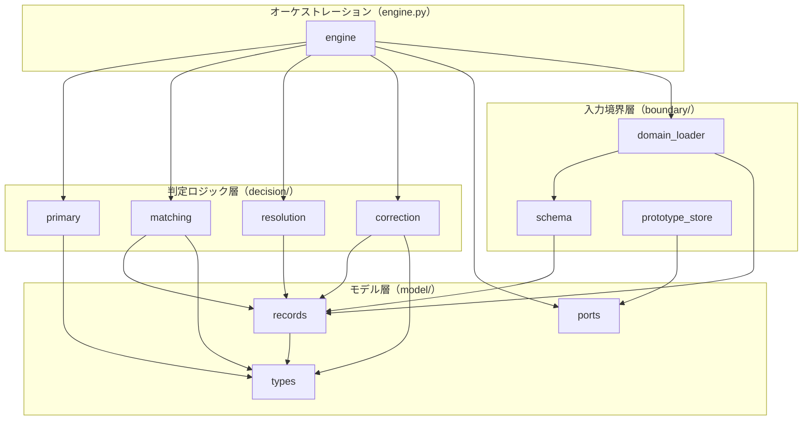
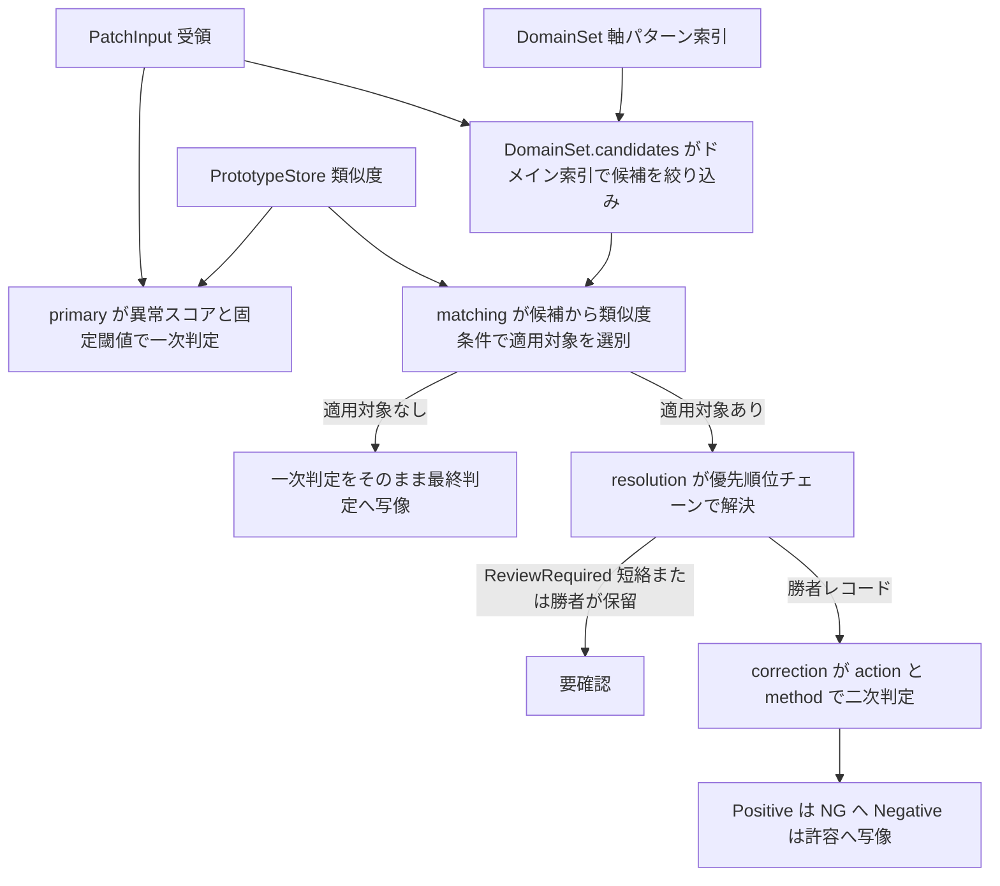

# 技術設計書 — promptable-correction-layer

## 概要

**Purpose**: 本機能は、一次判定（Positive=異常候補／Negative=正常）に対して、ROI 埋め込みとプロトタイプ記憶の近傍照合および HITL 由来の補正レコード（構造化 JSON）の適用条件を推論時に統合し、最終判定（NG／許容／要確認）を返す補正レイヤの判定ロジック本体を提供する。既知の許容パターンによる過検出（False Positive）の確認負荷を削減する。

**Users**: 品質管理者・運用担当者は補正済みの最終判定と人間確認の振り分けを運用に組み込む。研究開発者は 3 補正方式（ラベル上書き・スコア再重み付け・閾値適応）の比較検証基盤として利用する。

**Impact**: リポジトリに初のソースコード（`src/correction_layer/` パッケージとテスト一式）を追加する。スコープは `docs/incremental-development-plan.md` の Phase 0–3（永続化なし・合成データのみ）に限定し、判定スキーマは `docs/structured-json-versioning/correction-layer.md`（§6・§9）に従う。

### Goals

- 合成データ（合成プロトタイプ集合＋手書きドメイン別補正定義）だけで、近傍照合 → 補正レコード適用 → 最終判定の一連の判定処理を検証可能にする（Phase 0–1）
- 補正レコードの判定スキーマ全フィールド（4 action × 3 method＋null、match、8 フィールド）の解釈と構造検証を完成させる（Phase 2）
- 複数ドメイン定義の合成（`any` ワイルドカード）と優先順位チェーンによる決定的な競合解決を実装する（Phase 3）

### Non-Goals

- バージョン管理一式（版付き不変アーティファクト・マニフェスト・昇格・ロールバック・`element_id` 採番カウンタの永続化。Phase 4–6）
- `priority.json` による明示上書き（Phase 6）、メモリバンク版互換ゲート・dangling `prototype_ids` の skip／remap・expiry 間引き連動（Phase 5）
- オントロジー統合（CURIE 実在検証・上位クラス階層マッチ・remap。Phase 7）
- 実パイプライン統合と比較実験の実行（Phase 8）

## 境界コミットメント

### This Spec Owns

- 補正レイヤの判定ロジック本体: 一次判定（合成）→ 適用レコード選別 → 競合解決 → 補正適用 → 最終判定（NG／許容／要確認）
- 補正レコード判定スキーマ（`element_id`／`action`／`method`／`params`／`match`／`recorded_at`／`attributed_to`／`source_ref`）の**消費側の解釈と構造検証**、および pydantic モデルから生成する JSON Schema 成果物
- Phase 0–3 限定の簡易ドメイン定義 JSON（ドメイン軸 4 つ＋`elements[]`）というフィクスチャ契約
- 優先順位チェーン（specificity → `ReviewRequired` 短絡 → safety → recency → `element_id`）の実装と、その決定性（解決結果の一意性・入力順非依存・全域性）の検証

### Out of Boundary

- プロトタイプの登録・coreset 管理・実 kNN ストア（patch-feature-store が所有。本スコープでは合成 `PrototypeStore` で代替）
- 一次検出の実装（primary-anomaly-detection が所有。本スコープでは kNN スコア＋固定閾値の合成一次判定で代替）
- 構造化 JSON の生成・監査ログ（llm-feedback-structuring が所有。`source_ref` は不透明文字列として保持するのみ）
- 補正効果の定量評価（evaluation-framework が所有）
- バージョン管理・オントロジー・実統合（上記 Non-Goals の Phase 4–8）

### Allowed Dependencies

- ランタイム: `faiss-cpu`（Flat インデックス）、`numpy`、`pydantic>=2.7`、`jsonschema>=4.21`（いずれも既存依存）
- 開発: `pytest`、`ruff`（既存）、`hypothesis`（新規追加、dev のみ）
- 他 spec のコード・実計測データ・実 LLM 出力・外部オントロジー定義には依存しない（要件 1.4）
- torch／anomalib は本スコープでは使用しない（合成埋め込みは numpy で生成）

### Revalidation Triggers

- 補正レコードのフィールド名・型・enum 値の変更（llm-feedback-structuring と共有する語彙。JSON Schema 成果物の再配布が必要）
- 類似度尺度（cosine／L2 正規化／閾値の大小方向）の変更（patch-feature-store の実メトリックとの突合。Phase 8）
- プロトタイプ種別 `kind` の導入（設計メモ §2.1）により、実運用では一次判定（正常集合＝`normal`／`acceptable`）と補正照合（全種別）で参照集合が異なる。本スコープの合成 `PrototypeStore` は単一集合のため、Phase 8 統合時に参照集合の分離と突合する
- specificity 定義の変更（Phase 7 の上位クラス階層導入時）
- 最終判定ラベル集合（NG／許容／要確認）の変更（evaluation-framework・運用への波及）
- ドメイン軸（process／material／equipment／unit_of_work の 4 軸）の変更

## アーキテクチャ

### 既存アーキテクチャ分析

`src/` 配下にソースコードは存在しない（greenfield）。`pyproject.toml` に依存とツール設定（ruff）が整備済み。`.kiro/steering/roadmap.md` により、本 spec は 6 spec 構成の 1 つであり、他 spec が今後 `src/` に兄弟パッケージを追加する。他 spec との接点はコード依存ではなくデータ契約（判定スキーマ）のみ。

### アーキテクチャパターンと境界マップ

単一パッケージ内の段階分離を採用する。brief の境界候補（照合／補正／判定の 3 段分離）に対応し、入力境界（検証・ロード・ストア）と判定ロジックを分ける。



**依存方向（import-linter の契約で機械検査。違反は CI エラー）**: `model`（`types`／`ports` → `records`）→ `boundary`（`schema`／`prototype_store` → `domain_loader`）／`decision`（`primary`／`matching`／`correction`／`resolution`）→ `engine`。逆方向 import と循環は禁止。`boundary` と `decision` は互いに import しない。`decision` 内の各モジュールも互いに import しない（`engine` が合成する）。`engine` は boundary の具体ストア型に依存せず、`model/ports.py` の `SimilaritySource` Protocol に依存する（実体は構築時に注入）。契約の定義は Modified Files の `[tool.importlinter]` を参照。

**Key Decisions**:

- 一次判定（`primary`）と合成プロトタイプストア（`prototype_store`）は Phase 8 で実物（primary-anomaly-detection／patch-feature-store）に差し替える seam として独立モジュールに隔離する。
- `engine` は具体ストア型ではなく `model/ports.py` の `SimilaritySource` Protocol に依存する（設計検証 DESIGN-ARCH-002 対応）。Phase 8 の差し替えは port を満たす実装の注入だけで済み、`engine` と公開 API は変わらない。
- 類似度計算（照会埋め込みの L2 正規化を含む）は `prototype_store` に一元化し、一次判定と `similarity_threshold` 充足判定が常に同一尺度になることを構造で保証する（要件 2.5）。
- 設定値（一次判定の固定閾値・ドメイン定義パス）は境界（engine 構築時）で解決し、内部は解決済みの値のみを扱う。類似度も engine がストアで解決し、`primary`／`matching` は解決済みの値を引数で受け取る（ストアへ直接依存しない）。

### 技術スタック

- **言語・ランタイム**: Python 3.12（固定）。全実装。`pyproject.toml` の既存制約。
- **近傍検索**: `faiss-cpu>=1.11`（`IndexFlatIP`）。合成プロトタイプの厳密 kNN。
  L2 正規化＋内積＝cosine 類似度。
- **数値計算**: `numpy>=2.1,<3`。合成埋め込みの生成・正規化。
- **スキーマ定義**: `pydantic>=2.7`。補正レコード・ドメイン定義のモデル化と JSON Schema 生成。
  スキーマの単一の権威。
- **構造検証**: `jsonschema>=4.21`。raw JSON への構造検証と違反レポート。
  pydantic 生成スキーマを適用。
- **テスト**: `pytest>=8`、`hypothesis>=6`（**新規追加**）。
  単体・E2E・優先順位チェーンの決定性・索引等価性の property-based testing。
  `docs/library-adoption-proposal.md` §2。
- **依存方向検査**: `import-linter>=2`（**新規追加**）。層間・モジュール間の import 契約の機械検査。
  dev 依存。`lint-imports` を CI で実行。
- **Lint**: `ruff>=0.6`。既存設定（line-length 100）。

## ファイル構造計画

### Directory Structure

```text
src/
└── correction_layer/
    ├── __init__.py              # 公開 API（CorrectionEngine・SimilaritySource・コア型・JSON Schema 出力に加え、
    │                            #   合成データ構築用の PrototypeStore・load_domain_set。後者の公開は Phase 0–3 が
    │                            #   合成データで自己完結する意図的な選択。根拠は research.md）
    ├── model/                   # モデル層（最内側。パッケージ内の誰にも依存しない）
    │   ├── __init__.py
    │   ├── types.py             # コア型: ラベル enum・DomainAxes・PatchInput・PrimaryJudgment・FinalJudgment
    │   ├── ports.py             # engine が依存する類似度取得 port: SimilaritySource Protocol・NeighborHit
    │   └── records.py           # pydantic モデル: CorrectionRecord・MatchCriteria・Action/Method enum・
    │                            #   method 別 params モデル・action×method 制約バリデータ・
    │                            #   EffectiveRecord（レコード＋由来ドメイン軸）
    ├── boundary/                # 入力境界層（model のみに依存。decision に触れない）
    │   ├── __init__.py
    │   ├── schema.py            # pydantic モデルからの JSON Schema 生成、jsonschema による raw 文書の
    │   │                        #   構造検証と SchemaViolation 収集
    │   ├── prototype_store.py   # 合成プロトタイプ集合＋FAISS IndexFlatIP: kNN 検索と指定 id 群への類似度計算
    │   └── domain_loader.py     # ドメイン定義 JSON のロード・検証委譲・複数ドメイン合成（DomainSet）・
    │                            #   軸パターン索引の構築と candidates 引き当て・
    │                            #   element_id 全体一意性の検証・DomainValidationError
    ├── decision/                # 判定ロジック層（model のみに依存。モジュール間は互いに import しない）
    │   ├── __init__.py
    │   ├── primary.py           # 合成一次判定: 異常スコア（1 − 最大類似度）と固定閾値の比較
    │   ├── matching.py          # 適用可否評価: 索引候補に対する prototype_ids 類似度条件
    │   ├── correction.py        # action×method の解釈: 二次判定（ラベル上書き・スコア再重み付け・閾値適応）
    │   └── resolution.py        # 優先順位チェーン: specificity → ReviewRequired 短絡 → safety → recency → element_id
    └── engine.py                # composition root（CorrectionEngine）: 一次判定 → 選別 → 競合解決 → 補正 → 最終判定の合成

tests/
├── conftest.py                     # 合成埋め込み・PrototypeStore・エンジンのフィクスチャビルダ
├── fixtures/
│   └── domains/                    # 手書きドメイン定義 JSON（単一・複数ドメイン・不正系）
├── test_prototype_store.py         # kNN・類似度計算・正規化（Phase 0）
├── test_primary.py                 # 異常スコアと固定閾値の境界（Phase 1）
├── test_records.py                 # 全フィールド解釈・action×method 制約・params 形（Phase 2）
├── test_schema_validation.py       # 不正 JSON の拒否と違反理由の報告（Phase 2）
├── test_domain_loader.py           # ロード・複数ドメイン合成・element_id 重複拒否（Phase 1→3）
├── test_domain_index.py            # 索引の候補抽出: any 軸・未知ドメイン・specificity 降順、
│                                   #   hypothesis による全走査との等価性（Phase 3）
├── test_matching.py                # 類似度閾値・複数条件 AND・類似度条件なし（Phase 1→3）
├── test_correction.py              # 4 action × 3 method の一次→二次変換（Phase 1→2）
├── test_resolution.py              # チェーン各段のテーブル駆動テスト・KeepPrimary 遮蔽 vs 削除フォールバック（Phase 3）
├── test_resolution_properties.py   # hypothesis: 解決結果の一意性・入力順非依存・決定性（Phase 3）
└── test_engine_e2e.py              # 最小 E2E（Positive→許容の反転）と複合シナリオ（Phase 1→3）
```

### Modified Files

- `pyproject.toml` — dev 依存へ `hypothesis>=6` と `import-linter>=2` を追加。`[tool.pytest.ini_options]` に `pythonpath = ["src"]` と `testpaths = ["tests"]`、`[tool.importlinter]` に下記の依存契約を追加（Phase 0「pytest の整備」）。
- `.github/workflows/python-ci.yml`（**新規**）— Python 3.12 で `ruff check`・`lint-imports`・`pytest` を実行する CI workflow（Phase 0。設計検証 DESIGN-ARCH-003 対応。下記の依存方向契約の「違反は CI エラー」はこの workflow が担う）。

依存方向の規約は import-linter の契約として機械検査する（`lint-imports` を CI で実行）:

```toml
[tool.importlinter]
root_package = "correction_layer"

[[tool.importlinter.contracts]]
name = "層の依存方向（外側から内側のみ）"
type = "layers"
layers = [
    "correction_layer.engine",
    "correction_layer.boundary : correction_layer.decision",
    "correction_layer.model",
]

[[tool.importlinter.contracts]]
name = "decision 内のモジュールは互いに独立（engine が合成）"
type = "independence"
modules = [
    "correction_layer.decision.primary",
    "correction_layer.decision.matching",
    "correction_layer.decision.resolution",
    "correction_layer.decision.correction",
]

[[tool.importlinter.contracts]]
name = "model 内は records → types／ports の一方向"
type = "layers"
layers = [
    "correction_layer.model.records",
    "correction_layer.model.types : correction_layer.model.ports",
]

[[tool.importlinter.contracts]]
name = "boundary 内は domain_loader → schema／prototype_store の一方向"
type = "layers"
layers = [
    "correction_layer.boundary.domain_loader",
    "correction_layer.boundary.schema : correction_layer.boundary.prototype_store",
]
```

`layers` 契約の同一層に `:` で並べたモジュールは互いに import できない（`boundary` と `decision` の相互不干渉もこれで検査される）。

### 段階計画との対応

- **Phase 0**
  - 新規・拡張対象: `model/ports.py`（`NeighborHit`・`SimilaritySource`）、`boundary/prototype_store.py`、
    `tests/conftest.py`、`fixtures/domains/`、`pyproject.toml`（pytest 設定・import-linter 契約）、
    `.github/workflows/python-ci.yml`（ruff・`lint-imports`・pytest の CI 配線）
  - 完了確認: fixture のロードと kNN 検索が通り、CI で lint・依存方向検査・テストが実行される
- **Phase 1**
  - 新規・拡張対象: `model/types.py`、`decision/primary.py`、`decision/matching.py`（最小）、
    `decision/correction.py`（`OverrideNegative`×`LabelOverride`）、
    `boundary/domain_loader.py`（単一ファイル）、`engine.py`
  - 完了確認: 一次 Positive のパッチがプロトタイプ近傍で許容に反転する E2E
- **Phase 2**
  - 新規・拡張対象: `model/records.py`（全フィールド・全 enum）、`boundary/schema.py`、
    `decision/correction.py`（全 action×method）
  - 完了確認: 4 action の一次→二次変換、不正 JSON の reject
- **Phase 3**
  - 新規・拡張対象: `boundary/domain_loader.py`（複数ドメイン合成・軸パターン索引の構築と
    `candidates` 引き当て）、`decision/matching.py`（索引候補の受領）、`decision/resolution.py`
  - 完了確認: チェーン全段のテーブル駆動テスト＋hypothesis の決定性性質、
    索引の候補抽出が全走査と同一集合を返すこと

## システムフロー



- 適用候補の選別条件は一次判定の結果に依存しない（類似度・ドメイン軸のみ）。一次判定と選別は独立に計算し、engine が合成する。
- ドメイン軸の絞り込みは `DomainSet` の索引が担い（`candidates`）、`matching` は索引が返した候補に対して類似度条件のみを評価する。有効レコード全件の走査は行わない（設計メモ §10）。
- 類似度は engine が注入された `SimilaritySource`（Phase 0–3 の実体は `PrototypeStore`）の `nearest`（一次判定用の最大類似度）と `similarities`（選別用の `match.prototype_ids` 類似度。候補のうち類似度条件を持つレコードの分のみ）で解決し、解決済みの値を一次判定と選別へ渡す（境界での解決）。
- 優先順位チェーンの詳細はコンポーネント `resolution` を参照。

## 要件トレーサビリティ

- **1.1** フィクスチャから実行可能状態を構築
  - コンポーネント: domain_loader, prototype_store, engine
  - インターフェース／フロー: `load_domain_set`, `PrototypeStore.build`, `CorrectionEngine.__init__`
- **1.2** 最近傍プロトタイプの id と類似度を返す
  - コンポーネント: prototype_store
  - インターフェース／フロー: `PrototypeStore.nearest`
- **1.3** 近傍類似度と固定閾値で一次判定
  - コンポーネント: primary
  - インターフェース／フロー: `judge_primary`
- **1.4** 合成データのみで完結
  - コンポーネント: 全体
  - インターフェース／フロー: Allowed Dependencies（実データ・実 LLM・オントロジー非依存）
- **2.1** ROI 埋め込みとプロトタイプの類似度照合
  - コンポーネント: matching, prototype_store
  - インターフェース／フロー: `PrototypeStore.similarities`, `applicable_records`
- **2.2** 閾値充足レコードを適用対象と判定
  - コンポーネント: matching
  - インターフェース／フロー: `applicable_records`（ANY 意味論・類似度 ≥ threshold）
- **2.3** 閾値未達レコードを除外
  - コンポーネント: matching
  - インターフェース／フロー: 同上
- **2.4** 適用対象なしなら一次判定を最終判定に
  - コンポーネント: engine
  - インターフェース／フロー: `CorrectionEngine.judge`（候補なし分岐）
- **2.5** similarity_threshold を近傍検索と同一尺度で解釈
  - コンポーネント: prototype_store
  - インターフェース／フロー: cosine 類似度計算の一元化
- **2.6** 類似度条件なしレコードはドメイン軸のみで適用判定
  - コンポーネント: matching
  - インターフェース／フロー: `applicable_records`（類似度条件の有無で分岐）
- **3.1** LabelOverride 方式の OverrideNegative: Positive→Negative
  - コンポーネント: correction
  - インターフェース／フロー: `apply_correction`（LabelOverride 経路。soft 方式は要件 4.2／4.3 に従う）
- **3.2** LabelOverride 方式の OverridePositive: Negative→Positive
  - コンポーネント: correction
  - インターフェース／フロー: 同上
- **3.3** KeepPrimary: 一次判定を保持
  - コンポーネント: correction
  - インターフェース／フロー: `apply_correction`
- **3.4** ReviewRequired: 保留（要確認）で人間確認対象に
  - コンポーネント: resolution, engine
  - インターフェース／フロー: `resolve`（短絡）→ `FinalLabel.REVIEW_REQUIRED`
- **4.1** LabelOverride: 再計算なしでラベル直接上書き
  - コンポーネント: correction
  - インターフェース／フロー: `apply_correction`
- **4.2** ScoreReweight: weight でスコア再構成→閾値比較
  - コンポーネント: correction
  - インターフェース／フロー: `apply_correction`（`params.weight`）
- **4.3** ThresholdAdapt: threshold_delta で閾値適応→比較
  - コンポーネント: correction
  - インターフェース／フロー: `apply_correction`（`params.threshold_delta`）
- **4.4** KeepPrimary／ReviewRequired の method は null
  - コンポーネント: records
  - インターフェース／フロー: `CorrectionRecord` の action×method バリデータ
- **5.1** 8 フィールド全部の解釈
  - コンポーネント: records
  - インターフェース／フロー: `CorrectionRecord`（全フィールドを型付きで保持）
- **5.2** 欠落・型不一致・定義外 enum の拒否と理由報告
  - コンポーネント: schema, domain_loader
  - インターフェース／フロー: `validate_domain_document` → `DomainValidationError`
- **5.3** action×method 組合せ規約違反の拒否
  - コンポーネント: records
  - インターフェース／フロー: `CorrectionRecord` の model バリデータ
- **5.4** 複数の適用条件はすべて充足（AND）
  - コンポーネント: domain_loader, matching
  - インターフェース／フロー: `DomainSet.candidates`（ドメイン軸）＋ `applicable_records`（指定時の類似度条件）
- **5.5** 類似度条件の対の片方だけの指定を拒否
  - コンポーネント: records
  - インターフェース／フロー: `MatchCriteria` の model バリデータ
- **5.6** action と params の方向矛盾を拒否
  - コンポーネント: records
  - インターフェース／フロー: `CorrectionRecord` の model バリデータ
- **6.1** 複数ドメインの有効レコードを合成
  - コンポーネント: domain_loader
  - インターフェース／フロー: `load_domain_set` → `DomainSet`（軸パターン索引を同時構築）
- **6.2** `any` を広域ルールとして解釈
  - コンポーネント: domain_loader
  - インターフェース／フロー: `DomainSet.candidates`（入力軸から 16 パターンキーを生成して引き当て）
- **6.3** 具体ドメインを広域より優先
  - コンポーネント: resolution
  - インターフェース／フロー: specificity（辞書式: 非 `any` 軸数 → 類似度条件の有無）
- **6.4** 削除済みレコードは有効集合外・広域へフォールバック
  - コンポーネント: domain_loader
  - インターフェース／フロー: 有効集合＝ファイル記載要素のみ（削除は不在で表現）
- **7.1** 優先順位チェーンで解決結果を一意決定
  - コンポーネント: resolution
  - インターフェース／フロー: `resolve`（5 段チェーン）
- **7.2** specificity 同点集合の ReviewRequired 短絡と代表 element_id
  - コンポーネント: resolution
  - インターフェース／フロー: `resolve`（rule 2）→ `ReviewEscalation.element_id`（集合内最大）
- **7.3** safety: OverridePositive > KeepPrimary > OverrideNegative
  - コンポーネント: resolution
  - インターフェース／フロー: `resolve`（rule 3）
- **7.4** recency: recorded_at が新しい方
  - コンポーネント: resolution
  - インターフェース／フロー: `resolve`（rule 4）
- **7.5** element_id が大きい方
  - コンポーネント: resolution
  - インターフェース／フロー: `resolve`（rule 5）
- **7.6** 具体 KeepPrimary が広域上書きを遮蔽
  - コンポーネント: resolution
  - インターフェース／フロー: specificity の帰結（rule 1）＋テーブル駆動テスト
- **7.7** 同一入力・同一集合で常に同一判定
  - コンポーネント: resolution
  - インターフェース／フロー: 解決結果の一意性・入力順非依存を hypothesis で検証
- **8.1** 最終判定は NG／許容／要確認のいずれか
  - コンポーネント: engine, types
  - インターフェース／フロー: `FinalJudgment.label: FinalLabel`
- **8.2** 推論時の条件適用のみ（重み更新なし）
  - コンポーネント: engine
  - インターフェース／フロー: 判定は純粋関数（状態変更・学習コードなし）

## コンポーネントとインターフェース

- **types**（モデル（model/））: ラベル・入出力の共有型
  - Req Coverage: 8.1
  - Key Dependencies: pydantic (P0)
  - Contracts: State
- **ports**（モデル（model/））: engine が依存する類似度取得 port（`SimilaritySource`／`NeighborHit`）
  - Req Coverage: 1.2, 2.5
  - Key Dependencies: numpy (P0)
  - Contracts: Service
- **records**（モデル（model/））: 補正レコードの型付きモデルと組合せ制約
  - Req Coverage: 4.4, 5.1, 5.3, 5.5, 5.6
  - Key Dependencies: types (P0)
  - Contracts: State
- **schema**（入力境界（boundary/））: JSON Schema 生成と raw 文書の構造検証
  - Req Coverage: 5.2
  - Key Dependencies: records (P0), jsonschema (P0)
  - Contracts: Service
- **prototype_store**（入力境界（boundary/））: 合成プロトタイプの kNN と類似度計算
  - Req Coverage: 1.1, 1.2, 2.5
  - Key Dependencies: faiss (P0), numpy (P0)
  - Contracts: Service
- **domain_loader**（入力境界（boundary/））: ドメイン定義のロード・合成・一意性検証・軸パターン索引
  - Req Coverage: 1.1, 5.2, 6.1, 6.2, 6.4
  - Key Dependencies: schema (P0), records (P0)
  - Contracts: Service
- **primary**（判定ロジック（decision/））: 合成一次判定（解決済み類似度を受領）
  - Req Coverage: 1.3
  - Key Dependencies: types (P0)
  - Contracts: Service
- **matching**（判定ロジック（decision/））: 索引候補からの適用対象選別（解決済み類似度を受領）
  - Req Coverage: 2.1–2.3, 2.6, 5.4
  - Key Dependencies: records (P0), types (P0)
  - Contracts: Service
- **resolution**（判定ロジック（decision/））: 優先順位チェーンによる競合解決
  - Req Coverage: 3.4, 6.3, 7.1–7.7
  - Key Dependencies: records (P0)
  - Contracts: Service
- **correction**（判定ロジック（decision/））: action×method の二次判定適用
  - Req Coverage: 3.1–3.3, 4.1–4.3
  - Key Dependencies: records (P0), types (P0)
  - Contracts: Service
- **engine**（オーケストレーション）: パイプライン合成と最終判定写像
  - Req Coverage: 1.1, 1.4, 2.4, 8.1, 8.2
  - Key Dependencies: 上記すべて (P0)
  - Contracts: Service

### モデル層（model/）

#### ports

| Field        | Detail                                            |
| ------------ | ------------------------------------------------- |
| Intent       | engine が依存する類似度取得インターフェースの定義 |
| Requirements | 1.2, 2.5                                          |

##### Responsibilities & Constraints (ports)

- engine が必要とするストア操作（kNN 検索・指定 id 群への類似度計算）を `SimilaritySource` Protocol として定義する。engine は具体ストア型に依存せず、この port にのみ依存する（設計検証 DESIGN-ARCH-002 対応）。
- 実装（Phase 0–3 は `boundary/prototype_store.py`、Phase 8 は patch-feature-store のアダプタ）は Protocol を構造的に満たせばよく、明示継承しない。差し替えで engine・公開 API は変わらない。

##### Service Interface (ports)

```python
@dataclass(frozen=True)
class NeighborHit:
    prototype_id: int
    similarity: float   # cosine 類似度

class SimilaritySource(Protocol):
    def nearest(self, embedding: np.ndarray, k: int = 1) -> list[NeighborHit]: ...
    def similarities(self, embedding: np.ndarray, prototype_ids: Sequence[int]) -> dict[int, float]: ...
```

#### records

| Field        | Detail                                                 |
| ------------ | ------------------------------------------------------ |
| Intent       | 補正レコード・ドメイン定義の pydantic モデルと不変条件 |
| Requirements | 4.4, 5.1, 5.3, 5.5, 5.6                                |

##### Responsibilities & Constraints (records)

- 判定スキーマの 8 フィールド（設計メモ §6.3 のうち要素単位 `ontology_version`（Phase 7 責務）を除く。requirements 5.1 の列挙と同一）を型付きで表現する。スキーマ定義の単一の権威。
- action×method の組合せ規約（`KeepPrimary`／`ReviewRequired` は method null かつ params 空、`OverrideNegative`／`OverridePositive` は method 非 null）を model バリデータで強制する。
- method 別の params 形（`LabelOverride`→`{}`、`ScoreReweight`→`{"weight": float > 0}`、`ThresholdAdapt`→`{"threshold_delta": float}`）を検証する。未知フィールドは拒否（`extra="forbid"`）。
- `match` の類似度条件（`prototype_ids`／`similarity_threshold`）は**対で任意**とする。両方あり＝プロトタイプ照合つき、両方なし（`"match": {}`）＝ドメイン軸のみで適用する広域レコード（要件 2.6）。片方だけの指定は model バリデータで拒否する（要件 5.5）。
- soft method の params と action の方向整合（`OverrideNegative` は `weight` < 1／`threshold_delta` > 0、`OverridePositive` は `weight` > 1／`threshold_delta` < 0）を model バリデータで強制する（要件 5.6）。
- `recorded_at` はタイムゾーン付き（UTC）を必須とする。
- 有効レコードの共有型 `EffectiveRecord`（レコード＋由来ドメイン軸）を定義する。生成は domain_loader、消費は matching／resolution が行い、両者はこのモジュールの型のみに依存する。
- `DomainAxes` は `model/types.py` の定義を import して使う（このモジュールでは定義しない）。

##### Service Interface (records)

```python
class Action(StrEnum):
    OVERRIDE_NEGATIVE = "OverrideNegative"
    OVERRIDE_POSITIVE = "OverridePositive"
    KEEP_PRIMARY = "KeepPrimary"
    REVIEW_REQUIRED = "ReviewRequired"

class Method(StrEnum):
    LABEL_OVERRIDE = "LabelOverride"
    SCORE_REWEIGHT = "ScoreReweight"
    THRESHOLD_ADAPT = "ThresholdAdapt"

class MatchCriteria(BaseModel):
    # 類似度条件は対で任意（両方 None＝ドメイン軸のみで適用する広域レコード。要件 2.6。
    # 片方だけの指定は model バリデータで拒否。要件 5.5）
    prototype_ids: list[int] | None = None      # 指定時 min_length=1、int64 整数
    similarity_threshold: float | None = None   # cosine 類似度（高いほど近い）。充足は「類似度 >= threshold」

class CorrectionRecord(BaseModel):
    element_id: int
    action: Action
    method: Method | None
    params: ScoreReweightParams | ThresholdAdaptParams | EmptyParams
    match: MatchCriteria
    recorded_at: AwareDatetime        # UTC
    attributed_to: str
    source_ref: str                   # 監査ログへの不透明な外部キー

class DomainDefinition(BaseModel):
    domain: DomainAxes                # types.DomainAxes（軸の値は具体値または "any"）
    elements: list[CorrectionRecord]

@dataclass(frozen=True)
class EffectiveRecord:
    record: CorrectionRecord
    domain: DomainAxes        # 由来ドメイン定義の軸（specificity 判定に使用）
```

- Invariants: action×method 規約（要件 5.3）・params 形・類似度条件の対制約（要件 5.5）・action×params の方向整合（要件 5.6）は構築時に検証され、構築後のレコードは常に整合している。

### 入力境界層（boundary/）

#### schema

| Field        | Detail                                                           |
| ------------ | ---------------------------------------------------------------- |
| Intent       | pydantic モデルからの JSON Schema 生成と raw JSON 文書の構造検証 |
| Requirements | 5.2                                                              |

##### Responsibilities & Constraints (schema)

- `DomainDefinition.model_json_schema()` から JSON Schema を生成する。この Schema は llm-feedback-structuring と共有するデータ契約の成果物を兼ねる。
- raw 文書（dict）に jsonschema を適用し、全違反（フィールド欠落・型不一致・enum 定義外）を `SchemaViolation`（JSON パス＋理由）として収集して返す。fail-fast だが最初の 1 件で止めず違反は全件報告する。
- jsonschema 通過後の pydantic パースで action×method 等の組合せ制約を検証する（2 段構えの 1 段目＝構造、2 段目に相当する統制語彙検証は Phase 7 スコープ外）。

##### Service Interface (schema)

```python
@dataclass(frozen=True)
class SchemaViolation:
    json_path: str
    message: str

def domain_definition_json_schema() -> dict[str, Any]: ...
def validate_domain_document(raw: object) -> list[SchemaViolation]: ...
```

#### prototype_store

| Field        | Detail                                               |
| ------------ | ---------------------------------------------------- |
| Intent       | 合成プロトタイプ集合の保持と cosine 類似度の一元計算 |
| Requirements | 1.1, 1.2, 2.5                                        |

##### Responsibilities & Constraints (prototype_store)

- プロトタイプ（`prototype_id`＋埋め込み）を保持し、登録時に L2 正規化して `faiss.IndexFlatIP` を構築する。照会埋め込みも `nearest`／`similarities` の内部で L2 正規化する（正規化を呼び出し側に委ねない）。
- kNN 検索（要件 1.2）と、指定 `prototype_ids` への類似度計算（match 判定用）の両方を提供する。**類似度の定義（L2 正規化を含む）はこのモジュールだけが持つ**（cosine、[-1, 1]、高いほど近い）。要件 2.5 はこの一元化で構造的に保証される。
- `model/ports.py` の `SimilaritySource` Protocol を構造的に満たす（明示継承しない）。Phase 8 で patch-feature-store の実装に差し替える seam であり、差し替え先も同 Protocol を満たせば engine・公開 API の変更は不要。公開 API はドメイン操作（近傍検索・類似度）のみで、FAISS の型・関数は外に出さない。

##### Service Interface (prototype_store)

```python
class PrototypeStore:  # model/ports.py の SimilaritySource を構造的に充足（NeighborHit も ports で定義）
    @classmethod
    def build(cls, prototype_ids: Sequence[int], embeddings: np.ndarray) -> "PrototypeStore": ...
    def nearest(self, embedding: np.ndarray, k: int = 1) -> list[NeighborHit]: ...
    def similarities(self, embedding: np.ndarray, prototype_ids: Sequence[int]) -> dict[int, float]: ...
```

- Preconditions: `embeddings.shape == (len(prototype_ids), dim)`、`prototype_id` は一意。
- Postconditions: `nearest` は類似度降順。`similarities` は要求 id 全件を返す（未登録 id は `KeyError`。Phase 0–3 に dangling は存在しない）。

#### domain_loader

| Field        | Detail                                                 |
| ------------ | ------------------------------------------------------ |
| Intent       | ドメイン定義 JSON のロード・検証委譲・複数ドメイン合成 |
| Requirements | 1.1, 5.2, 6.1, 6.4                                     |

##### Responsibilities & Constraints (domain_loader)

- 指定パス群の JSON を読み、`schema.validate_domain_document` → `DomainDefinition` パースの順で検証する。いずれかのファイルに違反があれば `DomainValidationError`（ファイル別の違反一覧を保持）で fail-fast する（部分縮退はしない。理由は research.md の Design Decisions 参照）。
- 全ドメインの要素を「レコード＋由来ドメイン軸」（`records.EffectiveRecord`）に展開して `DomainSet` へ合成する（要件 6.1）。ファイルに存在しない要素は有効集合に含まれない（削除＝不在。要件 6.4）。
- `element_id` の**全ドメイン横断の一意性**を検証し、重複は `DomainValidationError` とする（チェーン最終段のタイブレークの前提。設計メモ §6.3）。
- **ロード時に不変のドメイン索引を構築する**（段階計画 Phase 3 の「合成インメモリ索引」、設計メモ §10 の線形スキャン禁止）。索引のキーは**由来ドメイン定義の軸パターンそのもの**（各軸が具体値または `any`）で、値は当該パターンのレコード列。判定時は入力パッチの具体 4 軸から、各軸を `any` に落とした組合せ 2^4 = 16 個のキーを生成して引き当て、候補だけを `matching` へ渡す。有効レコード総数によらず参照は定数回で、全レコード走査は行わない。
  - パターン側をキーにすることで、**ドメイン定義に現れない未知ドメインの入力でも広域（`any`）レコードが正しく引ける**（入力側キーを索引化すると未知ドメインで広域ルールを取りこぼす）。
  - 引き当ては specificity 降順（非 `any` 軸数の多いキーから）で行い、`resolution` へ渡す候補列の順序を入力ファイルの並びに依存させない。
  - Phase 0–3 のドメイン軸は不透明文字列の完全一致のみ（上位クラス階層は Phase 7）なので、キー生成は 16 通りの列挙で閉じる。Phase 7 で階層マッチを入れる際は、この生成規則を上位クラス集合へ拡張する（Revalidation Trigger）。

##### Service Interface (domain_loader)

```python
DomainPattern = tuple[str, str, str, str]   # 由来ドメインの軸パターン（各要素は具体値または "any"）

@dataclass(frozen=True)
class DomainSet:
    records: tuple[EffectiveRecord, ...]                        # 全有効レコード（監査・テスト用の全体ビュー）
    index: Mapping[DomainPattern, tuple[EffectiveRecord, ...]]  # 軸パターン → 当該パターンのレコード

    def candidates(self, domain: DomainAxes) -> tuple[EffectiveRecord, ...]:
        """入力の具体 4 軸から 16 個のパターンキーを生成して索引を引き、
        ドメイン軸に適合する候補のみを specificity 降順で返す（線形走査しない）。"""

class DomainValidationError(Exception):
    violations: Mapping[str, list[SchemaViolation]]   # ファイルパス → 違反一覧

def load_domain_set(paths: Sequence[Path]) -> DomainSet: ...
```

- Invariants: `index` の全エントリの和は `records` に一致する（各レコードはちょうど 1 つのパターンキーに属する）。構築後は不変。
- Postconditions: `candidates` の戻り値は、同じ `DomainSet` と同じ入力軸に対して常に同一の並び。

### 判定ロジック層（decision/）

#### primary

| Field        | Detail                               |
| ------------ | ------------------------------------ |
| Intent       | 合成一次判定（kNN スコア＋固定閾値） |
| Requirements | 1.3                                  |

##### Responsibilities & Constraints (primary)

- 異常スコアを `1 − 最大類似度`（0 に近いほど正常）とし、固定閾値との比較で一次判定を導出する: `anomaly_score > threshold` なら Positive、それ以外は Negative。
- primary-anomaly-detection の代替となる合成実装であり、Phase 8 の差し替え seam。最大類似度と閾値は engine が解決済みの値として渡す（`prototype_store` へ直接依存しない）。

##### Service Interface (primary)

```python
def judge_primary(
    max_similarity: float, threshold: float
) -> PrimaryJudgment:
    """anomaly_score = 1.0 - max_similarity。anomaly_score > threshold で Positive。"""
```

#### matching

| Field        | Detail                                                   |
| ------------ | -------------------------------------------------------- |
| Intent       | 有効レコード集合から入力パッチに適用可能なレコードを選別 |
| Requirements | 2.1, 2.2, 2.3, 2.6, 5.4, 6.2                             |

##### Responsibilities & Constraints (matching)

- 適用条件は指定された条件すべての充足（AND。要件 5.4）:
  1. **ドメイン軸**: レコード由来の 4 軸それぞれが、入力の軸と等しいか `any`（要件 6.2）。**索引引き当て（`DomainSet.candidates`）でこの条件は充足済み**であり、本モジュールは索引が保証する不変条件として前提にする（二重判定はしない）。
  2. **類似度条件（指定時のみ）**: `match.prototype_ids` のいずれかとの cosine 類似度が `similarity_threshold` 以上（ANY 意味論。根拠は research.md）。未達なら除外（要件 2.3）。
- 類似度条件を持たないレコードはドメイン軸のみで適用可否が決まるため、そのまま適用対象になる（要件 2.6。ドメイン単位の閾値調整等の広域補正）。
- 入力は索引で絞り込まれた候補列（`DomainSet.candidates` の戻り値）であり、全有効レコードを受け取らない（設計メモ §10 の線形スキャン禁止）。
- 類似度は引数で受け取る（`prototype_store` への問い合わせは engine が行い、解決済みの値を渡す）。

##### Service Interface (matching)

```python
def applicable_records(
    candidates: Sequence[EffectiveRecord],   # DomainSet.candidates の戻り値（ドメイン軸適合済み）
    similarities: Mapping[int, float],       # prototype_id → 入力 ROI 埋め込みとの cosine 類似度
) -> list[EffectiveRecord]: ...
```

- Preconditions: `candidates` の全レコードは入力パッチのドメイン軸に適合済み（索引の不変条件）。

#### resolution

| Field        | Detail                                            |
| ------------ | ------------------------------------------------- |
| Intent       | 競合する適用レコードの決定的な解決（結果の一意性）|
| Requirements | 3.4, 6.3, 7.1, 7.2, 7.3, 7.4, 7.5, 7.6, 7.7       |

##### Responsibilities & Constraints (resolution)

- 優先順位チェーン（設計メモ §9.1、要件 7.1）:
  1. **specificity**: 辞書式比較（第 1 キー: 非 `any` ドメイン軸数 0–4、第 2 キー: `match` の類似度条件の有無。条件ありが具体側）。大きい方が勝つ（要件 6.3。暫定定義の根拠と Phase 7 での再検証は research.md）。具体 `KeepPrimary` はここで広域上書きに勝ち、補正を遮蔽する（要件 7.6）。ドメイン軸が同点なら、プロトタイプ照合で絞られたレコードがドメイン全域に効くレコード（類似度条件なし）に勝つ。
  2. **`ReviewRequired` 短絡**: 最大 specificity の勝ち集合に `ReviewRequired` が 1 つでもあれば、以降を打ち切り保留（要件 7.2、3.4）。短絡は同 specificity 内でのみ効く（specificity に従属）。
  3. **safety**: `OverridePositive` > `KeepPrimary` > `OverrideNegative`（要件 7.3）。
  4. **recency**: `recorded_at` が新しい方（要件 7.4）。
  5. **element_id**: 数値の大きい方（要件 7.5。全ドメイン一意なのでここで必ず決着＝全域性）。
- **保証するのは「解決結果の一意性」**であり、レコード集合上の総順序ではない（設計検証 DESIGN-ARCH-005 対応）。rule 2 の `ReviewRequired` 短絡は分類軸（safety）とは別軸の打ち切りであり（設計メモ §9.1）、短絡した集合内のレコード間には順序を定義しない。短絡の結果は常に一意（要確認）なので、要件 7.7 の決定性は保たれる。
  - 短絡時も**説明可能性のために代表レコードを一意に決める**: 短絡集合のうち `element_id` が最大のものを `ReviewEscalation.element_id` に載せる（`FinalJudgment.applied_element_id` に伝播）。この選択自体も決定的である。
  - rule 3–5（safety → recency → element_id）は `ReviewRequired` を含まない集合上の総順序であり、この範囲では従来どおり総順序として検証する。
- 純粋関数として実装し、同一入力・同一集合で常に同一結果（要件 7.7）。決定性の性質（結果の一意性・入力順非依存・全域性、および rule 3–5 の総順序性）は hypothesis で検証する。

##### Service Interface (resolution)

```python
@dataclass(frozen=True)
class ReviewEscalation:
    """ReviewRequired 短絡または保留勝者。最終判定は要確認。"""
    element_id: int   # 短絡集合の代表（element_id 最大。説明可能性のため）

def resolve(candidates: Sequence[EffectiveRecord]) -> EffectiveRecord | ReviewEscalation:
    """candidates は非空。戻り値が EffectiveRecord のとき action は
    OverrideNegative / OverridePositive / KeepPrimary のいずれか
    （ReviewRequired は rule 2 で必ず ReviewEscalation になる）。"""
```

- Postconditions: 同一の候補集合（順序違いを含む）に対して戻り値は常に等価。`ReviewEscalation` の `element_id` も一意に定まる。

#### correction

| Field        | Detail                                                        |
| ------------ | ------------------------------------------------------------- |
| Intent       | 勝者レコードの action×method を一次判定へ適用し二次判定を導出 |
| Requirements | 3.1, 3.2, 3.3, 4.1, 4.2, 4.3                                  |

##### Responsibilities & Constraints (correction)

- method が計算方式を決める（役割分担の根拠は research.md の Design Decisions）:
  - `LabelOverride`: スコア・閾値を再計算せず、ラベルを action の方向へ直接上書き（`OverrideNegative`→Negative、`OverridePositive`→Positive。要件 4.1、3.1、3.2）。
  - `ScoreReweight`: `score' = anomaly_score × params.weight`。`score' > threshold` で Positive（要件 4.2）。
  - `ThresholdAdapt`: `threshold' = threshold + params.threshold_delta`。`anomaly_score > threshold'` で Positive（要件 4.3）。
- `KeepPrimary` は一次判定ラベルをそのまま返す（要件 3.3）。
- `ReviewRequired` は resolution が処理済みのため受け取らない（前提条件）。

##### Service Interface (correction)

```python
def apply_correction(
    record: CorrectionRecord, primary: PrimaryJudgment
) -> PrimaryLabel:
    """Precondition: record.action != Action.REVIEW_REQUIRED。
    戻り値は二次判定ラベル（Positive / Negative）。"""
```

### オーケストレーション層（engine）

#### engine

| Field        | Detail                                   |
| ------------ | ---------------------------------------- |
| Intent       | 判定パイプラインの合成と最終判定への写像 |
| Requirements | 1.1, 1.4, 2.4, 8.1, 8.2                  |

##### Responsibilities & Constraints (engine)

- 構築時に解決済みの `SimilaritySource`（`model/ports.py` の Protocol。Phase 0–3 では合成 `PrototypeStore` を注入）・`DomainSet`・一次判定閾値を受け取る（要件 1.1 の「実行可能な状態」）。
- `judge` は: (1) `DomainSet.candidates` で入力ドメインの候補を索引から引く、(2) ストアの `nearest`（一次判定用の最大類似度）と `similarities`（選別用。候補のうち類似度条件を持つレコードが参照する `prototype_ids` の分のみ）で類似度を解決（照会埋め込みの L2 正規化はストア内部で行う）、(3) 一次判定、(4) 候補からの適用対象の選別、(5) 適用対象なしなら一次判定を最終判定へ写像（要件 2.4）、(6) ありなら resolution → correction、(7) `FinalLabel` へ写像（Positive→NG、Negative→許容、保留→要確認。要件 8.1）。
- 純粋な推論処理であり、内部状態の更新・学習・永続化を一切行わない（要件 8.2、1.4）。

##### Service Interface (engine)

```python
class CorrectionEngine:
    def __init__(
        self, store: SimilaritySource, domain_set: DomainSet, primary_threshold: float
    ) -> None: ...
    def judge(self, patch: PatchInput) -> FinalJudgment: ...
```

- Postconditions: `FinalJudgment.label` は NG／許容／要確認のいずれか。`applied_element_id` は補正が適用された場合は勝者の `element_id`、`ReviewRequired` 短絡の場合は `ReviewEscalation.element_id`（代表）、適用対象なしの場合は `None`（説明可能性のため）。

## データモデル

### ドメインモデル

- **CorrectionRecord**（値オブジェクト）: HITL 由来の補正指示 1 件。`element_id` が同一性のキー。不変。
- **DomainSet**（集約）: ロード済み全ドメインの有効レコード集合と軸パターン索引。判定時の唯一の参照点。ロード後は不変。
- **PrototypeStore**（集約）: 合成プロトタイプ集合。類似度尺度の権威。構築後は不変。
- **判定はすべて純粋関数**: 一次判定 → 選別 → 解決 → 補正の各段は入力から出力を導出するのみで、状態を変更しない（要件 8.2 の不変制約）。

### 論理データモデル

コアの実行時型（`model/types.py`）:

```python
class PrimaryLabel(StrEnum):
    POSITIVE = "Positive"    # 異常候補
    NEGATIVE = "Negative"    # 正常

class FinalLabel(StrEnum):
    NG = "NG"
    ACCEPTABLE = "Acceptable"          # 許容
    REVIEW_REQUIRED = "ReviewRequired" # 要確認

class DomainAxes(BaseModel):
    """ドメイン軸。値は具体値または "any"（入力パッチ側の any は不可）。"""
    process: str
    material: str
    equipment: str
    unit_of_work: str

@dataclass(frozen=True)
class PatchInput:
    roi_embedding: np.ndarray        # shape (dim,)。照会時の L2 正規化は PrototypeStore が行う
    domain: DomainAxes               # 入力パッチの具体ドメイン軸（any 不可）

@dataclass(frozen=True)
class PrimaryJudgment:
    label: PrimaryLabel
    anomaly_score: float             # 1 − 最大類似度
    threshold: float                 # 固定閾値（構築時に解決済み）

@dataclass(frozen=True)
class FinalJudgment:
    label: FinalLabel
    applied_element_id: int | None   # 適用された補正レコード（説明可能性）
    primary: PrimaryJudgment
```

### データ契約と統合

**ドメイン定義 JSON（Phase 0–3 のフィクスチャ契約。本 spec が所有）**:

```json
{
  "domain": {
    "process": "semicont:DeepReactiveIonEtchProcess",
    "material": "any",
    "equipment": "any",
    "unit_of_work": "semicont:Wafer"
  },
  "elements": [
    {
      "element_id": 87,
      "action": "OverrideNegative",
      "method": "LabelOverride",
      "params": {},
      "match": {
        "prototype_ids": [2041],
        "similarity_threshold": 0.9
      },
      "recorded_at": "2026-06-20T10:00:00Z",
      "attributed_to": "op_tanaka",
      "source_ref": "annotation:ann-5700"
    },
    {
      "element_id": 91,
      "action": "OverrideNegative",
      "method": "ThresholdAdapt",
      "params": { "threshold_delta": 0.05 },
      "match": {},
      "recorded_at": "2026-07-30T09:00:00Z",
      "attributed_to": "op_sato",
      "source_ref": "annotation:ann-5931"
    }
  ]
}
```

- `elements[]` のレコード形は、設計メモ §6.3 のうち要素単位 `ontology_version`（オントロジー統合、Phase 7 責務）を除く 8 フィールド（requirements 5.1・段階計画 Phase 2 の列挙と同一）。llm-feedback-structuring との共有語彙。
- `match` の類似度条件は対で任意。`"match": {}` はドメイン軸のみで適用される広域レコード（上例 `element_id: 91`。当該ドメイン全域の判定閾値を調整する）。片方だけの指定は構造検証で拒否する（要件 5.5）。
- トップレベルのバージョン管理メタ（`domain_id`／`domain_version`／`domain_source_ontology_version`／`target_ontology_version`／`built_against_bank_snapshot_id`／`domain_representations_by_ontology_version`。§8.1）は**含めない**（`domain_id`／`domain_version` は Phase 4、`built_against_bank_snapshot_id` は Phase 5、オントロジー系 3 フィールドは Phase 7 の責務。根拠は research.md）。
- CURIE 形式の値（ドメイン軸の `semicont:...` 等）は本スコープでは**不透明文字列**であり、解釈・実在検証を行わない。
- action×method の許容組合せ:

| action \ method  | LabelOverride | ScoreReweight | ThresholdAdapt | null |
| ---------------- | ------------- | ------------- | -------------- | ---- |
| OverrideNegative | ✓             | ✓             | ✓              | 拒否 |
| OverridePositive | ✓             | ✓             | ✓              | 拒否 |
| KeepPrimary      | 拒否          | 拒否          | 拒否           | ✓    |
| ReviewRequired   | 拒否          | 拒否          | 拒否           | ✓    |

- JSON Schema（`domain_definition_json_schema()` の出力）が上記契約の機械可読形。スキーマの権威は pydantic モデル（`model/records.py`）。

## エラーハンドリング

### エラー戦略

- **ロード時（構成エラー）**: 不正なドメイン定義は `DomainValidationError` で fail-fast。全ファイル・全違反（JSON パス＋理由）を保持し、拒否理由の報告（要件 5.2）を満たす。部分縮退はしない（有効集合が暗黙に変わると判定結果が静かに変化するため）。
- **実行時（契約違反）**: `PatchInput` の embedding 次元不一致・`any` を含む入力ドメイン軸など呼び出し側の契約違反は `ValueError`。検証済み `DomainSet` と構築済みストアを前提とするため、判定パイプライン内部に防御的分岐は置かない。
- **想定内の空集合**: 適用候補なしは正常系（一次判定をそのまま返す。要件 2.4）。エラーにしない。

### Monitoring

Phase 0–3 はテスト駆動の検証段階のためログ基盤は導入しない。`FinalJudgment.applied_element_id` と `PrimaryJudgment` の保持が判定根拠の説明可能性を担う。

## テスト戦略

### Unit Tests

- `records`: 8 フィールド全解釈（5.1）、action×method の許容・拒否の全 8 組合せ（4.4、5.3）、params 形の検証（weight ≤ 0 拒否・未知キー拒否）、類似度条件の対制約（片方だけの指定を拒否。5.5）、action×params の方向矛盾の拒否（5.6）、`recorded_at` の非 UTC 拒否
- `schema`: フィールド欠落・型不一致・enum 定義外それぞれの違反レポート内容（5.2）、複数違反の全件報告
- `prototype_store`: 既知ベクトルでの kNN の id・類似度の厳密値（1.2）、`similarities` の一致性（2.5: `nearest` と同値になること）、未正規化の照会ベクトルが正規化済み入力と同一結果になること（照会時 L2 正規化のストア一元化の契約）
- `primary`: `anomaly_score > threshold` の境界値（等号側は Negative）（1.3）
- `matching`: 閾値ちょうど（≥ で充足）・未達除外（2.2、2.3）、複数条件 AND（5.4）、類似度条件なしレコードがそのまま適用対象になること（2.6）
- `correction`: 4 action × 適用可能 method の全経路の一次→二次変換（3.1–3.3、4.1–4.3）

### Integration Tests

- `domain_loader`: 複数ドメイン JSON の合成（6.1）、`element_id` 重複の拒否、不正ファイル混在時の fail-fast（5.2）
- `domain_loader` の索引（6.2、設計メモ §10）: `candidates` が返す集合が全レコード走査でドメイン軸照合した結果と一致すること（索引と素朴実装の等価性。hypothesis でランダムなドメイン定義と入力軸に対して検証）、`any` 軸レコードが**ドメイン定義に存在しない未知ドメインの入力**でも引けること、戻り値が specificity 降順かつ入力ファイル順に非依存であること
- `engine` E2E（Phase 1 の確認そのもの）: 一次 Positive のパッチが登録済みプロトタイプ近傍で「許容」に反転する（2.2＋3.1＋8.1）
- `engine` E2E: 適用候補なしで一次判定がそのまま最終判定になる（2.4）、ReviewRequired 適用で「要確認」（3.4）
- 削除フォールバック vs KeepPrimary 遮蔽: 同じ広域 `OverrideNegative` の下で、(a) 具体レコードをファイルから消すと広域が効く（6.4）、(b) 具体 `KeepPrimary` を置くと広域が遮蔽され一次判定が通る（7.6）——挙動差を対で固定する

### Property-Based Tests（hypothesis）

- `resolution` の決定性性質（7.7）: ランダム生成レコード集合に対し (a) 解決結果の一意性（勝者レコードまたは保留のいずれかに必ず定まる）、(b) 入力順を並べ替えても結果が不変、(c) 同一入力の決定性（複数回実行で不変）、(d) 同時刻 `recorded_at`・同 specificity でも必ず決着（全域性）、(e) `ReviewRequired` を含まない集合では 2 レコード比較が反対称性・推移律を満たす（rule 3–5 の総順序性）、(f) `ReviewRequired` を含む集合では代表 `element_id` が集合内最大に一意決定される
- テーブル駆動テスト: チェーン各段（specificity 差（ドメイン軸数・類似度条件の有無の両キー）・ReviewRequired 短絡・safety 順・recency・element_id）で決着する競合ケースを段ごとに網羅（7.1–7.5、6.3）——設計上最も壊れやすい部分として厚めに固定する
