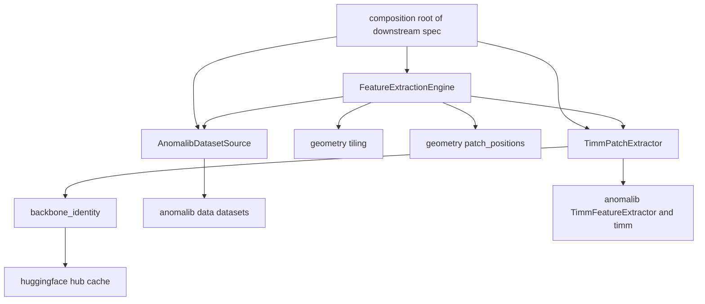
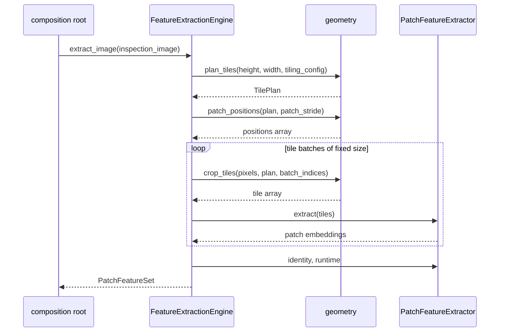
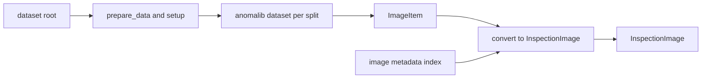

# Design Document

## Overview

本機能（`ssl-vit-feature-extraction`）は、検査画像を入力に取り込み、タイル化・パッチ化し、重み固定の自己教師あり事前学習済み ViT でパッチ特徴を生成する、パイプラインの起点となる Python パッケージ `feature_extraction` を新設する。生成物は「1 画像 = 1 パッチ特徴集合」であり、各パッチ特徴には元画像内の位置が、画像単位ではドメインタグ・由来キー・抽出器同一性メタ・抽出条件が付随する。

利用者は下流 spec の合成ルート（`patch-feature-store`、`primary-anomaly-detection`、`evaluation-framework`）である。これらは本機能が定義する型だけを介して特徴を受け取り、anomalib・timm・torch の型に依存しない。

現状 `src/` には `correction_layer` の 1 パッケージのみが存在する。本設計は同じ層パターン（`model` → `geometry` / `boundary` → `engine`）で 2 つ目のパッケージを追加し、`pyproject.toml` の import-linter 契約を複数パッケージ対応へ変更する。

### Goals

- データセット入力（画像・split・画像単位ラベル・正解マスク）を本機能の型へ閉じ込め、anomalib の型を下流へ漏らさない。
- 超高解像度画像を、領域欠落なく、暗黙のリサイズなしにタイル化し、1 枚あたり数千〜数万パッチの特徴を生成する。
- バックボーンを設定値の変更だけで切り替え、前処理条件を全バックボーンに同一の解釈で適用する。
- 各パッチ特徴に元画像座標の位置を、画像単位にドメインタグ・由来キーを付与する。
- 抽出器同一性メタ（バックボーン名・重みリビジョン・前処理条件・埋め込み次元）と抽出条件（パッチ数・タイル化条件）を出力する。

### Non-Goals

- 異常スコア計算・ヒートマップ・ROI 抽出（`primary-anomaly-detection`）。
- パッチ特徴の永続化・索引・近傍検索・coreset（`patch-feature-store`）。
- 評価指標の算出、抽出器比較プロトコルの実行（`evaluation-framework`）。
- バックボーンの重み更新、ローカルでの自己教師あり事前学習、MAE 再構成経路。
- 複数層特徴の融合・マルチスケール抽出。1 回の抽出は単一層に閉じる。
- ドメインタグの生成・正規化・外部システムとの突合（値は入力から供給される）。

## 境界コミットメント

### 本 spec が所有するもの

- データセット入力の取得と本機能型への変換、および入力取得失敗の報告契約。
- タイル配置の決定（タイルサイズ・重なり量・端部被覆）と、タイル座標からパッチ座標への写像。
- 重み固定バックボーンのロード、前処理条件の解決と適用、パッチ特徴テンソルの生成。
- パッチ特徴の出力契約 `PatchFeatureSet`（埋め込み・位置・ドメインタグ・由来キー・同一性メタ・抽出条件）。
- 抽出器同一性メタと抽出条件の値の権威。下流はこれを読むだけで再生成しない。

### 境界外

- 異常スコア・ヒートマップ・ROI 候補の生成。
- 特徴の永続化・索引・kNN・coreset・増分追加。
- 評価指標の算出と抽出器比較実験の実行。
- ドメインタグ・由来キーの値の生成・正規化・欠損補完。
- 補正レイヤの 4 軸ドメイン（`unit_of_work` を含む）への変換。本機能は要件が定める 3 軸（工程・材料・装置）を素通しする。
- パッチ特徴の L2 正規化（`promptable-correction-layer` の `PrototypeStore` が照会時に所有する）。
- 重複タイル領域に由来する重複パッチの排除。重なりは設定条件として出力に記録するに留める。

### 許可された依存

- 外部: `anomalib>=2.6,<3`（`anomalib.data` のデータセット、`TimmFeatureExtractor`）、`timm>=1.0.20`、`torch>=2.9`、`numpy`、`pydantic v2`、`huggingface_hub`。
- これらの依存は `feature_extraction.boundary` の内側にのみ存在してよい。`model`・`geometry`・`engine` は `numpy` と標準ライブラリ、`pydantic` だけに依存する。
- 本パッケージは `correction_layer` に依存しない。逆方向も作らない。
- 依存方向: `engine` → `boundary` / `geometry` → `model`。逆流と `boundary` ⇄ `geometry` の相互 import を禁止する。
- 上記 3 点はいずれも import-linter の契約で CI 検査する。契約の具体は「変更するファイル」に記す。宣言のみで検査手段を持たない依存規則を置かない。

### 再検証トリガー

- `PatchFeatureSet`・`ExtractorIdentity`・`ExtractionConditions` のフィールド追加・削除・意味変更。
- `positions` の座標系（元画像座標・4 列 `top, left, height, width`）またはパッチ順序の変更。
- `InspectionImage` の画素表現（`(3, H, W)` float32 `[0, 1]`）の変更。
- 埋め込みの数値契約（float32・有限値・非ゼロノルム）の変更。
- 依存方向の変更、および `boundary` 外への torch / anomalib 型の露出。
- タイル端部の被覆規則（原点クランプ方式）の変更。パッチ位置の重複分布が変わり、下流のバンク構成に影響する。

## Architecture

### 既存アーキテクチャの分析

`src/correction_layer` は `model`（型・Protocol）→ `boundary`（外部 I/O と重い依存）/ `decision`（純関数）→ `engine`（合成ルート）の一方向構成で、層契約を import-linter が CI 検査する。重い依存（FAISS）は `boundary/prototype_store.py` に閉じ、内部 Protocol で型を隠蔽している。公開面はパッケージルートの `__init__.py` の `__all__` だけで定義し、サブパッケージの `__init__.py` は空である。

本設計はこの構成をそのまま踏襲し、`decision` に相当する純粋計算層を `geometry`（タイル配置とパッチ座標）とする。FAISS を隠す `PrototypeStore` と同じ要領で、torch / timm / anomalib を `boundary` に閉じる。

`pyproject.toml` の `[tool.importlinter]` は `root_package = "correction_layer"`（単数形）であり、新規パッケージは検査対象外になる。import-linter 2.13 は `root_package` を内部で `root_packages` へ正規化し、両方が存在する場合は複数形のみを採用するため、複数形へ書き換える必要がある。

### アーキテクチャパターンと境界マップ

選択パターンは既存踏襲のレイヤード + ポート注入である。3 つの外部境界（データセット・バックボーン・重みリビジョン解決）をそれぞれ独立したモジュールに割り当て、合成ルートである `engine` が Protocol 経由で受け取る。



主要な決定は 3 点である。第一に、`engine` は具体実装を型として知らず `InspectionImageSource` と `PatchFeatureExtractor` の 2 つの Protocol だけを受け取る。第二に、設定値（タイル化条件・前処理条件・バックボーン指定）は境界で解決し、内部には解決済みの値だけを流す。第三に、バックボーン差（ViT のトークン列と CNN の特徴マップ）は `boundary` 内で吸収し、`geometry` と `engine` は「パッチストライド」という単一の概念だけを扱う。

### 技術スタック

- **入力アダプタ**: `anomalib.data` の `Visa` / `Folder` DataModule。`prepare_data()` と `setup()` を呼んだうえで、DataLoader を使わず `Dataset.__getitem__` を直接反復する。
- **特徴抽出**: `anomalib.models.components.feature_extractors.TimmFeatureExtractor`（anomalib 2.6.0）＋ timm 1.0.28。DINOv3 は `vit_*_patch16_dinov3`。
- **重み配布**: Hugging Face Hub の timm ミラー（`timm/vit_small_patch16_dinov3.lvd1689m` 等）。リビジョン固定は `hf-hub:<repo>@<revision>` 形式のモデル名で行う。
- **数値表現**: 公開契約は `numpy`（float32 / int32）。`torch` は `boundary` 内部だけで使う。
- **設定検証**: pydantic v2（`extra="forbid"`）。内部の値オブジェクトは frozen dataclass。

**ランタイム前提（実装着手前に解消が必要）**: 現在の `.venv` は `opencv-python-headless` のインストールが壊れており、`import cv2` が失敗する。`anomalib.data` と `anomalib.models` はこれに依存するため、本パッケージのテストは現状では実行できない。`opencv-python-headless` の再インストールが実装タスクの前提条件である。

## ファイル構造計画

### ディレクトリ構造

```text
src/feature_extraction/
├── __init__.py                   # 公開 API。__all__ でドメイン型・操作・例外のみを公開
├── engine.py                     # 合成ルート。FeatureExtractionEngine（画像→PatchFeatureSet）
├── model/
│   ├── __init__.py               # 空
│   ├── types.py                  # 入力側の型: DatasetSplit, ImageLabel, DomainTags,
│   │                             #   ProvenanceKeys, ImageMetadata, InspectionImage
│   ├── layout.py                 # タイル配置の値オブジェクト: TilePlacement, TilePlan
│   ├── config.py                 # 設定型: TilingConfig, PreprocessingConfig, BackboneConfig,
│   │                             #   ExtractionRuntimeConfig, FeatureLayout, FeatureNormalization
│   ├── features.py               # 出力側の型: ResolvedPreprocessing, ExtractorIdentity,
│   │                             #   ExtractionConditions, PatchFeatureSet
│   └── ports.py                  # Protocol: InspectionImageSource, PatchFeatureExtractor
├── geometry/
│   ├── __init__.py               # 空
│   ├── tiling.py                 # plan_tiles / crop_tiles。タイル配置の決定と切り出し
│   └── patch_positions.py        # patch_positions。タイル座標→元画像パッチ座標の写像
└── boundary/
    ├── __init__.py               # 空
    ├── anomalib_source.py        # AnomalibDatasetSource, visa_image_source,
    │                             #   folder_image_source, DatasetInputError
    ├── timm_backbone.py          # TimmPatchExtractor, BackboneUnavailableError
    └── backbone_identity.py      # resolve_preprocessing, resolve_weight_revision,
                                  #   resolve_extractor_identity

tests/
├── test_tiling.py                # タイル配置・被覆・設定検証
├── test_tiling_properties.py     # hypothesis: 任意画像サイズでの全域被覆と境界内性
├── test_patch_positions.py       # パッチ座標写像とパッチ数
├── test_feature_config.py        # TilingConfig / BackboneConfig / PreprocessingConfig /
│                                 #   ExtractionRuntimeConfig の検証
├── test_anomalib_source.py       # 合成 Folder データセットからの入力取得・欠損表現・失敗報告
├── test_timm_backbone.py         # バックボーンのロード失敗報告、前処理条件の適用と拒否
├── test_backbone_identity.py     # 前処理条件の解決、同一性メタの組み立て、重みリビジョン取得不可の表現
├── test_extraction_engine.py     # 疑似抽出器による合成での位置・メタ付与・条件記録
└── test_extraction_e2e.py        # 実バックボーン通し。重み未取得環境では skip
```

各モジュールは 300 行未満に収まる想定である。`model/types.py` と `model/features.py` は型定義のみ、`geometry/*` は純関数のみ、`boundary/*` は 1 外部依存 1 モジュールとする。

### 変更するファイル

- `pyproject.toml` — `[tool.importlinter]` を複数パッケージ対応にし、`feature_extraction` の契約を追加する。既存 4 契約は完全修飾名のため変更不要。
  - `root_package = "correction_layer"` を `root_packages = ["correction_layer", "feature_extraction"]` へ書き換える。
  - session option に `include_external_packages = true` を追加する。外部パッケージを `forbidden_modules` に置く契約は、この設定がないと `_check_external_forbidden_modules` が `ValueError` で拒否する（`importlinter/contracts/forbidden.py:220-234`）。TOML の真偽値は reader が `"True"` へ正規化するため `true` と書けばよい（`importlinter/adapters/user_options.py:105-108`）。

追加する契約は次の 5 つである。

```toml
[[tool.importlinter.contracts]]
name = "feature_extraction の層の依存方向（外側から内側のみ）"
type = "layers"
layers = [
    "feature_extraction.engine",
    "feature_extraction.boundary : feature_extraction.geometry",
    "feature_extraction.model",
]

[[tool.importlinter.contracts]]
name = "torch / timm / anomalib は boundary の外で import しない"
type = "forbidden"
source_modules = [
    "feature_extraction.model",
    "feature_extraction.geometry",
    "feature_extraction.engine",
]
forbidden_modules = ["torch", "timm", "anomalib"]

[[tool.importlinter.contracts]]
name = "geometry 内のモジュールは互いに独立（engine が合成）"
type = "independence"
modules = [
    "feature_extraction.geometry.tiling",
    "feature_extraction.geometry.patch_positions",
]

[[tool.importlinter.contracts]]
name = "model 内は ports → features → config／types・layout の一方向"
type = "layers"
layers = [
    "feature_extraction.model.ports",
    "feature_extraction.model.features",
    "feature_extraction.model.config",
    "feature_extraction.model.types : feature_extraction.model.layout",
]

[[tool.importlinter.contracts]]
name = "boundary 内は timm_backbone／anomalib_source → backbone_identity の一方向"
type = "layers"
layers = [
    "feature_extraction.boundary.timm_backbone : feature_extraction.boundary.anomalib_source",
    "feature_extraction.boundary.backbone_identity",
]
```

契約の意図は次のとおりである。

- `forbidden` 契約が「重い依存を `boundary` に閉じる」という本設計の中心的な不変条件を検査する唯一の手段である。`layers` 契約は内部モジュール間の向きしか見ないため、`geometry/tiling.py` が `torch` を import しても検出できない。間接 import も検査対象になるので、`model` が `boundary` 経由で torch へ到達する経路も破断として報告される。
- `forbidden_modules` に挙げた外部パッケージがグラフに現れない場合（その依存をまだ誰も import していない状態）は、契約エラーではなく検査対象から外れるだけである（`forbidden.py:103`）。実装途中でも CI が壊れない。
- `model` 内の層順序は実際の型依存に対応する。`ports` は `features`（`ExtractorIdentity`）と `types`（`InspectionImage`・`DatasetSplit`）を、`features` は `config`（`TilingConfig`・`ExtractionRuntimeConfig`・`FeatureNormalization`）と `types` を参照する。`types` と `layout` は同一段で互いに独立とする。
- `boundary` 内は `timm_backbone` と `anomalib_source` が同一段で互いに独立、その下に `backbone_identity` を置く。既存 `correction_layer.boundary` の契約と同じ形である。

## System Flows

### 1 画像の特徴抽出



タイルは `runtime.tile_batch_size` 枚ずつ投入する。末尾の端数バッチはバックボーンアダプタ内部で `0.0` の充填により規定サイズまで詰め、出力の余剰行を破棄する。これは同一バッチ形状でのみ数値が再現するという実測結果に基づく再現性の担保手段であり、`runtime` は抽出条件として記録する。

### 入力取得



DataLoader と `ImageBatch.collate` を経由しない。collate はバッチ内で画像形状が混在すると最大辺を持つ 1 枚の形状へ全件をリサイズし、アスペクト比を破壊するため、ネイティブ解像度保持の要件と両立しない。ドメインタグと由来キーは anomalib のデータセットが持たないため、呼び出し側が供給する `Mapping[str, ImageMetadata]` を引いて付与する。供給がなければ未提供のまま出力する。索引の鍵は `InspectionImage.image_id` と同一の値であり、`str(ImageItem.image_path)` をそのまま使う。`image_id` と索引の鍵を同じ値に定めることで、呼び出し側は出力の `PatchFeatureSet.image_id` から索引の項目を逆引きでき、パス表記の正規化規則を本機能と呼び出し側で二重に持つ必要がなくなる。

## 要件トレーサビリティ

### Requirement 1: データセット入力の取得と型の閉じ込め

- **1.1** — `AnomalibDatasetSource.images(split)` が `InspectionImage`（`pixels`・`split`・`image_label`）を返す。
- **1.2** — `ImageItem.gt_mask` を `InspectionImage.ground_truth_mask`（bool 配列）へ変換する。
- **1.3** — マスクを持たない入力では `ground_truth_mask` を `None` にする。
- **1.4** — DataLoader と PreProcessor を使わず `Dataset.__getitem__` を直接反復し、リサイズを介在させない。
- **1.5** — `InspectionImage` は `numpy` と `model/types.py` の型のみで構成する。anomalib 型は `boundary` を出ない。
- **1.6** — 入力取得の失敗を `DatasetInputError(location, reason)` として送出する。

### Requirement 2: 超高解像度画像のタイル化・パッチ化

- **2.1** — `plan_tiles` が `TilingConfig`（`tile_size`・`overlap`）から `TilePlan` を生成する。
- **2.2** — 末尾タイルの原点を `size - tile_size` にクランプし、パディングなしで全域を被覆する。
- **2.3** — `TilePlacement(top, left)` が各タイルの元画像領域を一意に定める。
- **2.4** — `TilingConfig` の pydantic バリデータが `tile_size <= 0` と `overlap < 0` / `overlap >= tile_size` を項目名と値付きで拒否する。
- **2.5** — 全タイルを固定バッチで走査し、打ち切り分岐を持たない。`PatchFeatureSet.embeddings` は全パッチを含む。

### Requirement 3: 重み固定のバックボーンによるパッチ特徴生成

- **3.1** — `TimmPatchExtractor.extract` が `(タイル数, パッチ数, 埋め込み次元)` の float32 配列を返す。
- **3.2** — ロード時に全パラメータの `requires_grad` を明示的に落とし、`eval()` と `torch.inference_mode()` で実行する。
- **3.3** — 固定バッチサイズ（端数は `0.0` で充填し、余剰行を破棄）と `eval` + `inference_mode` により、同一デバイス上で同一出力を返す。バッチサイズとデバイスは `ExtractionRuntimeConfig` で指定し、`ExtractionConditions.runtime` に記録する。
- **3.4** — 重み取得の失敗を `BackboneUnavailableError(backbone_name, reason)` として送出し、抽出を開始しない。
- **3.5** — `pre_trained=True` の重みロードのみを行い、学習ループを持たない。

### Requirement 4: バックボーン切替と前処理条件の統一

- **4.1** — `BackboneConfig`（同一性のみを持つ）の変更だけで切替可能。実行条件 `ExtractionRuntimeConfig` の再指定を伴わない。`PatchFeatureExtractor` の契約は不変で、`engine` の呼び出し手順も変わらない。
- **4.2** — 入力正規化（mean / std）と特徴正規化（`FeatureNormalization`）を全バックボーンで同一の解釈で適用する。適用できない組み合わせは黙殺せず構築時に拒否する。
- **4.3** — 未指定の前処理条件は `pretrained_cfg` から解決し、解決結果を `ResolvedPreprocessing` として `ExtractorIdentity` に記録する。
- **4.4** — 利用できないバックボーン名は `BackboneUnavailableError` として報告し、抽出を開始しない。

### Requirement 5: 位置・ドメインタグ・由来キーの付与

- **5.1** — `patch_positions` が元画像座標の `(top, left, height, width)` を全パッチ分生成し、`PatchFeatureSet.positions` に格納する。
- **5.2** — `InspectionImage.domain` を `PatchFeatureSet.domain` として画像単位で保持し、全パッチが共有する。
- **5.3** — 由来キーを `PatchFeatureSet.provenance` として画像単位で保持する。
- **5.4** — 未供給のタグ・キーは `None`（項目単位でも `None`）とし、推測補完を行わない。
- **5.5** — 1 画像 = 1 `PatchFeatureSet` の構造により、同一画像由来の全パッチが同一の由来キーを共有することを型で保証する。

### Requirement 6: 抽出器同一性メタと条件の出力

- **6.1** — `ExtractorIdentity(backbone_name, weight_revision, feature_layer, embedding_dim, preprocessing)` を出力する。
- **6.2** — `ExtractionConditions(tiling, runtime, patch_count)` を出力する。`runtime` は `tile_batch_size` と `device` を保持する。
- **6.3** — `PatchFeatureSet` が `embeddings` と `identity`・`conditions` を同一オブジェクトで保持する。
- **6.4** — 重みリビジョンを解決できない場合は `weight_revision = None`（取得不可）として出力する。

## Components and Interfaces

| コンポーネント | 層 | 意図 | 要件 | 主要依存 | 契約 |
| --- | --- | --- | --- | --- | --- |
| `FeatureExtractionEngine` | engine | 抽出フローの合成 | 2.5, 3.1, 5.1, 6.3 | ports (P0) | Service |
| `plan_tiles` / `crop_tiles` | geometry | タイル配置と切り出し | 2.1-2.4 | model.layout (P0) | Service |
| `patch_positions` | geometry | パッチ座標写像 | 2.3, 5.1 | model.layout (P0) | Service |
| `AnomalibDatasetSource` | boundary | 入力取得と型変換 | 1.1-1.6 | anomalib.data (P0) | Service |
| `TimmPatchExtractor` | boundary | 重み固定推論 | 3.1-3.5, 4.1-4.4 | anomalib, timm (P0) | Service |
| `backbone_identity` | boundary | 前処理条件・重みリビジョンの解決と同一性メタ組み立て | 4.3, 6.1, 6.4 | huggingface_hub (P1) | Service |

### Model

#### Ports

`model/ports.py` は差し替え口を 2 つだけ定義する。`@runtime_checkable` は付けず、実装は Protocol を継承しない（既存パッケージの方針）。

```python
class InspectionImageSource(Protocol):
    def images(self, split: DatasetSplit) -> Iterator[InspectionImage]: ...


class PatchFeatureExtractor(Protocol):
    @property
    def identity(self) -> ExtractorIdentity: ...

    @property
    def patch_stride(self) -> int: ...

    @property
    def runtime(self) -> ExtractionRuntimeConfig: ...

    def extract(self, tiles: np.ndarray) -> np.ndarray: ...
```

`patch_stride` と `runtime` を port に置くのは、`engine` がこれらを設定から再解決せず、注入された抽出器に問い合わせるだけでバッチ分割と抽出条件の記録を行えるようにするためである。`engine` は `runtime.tile_batch_size` をタイル投入の分割幅に使い、`runtime` をそのまま `ExtractionConditions` に記録する。抽出器の同一性（`identity`）と実行条件（`runtime`）は別の問い合わせ口とし、1 つの値に混ぜない。

### Engine

#### FeatureExtractionEngine

| 項目 | 内容 |
| --- | --- |
| Intent | タイル計画・切り出し・推論・メタ付与を合成し、1 画像分の特徴集合を返す |
| Requirements | 2.5, 3.1, 3.3, 5.1, 5.2, 5.3, 5.5, 6.2, 6.3 |

##### 責務と制約 (FeatureExtractionEngine)

- 具体実装を型として知らない。`PatchFeatureExtractor` と `InspectionImageSource` の Protocol のみを扱う。
- 設定の再解決を行わない。`TilingConfig` は構築時に受け取った値をそのまま使う。
- タイルバッチのループは「解決済みの計画に対する実行」だけを担い、ループ内で設定を解釈しない。

##### 依存 (FeatureExtractionEngine)

- Inbound: 下流 spec の合成ルート — 特徴生成の起動（P0）
- Outbound: `PatchFeatureExtractor` — パッチ特徴生成（P0）、`geometry` — 幾何計算（P0）

**Contracts**: Service [x]

##### Service Interface (FeatureExtractionEngine)

```python
class FeatureExtractionEngine:
    def __init__(self, extractor: PatchFeatureExtractor, tiling: TilingConfig) -> None: ...

    def extract_image(self, image: InspectionImage) -> PatchFeatureSet: ...

    def extract_split(
        self, source: InspectionImageSource, split: DatasetSplit
    ) -> Iterator[PatchFeatureSet]: ...
```

- 事前条件: `tiling.tile_size % extractor.patch_stride == 0`。構築時に検証し、違反は `ValueError` で拒否する。
- 事前条件: `image.pixels` は `(3, H, W)` float32、`H >= tile_size` かつ `W >= tile_size`。
- 事後条件: `embeddings.shape == (P, identity.embedding_dim)`、`positions.shape == (P, 4)`、`conditions.patch_count == P`。
- 事後条件: `positions` の各行が元画像の範囲内に収まる。
- 不変条件: `embeddings` の行順と `positions` の行順が一致する（タイル順・タイル内行優先）。

### Geometry

#### plan_tiles / crop_tiles

| 項目 | 内容 |
| --- | --- |
| Intent | タイル原点の決定と、計画に基づくタイル切り出し |
| Requirements | 2.1, 2.2, 2.3, 2.4 |

##### 責務と制約 (plan_tiles / crop_tiles)

- 純関数。`numpy` と `model` のみに依存し、torch を知らない。
- 端部は原点クランプで被覆する。ゼロパディングを行わない。パディング領域は実在しない画素であり、正常メモリバンクに人工的な内容を混入させるため採らない。
- 画像がタイルより小さい場合は被覆規則が定義できないため `ValueError` で拒否する（画像寸法とタイルサイズを報告する）。

**Contracts**: Service [x]

##### Service Interface (plan_tiles / crop_tiles)

```python
def plan_tiles(image_height: int, image_width: int, config: TilingConfig) -> TilePlan: ...

def crop_tiles(
    pixels: np.ndarray, plan: TilePlan, indices: Sequence[int]
) -> np.ndarray: ...
```

- `plan_tiles` 事後条件: 原点列は `0, step, 2*step, ...`（`step = tile_size - overlap`）で、最終原点は `size - tile_size` にクランプされる。原点列は単調増加で重複しない。
- `plan_tiles` 事後条件: 全タイルの和集合が画像全域を被覆する。
- `crop_tiles` 事後条件: 戻り値の形状は `(len(indices), 3, tile_size, tile_size)`。

#### patch_positions

| 項目 | 内容 |
| --- | --- |
| Intent | タイル配置とパッチストライドから元画像座標のパッチ位置を生成する |
| Requirements | 2.3, 5.1 |

**Contracts**: Service [x]

##### Service Interface (patch_positions)

```python
def patch_positions(plan: TilePlan, patch_stride: int) -> np.ndarray: ...
```

- 事前条件: `plan.tile_size % patch_stride == 0`。違反は `ValueError`。
- 事後条件: 形状 `(タイル数 * (tile_size // patch_stride) ** 2, 4)` の int32 配列。列は `top, left, height, width`。
- 事後条件: 行順はタイル順、タイル内はパッチ行優先。バックボーンのトークン列順と一致する。

### Boundary

#### AnomalibDatasetSource

| 項目 | 内容 |
| --- | --- |
| Intent | anomalib のデータセットを本機能の入力型へ変換する |
| Requirements | 1.1, 1.2, 1.3, 1.4, 1.5, 1.6, 5.2, 5.3, 5.4 |

##### 責務と制約 (AnomalibDatasetSource)

- anomalib の `ImageItem` を `InspectionImage` へ変換し、anomalib 型をモジュール外へ出さない。
- DataLoader と `ImageBatch.collate` を使わない。`prepare_data()` と `setup()` を呼んだうえで `Dataset.__getitem__` を直接反復する。
- `prepare_data()` は無条件に呼ぶ。`Visa` は未取得時にダウンロードと split 変換を行い、取得済みなら何もしない。取得の抑止を指定する引数を持たないため、本コンポーネントも抑止スイッチを設けない。
- リサイズを行わない。anomalib のモデル側 `PreProcessor` を一切構成しない。
- ドメインタグと由来キーは呼び出し側が供給する索引から引く。索引に無い画像は未提供のまま返す。
- `InspectionImage.image_id` は `str(ImageItem.image_path)` とし、`metadata_index` の鍵も同じ値とする。パスの正規化・相対化を行わない。`ImageItem.image_path` が `None` の項目は入力として成立しないため `DatasetInputError` で報告する。

##### 依存 (AnomalibDatasetSource)

- External: `anomalib.data`（`Visa` / `Folder` DataModule と Dataset）— 画像・ラベル・マスク・split の取得（P0）

**Contracts**: Service [x]

##### Service Interface (AnomalibDatasetSource)

```python
def visa_image_source(
    root: Path,
    category: str,
    metadata_index: Mapping[str, ImageMetadata] | None = None,
) -> AnomalibDatasetSource: ...

def folder_image_source(
    name: str,
    root: Path,
    normal_dir: str,
    abnormal_dir: str | None = None,
    normal_test_dir: str | None = None,
    mask_dir: str | None = None,
    metadata_index: Mapping[str, ImageMetadata] | None = None,
) -> AnomalibDatasetSource: ...


class AnomalibDatasetSource:
    def images(self, split: DatasetSplit) -> Iterator[InspectionImage]: ...
```

- 事後条件: `pixels` は `(3, H, W)` float32 `[0, 1]`、元画像の解像度そのまま。
- 事後条件: `ground_truth_mask` はマスクがある場合のみ `(H, W)` bool、無い場合は `None`。
- エラー: ルートが存在しない、読み取れない、split に対応するデータが無い場合、および `prepare_data()` がデータを用意できなかった場合は `DatasetInputError(location, reason)`。

#### TimmPatchExtractor

| 項目 | 内容 |
| --- | --- |
| Intent | 重み固定バックボーンをロードし、タイル配列からパッチ特徴を生成する |
| Requirements | 3.1, 3.2, 3.3, 3.4, 3.5, 4.1, 4.2, 4.3, 4.4, 6.1 |

##### 責務と制約 (TimmPatchExtractor)

- `TimmFeatureExtractor` を単一層構成（`layers=[feature_layer]`）で使う。複数層の融合は行わない。
- ViT 系は `output_fmt="NLC"`、CNN 系は `output_fmt="NCHW"` を使い、いずれも `(タイル数, パッチ数, 次元)` へ正規化する。CLS・register トークンは含めない（`return_class_token=False`）。
- `TimmFeatureExtractor` の経路選択は `output_fmt == "NLC"` **または**バックボーン名に `vit` を含むかで決まる。したがって名前に `vit` を含むバックボーンは `FEATURE_MAP` を指定しても CNN 経路に入らず、`load` は `backbone.name` と `feature_layout` の整合を構築前に検証する。`vit` を含む名前に `FEATURE_MAP` を指定した組み合わせは、そのバックボーンがそのレイアウトで利用できないことを意味するため `BackboneUnavailableError` で拒否する。ライブラリ内部の `AttributeError` を呼び出し側に見せない。
- `load` は `feature_layer` が対象バックボーンに実在することを検証し、不在なら `BackboneUnavailableError(backbone_name, reason)` で拒否する。anomalib は CNN 経路で見つからない層を例外にせず、警告ログを出して `layers` から取り除くため、層が 1 つも残らないまま構築だけが成功しうる。ViT 経路では範囲外のブロック番号が構築時に検出されず、最初の `forward` で `AssertionError` になる。いずれも要件 4.4 の「抽出を開始せず報告する」と要件 3.1 の出力契約に反するため、構築成功として扱わない。判定は `FEATURE_MAP` では構築後に `TimmFeatureExtractor.layers` へ `feature_layer` が残っていること、`TOKENS` ではブロック番号がモデルのブロック数未満であることで行う。ブロック数は `len(extractor.feature_extractor.blocks)` から得る。`TOKENS` 経路の `TimmFeatureExtractor.feature_extractor` は timm のモデル本体であり、timm 側の `forward_intermediates` も `feature_take_indices(len(self.blocks), indices)` で同じ値を上限に使う（DINOv3 の実装クラスは `timm/models/eva.py:947`、`VisionTransformer` 系は `timm/models/vision_transformer.py:1110`）。すなわち構築時の検証と実行時の判定が同一の権威を参照する。
- `load` は構築前に確定できる条件をすべて構築前に確定させ、`TimmFeatureExtractor` の構築はその後に 1 度だけ行う。順序は次のとおりである。

  1. `timm.get_pretrained_cfg(backbone.name)` で `pretrained_cfg` を取得する。`backbone.name` が timm に未登録、またはタグが不正で取得できない場合は構築せず `BackboneUnavailableError` で拒否する。
  2. `resolve_preprocessing` で前処理条件を解決する。解決結果の `feature_normalization` は `TimmFeatureExtractor` の `norm` 引数に対応するため、構築後に解決すると適用値と記録値が食い違う。
  3. `resolve_weight_revision` で重みリビジョンを解決する。入力は `pretrained_cfg` の `hf_hub_id` と `backbone.weights_revision` だけであり、構築物を必要としない。
  4. 3 でリビジョンが定まった場合は構築用モデル名 `hf-hub:<repo>@<revision>` を組み立て、定まらない場合は `backbone.name` を使う。ここで構築に使ったリビジョンが、そのまま `ExtractorIdentity.weight_revision` に記録する値である。

- 構築後に確定するのは `embedding_dim` だけである。`load` は 2 の `ResolvedPreprocessing` と 3 の `weight_revision` を `resolve_extractor_identity` へ渡して同一性メタを組み立て、構築後に条件を解決し直す経路を持たない。`weights_revision` を明示指定したのに構築に反映されないまま記録だけが行われる経路を作らないためである。
- `BackboneConfig.name` は timm に登録済みのモデル名であり、`hf-hub:<repo>@<revision>` 形式は 4 で内部的に組み立てる構築用の名前であって設定値ではない。
- パッチストライドは ViT 系で公開属性 `patch_size`、CNN 系で公開属性 `reductions` の該当層の値を採る。いずれも `TimmFeatureExtractor` が経路ごとに設定する属性であり、内部の `feature_info` へ直接到達しない。
- `requires_grad=False` は anomalib 側ではパラメータを凍結せず、forward 時の `eval()` と `no_grad()` を意味するに過ぎない。ロード時に全パラメータの `requires_grad` を明示的に落とす。
- 入力正規化（mean / std）は本コンポーネントが適用する。リサイズは行わない。
- 特徴正規化は `FeatureNormalization` で表現する。`BACKBONE_FINAL_NORM` は `TimmFeatureExtractor` の `norm` 引数に対応するが、CNN 系の `features_only` 経路では無視される。したがって `FEATURE_MAP` レイアウトで `BACKBONE_FINAL_NORM` が**明示指定**された場合のみ、条件が適用できないことを黙殺せず構築時に `ValueError` で拒否する。未指定時は `FEATURE_MAP` の既定 `NONE` に解決されるため拒否しない。
- 実行条件は `load` の `runtime` 引数（`ExtractionRuntimeConfig`）で受け取り、そのまま `runtime` プロパティで公開する。`BackboneConfig` からは実行条件を読まない。`device` はモデルの配置先とタイルテンソルの転送先の双方に使う。
- 端数バッチは `runtime.tile_batch_size` まで詰めて推論し、余剰出力を破棄する。バッチ形状が変わると数値が変わるためである。充填値は `0.0` とする。`eval()` 実行では標本間で統計が混ざらない（BatchNorm は running statistics を使い、LayerNorm はトークン内で閉じる）ため、充填値は保持行の数値に影響しない。確認は CPU 上の小規模モデル（Conv + BatchNorm + LayerNorm、`eval` + `inference_mode`）で行い、実 5 枚 + 充填 3 枚のバッチの充填内容を 0 と乱数で入れ替えても保持 5 行がビット単位で一致した。DINOv3 実重みでの再確認は実装タスクで行う。`0.0` は有限値であり、`extract` の「有限値のみ」という事後条件を充填行が壊すこともない。

##### 依存 (TimmPatchExtractor)

- External: `anomalib` `TimmFeatureExtractor` — バックボーン構築と特徴取得（P0）
- External: `timm` — 重みのロードと `pretrained_cfg`（P0）
- Outbound: `backbone_identity` — 前処理条件と重みリビジョンの解決、同一性メタの組み立て（P1）

**Contracts**: Service [x] / State [x]

##### Service Interface (TimmPatchExtractor)

```python
class TimmPatchExtractor:
    @classmethod
    def load(
        cls,
        backbone: BackboneConfig,
        preprocessing: PreprocessingConfig,
        runtime: ExtractionRuntimeConfig,
    ) -> "TimmPatchExtractor": ...

    @property
    def identity(self) -> ExtractorIdentity: ...

    @property
    def patch_stride(self) -> int: ...

    @property
    def runtime(self) -> ExtractionRuntimeConfig: ...

    def extract(self, tiles: np.ndarray) -> np.ndarray: ...
```

- 事前条件: `tiles` は `(n, 3, tile, tile)` float32 `[0, 1]`、`1 <= n <= runtime.tile_batch_size`、`tile % patch_stride == 0`。
- 事後条件: 戻り値は `(n, (tile // patch_stride) ** 2, embedding_dim)` float32、有限値のみ。
- 事後条件: 同一デバイス・同一プロセス・同一 `runtime.tile_batch_size` で反復すると出力はビット単位で一致する。
- エラー: 重みの取得失敗、未知のバックボーン名、レイアウトと前処理条件の不整合は `BackboneUnavailableError` または `ValueError`。

##### State Management

- モデルは `load` で 1 度だけ構築し、以後は不変に扱う。`extract` はモデル状態を変更しない。
- 1 インスタンスは 1 バックボーン構成に対応する。切替は新しいインスタンスの生成で行う。

#### backbone_identity

| 項目 | 内容 |
| --- | --- |
| Intent | 前処理条件と重みリビジョンの解決、抽出器同一性メタの組み立て |
| Requirements | 4.3, 6.1, 6.4 |

##### 責務と制約 (backbone_identity)

- `resolve_preprocessing` は前処理条件を解決する唯一の場所である。未指定の `input_mean` / `input_std` を `pretrained_cfg` の値で解決し、未指定の `feature_normalization` を `backbone.feature_layout` から決める。`TOKENS` は `BACKBONE_FINAL_NORM`、`FEATURE_MAP` は `NONE`（CNN の `features_only` 経路では `norm` が無視され、適用されない条件を適用済みと記録しないため）。
- `resolve_preprocessing` は `embedding_dim` を必要としない。`feature_normalization` が `TimmFeatureExtractor` の `norm` 引数に対応する以上、解決はバックボーン構築より前に完了していなければならず、構築後にしか得られない `embedding_dim` と同じ関数に置くと既定規則が二重化するか適用値と記録値が食い違うためである。`pretrained_cfg` は `timm.get_pretrained_cfg` により構築前に取得できる。
- `resolve_weight_revision` は重みリビジョンを解決する唯一の場所である。入力は `pretrained_cfg` の `hf_hub_id` と設定値 `BackboneConfig.weights_revision` だけで、構築済みモデルを必要としないため `load` が構築前に呼べる。解決順序は、明示指定 → Hugging Face キャッシュにある commit → `None`。ネットワークアクセスを前提にしない。
- キャッシュ照会は `huggingface_hub.try_to_load_from_cache(repo_id=hf_hub_id, filename=<候補>)` で行う。候補は timm が実際にキャッシュへ置く重みファイルであり、timm の safetensors 優先の取得順に合わせて `model.safetensors` → `pytorch_model.bin` の順に照会する。`config.json` は照会対象にしない。timm が `config.json` を取得するのは `hf-hub:` 前置きのモデル名を渡した場合だけであり、`BackboneConfig.name`（timm 登録名）での構築では重みファイルしかキャッシュに現れないためである。`revision` は既定の `main` を使い、`refs/main` が指す commit を解決対象とする。`hf_hub_id` が `None`（HF ミラーを持たないモデル）の場合は照会自体を行わない。
- `pretrained_cfg.custom_load` が真のタグ（重みが `.npz` で配布される flexivit 系など）は、`hf_hub_id` を持っていても重みファイルが HF キャッシュに現れないため `weight_revision` は常に `None` へ縮退する。これらのタグは timm 自身が HF hub 経路での重みロードを行わず、警告ログ `"Hugging Face hub not currently supported for custom load pretrained models"` を出して repo id を読み込み関数へ渡す（`timm/models/_builder.py:130-147`）。本設計が想定する DINOv3 各タグと比較用 CNN（`wide_resnet50_2.tv_in1k`）はいずれも `custom_load = False` であり、この縮退は起きない。`custom_load` を検出する分岐は設けず、`weight_revision = None` という既定の縮退経路（6.4）で扱う。
- 照会の戻り値は「パス」「非存在がキャッシュ済みであることを表すセンチネル（`huggingface_hub._CACHED_NO_EXIST`）」「未キャッシュを表す `None`」の 3 値である。`str` が返った候補についてのみ、そのパス `<cache>/snapshots/<commit>/<候補>` の親ディレクトリ名を commit として採用する。センチネルと `None` はいずれも未解決として扱って次の候補へ進み、全候補が未解決なら `None` を返す。センチネルは真値でありパスとして扱うと不正な commit を記録するため、判定は `isinstance(result, str)` で行う。
- `resolve_extractor_identity` は解決済みの前処理条件・`weight_revision`・`embedding_dim` を受け取り、同一性メタを組み立てるだけである。前処理条件の既定も重みリビジョンも再解決しない。構築に適用した値と記録する値を一致させるため、解決は構築前に 1 度だけ行う。

**Contracts**: Service [x]

##### Service Interface (backbone_identity)

```python
def resolve_preprocessing(
    backbone: BackboneConfig,
    preprocessing: PreprocessingConfig,
    pretrained_cfg: Mapping[str, object],
) -> ResolvedPreprocessing: ...

def resolve_weight_revision(hf_hub_id: str | None, requested: str | None) -> str | None: ...

def resolve_extractor_identity(
    backbone: BackboneConfig,
    preprocessing: ResolvedPreprocessing,
    weight_revision: str | None,
    embedding_dim: int,
) -> ExtractorIdentity: ...
```

- 事前条件: `resolve_preprocessing` の `pretrained_cfg` は `timm.get_pretrained_cfg(backbone.name).to_dict()` の内容であり、`mean` / `std` / `hf_hub_id` を含みうる。timm の型を境界の外へ出さないため dict として扱う。
- 事前条件: `resolve_weight_revision` の `hf_hub_id` は同じ `pretrained_cfg` の `hf_hub_id`、`requested` は `BackboneConfig.weights_revision`。
- 事前条件: `resolve_extractor_identity` の `preprocessing` と `weight_revision` は解決済みの値であり、`load` が構築に適用したものと同一である。
- 事後条件: `resolve_preprocessing` の戻り値は全項目が具体値に解決された `ResolvedPreprocessing`。
- 事後条件: `resolve_weight_revision` の戻り値は解決できた場合のみ文字列、できなければ `None`。
- 事後条件: `ExtractorIdentity.preprocessing` と `ExtractorIdentity.weight_revision` は引数の値と一致する。
- 事後条件: `ExtractorIdentity.backbone_name` は `BackboneConfig.name`（timm 登録名）であり、リビジョンを埋め込んだ構築用モデル名ではない。リビジョンは `weight_revision` だけが表す。

## Data Models

### ドメインモデル

集約の単位は「1 画像」である。`InspectionImage` が入力側の集約ルート、`PatchFeatureSet` が出力側の集約ルートであり、由来キー・ドメインタグ・同一性メタ・抽出条件はすべて画像単位で 1 つだけ存在する。パッチは独立した実体を持たず、配列の行として集約に内包される。この構造により「同一画像由来の全パッチが同一の由来キーを共有する」不変条件が型で保証される。

### 論理データモデル

```python
class DatasetSplit(StrEnum):
    TRAIN = "train"
    VAL = "val"
    TEST = "test"


class ImageLabel(StrEnum):
    NORMAL = "normal"
    ANOMALOUS = "anomalous"


@dataclass(frozen=True)
class DomainTags:
    process: str | None
    material: str | None
    equipment: str | None


@dataclass(frozen=True)
class ProvenanceKeys:
    wafer_id: str | None
    lot_id: str | None
    captured_on: date | None


@dataclass(frozen=True)
class ImageMetadata:
    domain: DomainTags | None
    provenance: ProvenanceKeys | None


@dataclass(frozen=True)
class InspectionImage:
    image_id: str                           # str(ImageItem.image_path)。metadata_index の鍵と同値
    pixels: np.ndarray                      # (3, H, W) float32 [0, 1]
    split: DatasetSplit
    image_label: ImageLabel
    ground_truth_mask: np.ndarray | None    # (H, W) bool
    domain: DomainTags | None
    provenance: ProvenanceKeys | None


@dataclass(frozen=True)
class TilePlacement:
    top: int
    left: int


@dataclass(frozen=True)
class TilePlan:
    image_height: int
    image_width: int
    tile_size: int
    placements: tuple[TilePlacement, ...]
```

設定型は pydantic（`extra="forbid"`）で定義する。

```python
class FeatureLayout(StrEnum):
    TOKENS = "tokens"                 # ViT: output_fmt="NLC"
    FEATURE_MAP = "feature_map"       # CNN: output_fmt="NCHW"


class FeatureNormalization(StrEnum):
    BACKBONE_FINAL_NORM = "backbone_final_norm"
    NONE = "none"


class TilingConfig(BaseModel):
    tile_size: int                    # > 0
    overlap: int                      # 0 <= overlap < tile_size


class PreprocessingConfig(BaseModel):
    input_mean: tuple[float, float, float] | None = None
    input_std: tuple[float, float, float] | None = None
    feature_normalization: FeatureNormalization | None = None


class BackboneConfig(BaseModel):
    name: str                         # 例: "vit_small_patch16_dinov3.lvd1689m"
    feature_layer: str                # 例: "blocks.11" / "layer3"
    feature_layout: FeatureLayout
    weights_revision: str | None = None

    @model_validator(mode="after")
    def _check_layer_matches_layout(self) -> "BackboneConfig": ...


class ExtractionRuntimeConfig(BaseModel):
    tile_batch_size: int = 8          # > 0
    device: str = "cpu"
```

`BackboneConfig` は「どの抽出器か」だけを表す。`name`・`feature_layer`・`feature_layout`・`weights_revision` は `ExtractorIdentity` の権威であり、この 4 項目が同じなら同じ抽出器である。`tile_batch_size` と `device` は「どう実行したか」であって抽出器の同一性ではないため、`ExtractionRuntimeConfig` に分ける。同一バックボーンをデバイス違い・バッチ違いで走らせる構成でも `BackboneConfig` は 1 つで足り、要件 4.1 の「設定の変更だけで切り替える」が実行条件の再指定を伴わない。

`name`・`feature_layout`・`feature_layer` は独立に指定できるため、組み合わせの整合を検証しないと不整合が構築時ではなく推論経路の内部で表面化する。`_check_layer_matches_layout` は `TOKENS` のときに `feature_layer` が `blocks.<int>` 形式であることだけを検証し、違反を項目名と値付きの `ValueError` で拒否する。`TimmFeatureExtractor` は `NLC` 経路でブロック名を整数インデックスへ解析し、解析できない名前を `ValueError` にするためである。

`FEATURE_MAP` の `feature_layer` には形式上の制約を課さない。CNN の層名は timm のモデル系列ごとに異なり、`blocks.<int>` 形式も正当な層名として登録される（EfficientNet 系は特徴抽出用の層名に `blocks.<stack_idx>` を登録する）。形式で拒否すると正当な構成を構築前に弾き、要件 4.1 のバックボーン切替を狭めてしまう。正しい条件は「対象バックボーンの層一覧に実在するか」であり、これはライブラリを構築しないと判定できないため `boundary` の `TimmPatchExtractor.load` が担う。

同じ理由で、`name` と `feature_layout` の整合（`TimmFeatureExtractor` が `output_fmt` とバックボーン名の双方から経路を選び、`vit` を含む名前は `NLC` 経路に固定される）もライブラリ側の経路選択規則に属するため、`model` ではなく `TimmPatchExtractor.load` が検証する。

出力型は frozen dataclass で定義する。

```python
@dataclass(frozen=True)
class ResolvedPreprocessing:
    input_mean: tuple[float, float, float]
    input_std: tuple[float, float, float]
    feature_normalization: FeatureNormalization


@dataclass(frozen=True)
class ExtractorIdentity:
    backbone_name: str
    weight_revision: str | None       # None は取得不可を表す
    feature_layer: str
    embedding_dim: int
    preprocessing: ResolvedPreprocessing


@dataclass(frozen=True)
class ExtractionConditions:
    tiling: TilingConfig
    runtime: ExtractionRuntimeConfig
    patch_count: int


@dataclass(frozen=True)
class PatchFeatureSet:
    image_id: str
    split: DatasetSplit
    image_label: ImageLabel
    embeddings: np.ndarray            # (P, embedding_dim) float32
    positions: np.ndarray             # (P, 4) int32: top, left, height, width
    domain: DomainTags | None
    provenance: ProvenanceKeys | None
    identity: ExtractorIdentity
    conditions: ExtractionConditions
```

`ExtractionConditions` は要件 6.2 が列挙するタイル化条件とパッチ数に加えて、実行条件 `runtime` を持つ。`tile_batch_size` と `device` は要件 3.3 の再現性が成立する条件そのものであり、これを記録しないと出力から再現条件を確認できないためである。値は `TimmPatchExtractor` に渡した `ExtractionRuntimeConfig` そのものであり、`engine` は `extractor.runtime` を読むだけで再構成しない。

### データ契約

- 埋め込みは float32、有限値のみ、L2 ノルムは非ゼロ。L2 正規化は行わない（照会時の正規化は下流の `PrototypeStore` が所有する）。
- 位置は元画像のピクセル座標で、`height` と `width` はパッチストライドに等しい。タイルの重なりにより同一座標が複数回出現しうる。
- `weight_revision` が `None` の場合、下流は「同一バックボーン由来」の判定に `backbone_name` と `preprocessing` のみを使う。

## Error Handling

### エラー戦略

失敗は早期に、原因の対象と理由を伴って送出する。握りつぶしと既定値へのフォールバックを行わない。例外クラスは、構造化された情報を呼び出し側が必要とする 2 箇所のみに定義し、それ以外は `ValueError` を使う（既存パッケージの方針を踏襲）。

### エラー分類と応答

- **設定エラー** — `TilingConfig` / `BackboneConfig` / `ExtractionRuntimeConfig` の不正値は pydantic のバリデータが項目名と値を含めて拒否する（2.4、3.3）。`TOKENS` に `blocks.<int>` 形式でない `feature_layer` を指定した形式不整合も同じ経路で拒否する。`tile_size % patch_stride != 0`、`FEATURE_MAP` に `BACKBONE_FINAL_NORM` を明示指定した組み合わせは `ValueError`（4.2）。
- **入力エラー** — データの所在が存在しない・読めない・split が空、`prepare_data()` がデータを用意できない場合は `DatasetInputError(location, reason)`（1.6）。
- **バックボーンエラー** — 重みの取得失敗、未知のバックボーン名（`timm.get_pretrained_cfg` が取得できない）、`name` と `feature_layout` の経路不整合（`vit` を含む名前に `FEATURE_MAP` を指定）、および `feature_layer` が対象バックボーンに実在しない場合は `BackboneUnavailableError(backbone_name, reason)`（3.4、4.4）。いずれも抽出を開始しない。層の不在は anomalib が警告ログのみで縮退させ、範囲外のブロック番号は最初の `forward` まで遅延するため、`load` が検出して構築失敗として報告する。
- **メタ取得の縮退** — 重みリビジョンの解決失敗は失敗として扱わず、`weight_revision = None` として出力を継続する（6.4）。これは唯一の縮退経路である。

### 監視

抽出は 1 画像単位で完結するため、進捗と条件の可観測性は `PatchFeatureSet` 自体が担う。ログ出力の方針は下流の合成ルートが所有する。

## Testing Strategy

### Unit Tests

- `plan_tiles` が割り切れない寸法（例: 1000 x 700、タイル 256、重なり 32）で全域を被覆し、最終原点が `size - tile_size` にクランプされる（2.1、2.2、2.3）。
- `TilingConfig` が `tile_size = 0`、`overlap = -1`、`overlap = tile_size` を項目名と値を含むメッセージで拒否する（2.4）。
- `patch_positions` がパッチ数 `タイル数 * (tile_size // stride) ** 2` を返し、全行が画像範囲内に収まり、行順がタイル順・行優先である（2.3、5.1）。
- `resolve_preprocessing` が未指定の mean / std を `pretrained_cfg` から解決する（4.3）。
- `resolve_preprocessing` が未指定の `feature_normalization` を `feature_layout` に応じて解決する。`TOKENS` は `BACKBONE_FINAL_NORM`、`FEATURE_MAP` は `NONE` になる（4.3）。
- `resolve_extractor_identity` が渡された `ResolvedPreprocessing` と `weight_revision` をそのまま保持し、いずれも再解決しない（4.3、6.1）。
- `resolve_weight_revision` が 明示指定 → キャッシュの commit → `None` の順で解決する。明示指定があればキャッシュを参照せずその値を返し、未指定ならキャッシュのスナップショットから得た commit を返し、`hf_hub_id` が `None` またはキャッシュ不在なら `None` を返す（6.4）。
- `resolve_weight_revision` が照会するのは重みファイルだけである。`model.safetensors` だけを置いたキャッシュと `pytorch_model.bin` だけを置いたキャッシュのいずれからも commit を解決する一方、`config.json` だけを置いたキャッシュからは解決せず `None` を返す（6.4）。
- `resolve_weight_revision` が `try_to_load_from_cache` の 3 値をすべて処理する。`_CACHED_NO_EXIST` センチネルが返る候補は未解決として次の候補へ進み、全候補がセンチネルまたは `None` なら `None` を返す。センチネルを commit として記録せず、例外にもしない（6.4）。
- `TimmPatchExtractor.load` が `weights_revision` の明示指定時に構築用モデル名を `hf-hub:<repo>@<revision>` で組み立て、その `<revision>` と `identity.weight_revision` が一致する。リビジョンを解決できない場合は `backbone.name` で構築し `identity.weight_revision` が `None` になる。いずれの場合も `identity.backbone_name` は `BackboneConfig.name` のままである（6.1、6.4）。
- `BackboneConfig` が `TOKENS` × `feature_layer = "layer3"` を項目名と値を含むメッセージで拒否する一方、`FEATURE_MAP` × `feature_layer = "blocks.11"` は形式では拒否せず受け入れる（4.1、4.2）。
- `BackboneConfig` が `tile_batch_size` / `device` を受け付けない（`extra="forbid"` により拒否される）。実行条件は `ExtractionRuntimeConfig` だけが持つ（4.1）。
- `ExtractionRuntimeConfig` が `tile_batch_size = 0` と負値を項目名と値を含むメッセージで拒否し、未指定時に既定値（`tile_batch_size = 8`、`device = "cpu"`）へ解決する（3.3）。
- `TimmPatchExtractor.load` が未知のバックボーン名と、`vit` を含む名前 × `FEATURE_MAP` の経路不整合を `BackboneUnavailableError` で拒否する（4.4）。
- `TimmPatchExtractor.load` が対象バックボーンに存在しない `feature_layer`（`FEATURE_MAP` で未登録の層名、`TOKENS` で範囲外のブロック番号）を `BackboneUnavailableError` で拒否し、警告のみで縮退した構築結果を返さない（4.4）。
- `TimmPatchExtractor.load` が `FEATURE_MAP` × `BACKBONE_FINAL_NORM` の**明示指定**を `ValueError` で拒否する一方、`FEATURE_MAP` × 前処理未指定は拒否せず構築できる（4.2、4.3）。
- `TimmPatchExtractor.load` の直後に、モデルの全パラメータの `requires_grad` が `False` である（3.2）。
- `extract` の前後でモデルの全パラメータ値が変化しない（3.2）。

### Property Tests（hypothesis）

- 任意の画像寸法（タイルサイズ以上）と任意の重なり量に対し、`plan_tiles` の結果が全画素を被覆し、原点が単調増加で重複しない（2.2）。
- 任意の計画に対し `patch_positions` の全座標が `[0, H) x [0, W)` に収まる（5.1）。

### Integration Tests

- 合成 Folder データセット（マスクあり・なしの 2 構成）から `AnomalibDatasetSource.images` が split・ラベル・マスク有無を正しく返し、画素がネイティブ解像度のままである（1.1-1.4）。
- 存在しないルートを指定した場合に `DatasetInputError` が所在と理由を保持する（1.6）。
- `AnomalibDatasetSource.images` の戻り値（`InspectionImage` と各フィールド）の型、およびパッケージルートの `__all__` に、`anomalib` / `torch` 由来の型・名前が出現しない（1.5）。
- 決定的な疑似 `PatchFeatureExtractor`（入力から解析的に特徴を返す実装）を注入した `FeatureExtractionEngine` が、位置・ドメインタグ・由来キー・同一性メタ・抽出条件を付与し、`patch_count` が `positions` の行数と一致する（3.1、5.1-5.5、6.2、6.3）。
- ドメインタグ・由来キーを供給しない場合に `None` のまま出力され、補完が起きない（5.4）。
- 同一画像・同一設定での 2 回の `extract_image` が同一の埋め込みを返す（3.3）。

### End-to-End Tests

- 実バックボーン（`vit_small_patch16_dinov3`）で合成画像 1 枚を通し、埋め込み次元が `identity.embedding_dim` と一致し、全要素が有限値である（3.1、6.1）。重みが取得できない環境では skip する。
- CNN バックボーン（`wide_resnet50_2`、`FEATURE_MAP`、前処理条件は未指定）で同一の呼び出し手順が通り、出力契約が ViT と同一である。`identity.preprocessing.feature_normalization` は `NONE` に解決される（4.1、4.3）。重みが取得できない環境では skip する。
- 端数バッチ（`n < runtime.tile_batch_size`）の `extract` が、同じタイルを先頭に置いた満杯バッチの対応行とビット単位で一致する。充填行の内容が保持行に影響しないことを実バックボーンで確認する（3.3）。重みが取得できない環境では skip する。

## Performance & Scalability

- 1 枚あたりのパッチ数は タイル数 × `(tile_size // patch_stride) ** 2` で決まる。タイル 512・ストライド 16 の場合 1 タイル 1024 パッチであり、8000 x 8000 の画像では約 26 万パッチ、埋め込み 384 次元 float32 で約 400 MB になる。`PatchFeatureSet` は画像単位で完結するため、下流はこの粒度で逐次処理できる。ストリーミング化と永続化は `patch-feature-store` の責務である。
- タイルの切り出しは `numpy` のスライスコピーで行い、バッチ単位でのみ torch テンソルへ変換する。画像全体を一度に torch へ載せない。
- `tile_batch_size` は再現性のために固定する。値の探索（スループット最適化）は本 spec の対象外である。

## Supporting References

- 詳細な調査記録（anomalib / timm の実測、決定性の検証、代替案の比較）は `research.md` を参照する。
