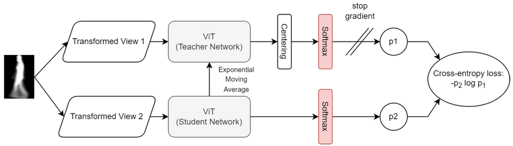

DINO と MAE はどちらも **Vision Transformer（ViT）を前提とした自己教師あり学習（Self-Supervised Learning）手法**です。
特に、**半導体SEM画像やVAD（教師なし異常検知）** と非常に相性が良い系統です。

---

# 1️⃣ DINO（自己蒸留型表現学習）

## DINO

(Distillation with No Labels)




## 🔹 基本アイデア

> ラベルなしで「教師モデル」と「生徒モデル」を一致させる

* 同じ画像を異なるAugmentationで複数生成
* Teacher（重み固定 or EMA）
* Student（学習対象）
* 出力分布を一致させる（クロスエントロピー）

---

## 🔹 特徴

* **自己蒸留（Self-distillation）**
* クラスタリング能力が自然に出現
* Attention Map が意味構造を捉える
* ViTとの相性が非常に良い

---

## 🔹 数式イメージ

```text
Loss = CrossEntropy(Teacher(x1), Student(x2))
```

---

## 🔹 何がすごい？

* ラベルなしで物体セグメンテーション的な構造が現れる
* 線形分類でも高精度
* 異常検知でのFeature Extractorとして優秀

あなたの用途（SEM欠陥）では：

> DINO特徴量 → PaDiM / PatchCore に入力
> は非常に有効です。

---

# 2️⃣ MAE（Masked Autoencoder）

## Masked Autoencoders

(Masked Autoencoders Are Scalable Vision Learners)


---

## 🔹 基本アイデア

> 画像の大部分を隠して復元させる

* 画像パッチの **75% をマスク**
* 残り25%だけでエンコード
* デコーダで元画像を復元

---

## 🔹 なぜ75%？

画像は冗長性が高いため
大部分を隠しても構造を学習できる。

---

## 🔹 学習目的

```text
Loss = || original_pixels - reconstructed_pixels ||²
```

---

## 🔹 特徴

* 再構成型自己教師
* 大規模学習に強い
* 画像全体構造を理解
* ViTを効率的に学習可能

---

# 3️⃣ DINO vs MAE 比較

|     観点     |       DINO        |          MAE          |
| ------------ | ----------------- | --------------------- |
| 学習方式     | 自己蒸留          | 再構成                |
| 目的         | 表現分布一致      | ピクセル復元          |
| 出力性質     | 意味的特徴        | 構造的特徴            |
| 異常検知適性 | ◎（特徴抽出向き） | ◎（再構成誤差活用可） |
| SEM向き      | クラスタ分離強い  | 微細構造把握強い      |

---

# 4️⃣ あなたのVAD設計との関係

あなたの評価指標（AUROC, IoU, 耐ノイズ性）を考えると：

### ✔ 高AUROC狙い

→ DINO特徴 + PatchCore

### ✔ 欠陥局在（IoU重視）

→ MAE再構成誤差ヒートマップ

### ✔ ノイズ耐性

→ DINO v2 系

---

# 5️⃣ 直感的な違い

* DINO = 「意味を揃える」
* MAE = 「欠けた部分を想像する」

---

# 6️⃣ さらに一段深い理解

### DINOは「コントラスト学習系の進化形」

### MAEは「Autoencoder系の進化形」

両者は

> 表現学習（Representation Learning）の異なる哲学

---

# 7️⃣ 一文まとめ

> DINOは“意味的特徴を揃える自己蒸留型ViT学習法”、
> MAEは“マスク復元による構造理解型ViT学習法”。
